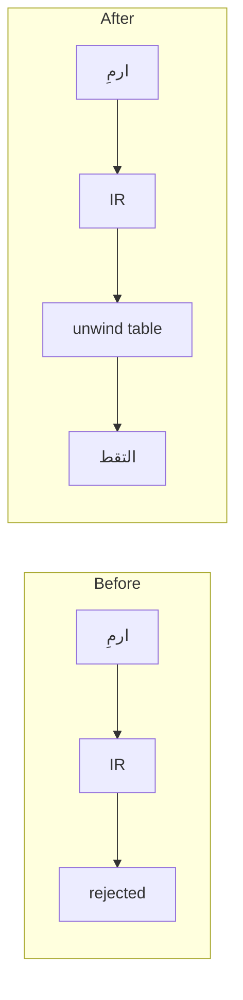

# Diagrams (Mermaid)

A diagram earns its place when it replaces prose that would be harder to follow.
It is not decoration, and it is not a summary of the PR title.

The `mermaid` skill (`.claude/skills/mermaid/`) covers **how to write the syntax**.
This file covers **whether to draw at all, and how big**. Where they disagree — the
skill leans toward theming and elaborate output — this file wins.

## When to Draw

These should usually carry one small diagram:

| Situation | Diagram |
|-----------|---------|
| New feature PR | Its control or data flow |
| Refactor PR | Before → after |
| Behavior crossing module boundaries | The path through the pipeline |
| A state machine or protocol | `stateDiagram-v2` |

Cap: **one per PR or document.** Two only when before/after genuinely needs to be
two separate diagrams.

## When Not To

- **Bug fixes with a local cause.** A one-line null check needs a sentence, not a picture.
- **Restating structure that is already a list.** A file tree is a file tree.
- **Whole-codebase class diagrams.** Nobody reads them, and they go stale in a week.
- **Anything the PR title already says.**

If you are drawing because the PR feels thin without one, don't.

## Size

**≤12 nodes, ≤15 edges, at most one level of `subgraph`.**

Past that, the diagram is the wrong tool. Split the concept or drop it. A diagram
that needs zooming has failed at the one thing it was for.

## Form

- One ` ```mermaid ` fence. GitHub renders it natively — no image files, no exports.
- Pick one: `flowchart`, `sequenceDiagram`, `stateDiagram-v2`.
- **No styling, theming, `classDef`, or CSS.** Default rendering only. Colors do not
  survive dark mode, and they carry no meaning a label could not.

## Language and RTL

Labels match the language of the host document: Arabic in `ARCHITECTURE.md` and
`docs/رموز_الأخطاء/`, English in PR and issue bodies.

**Never mix Arabic and Latin inside a single label.** Bidi reordering mangles it —
`native: ت٠٣٠٣ refused` renders as `native: ٠٣٠٣ت refused`, with the error code
reversed. This is not a mermaid bug; it is the Unicode bidirectional algorithm doing
its job on a string that mixes directions. Split the two scripts into separate nodes.

Quote any label containing parentheses or Arabic punctuation:

```
A["تحليل نحوي (برات)"]
```

## Validate Before Shipping

Run `mcp__mermaidchart__validate_and_render_mermaid_diagram` on every diagram before
it goes into a PR or a committed file. An invalid diagram renders on GitHub as a
broken code block — worse than no diagram, because it looks like a mistake nobody
checked.

Rendering also catches what validation alone cannot: bidi mangling, labels that
overflow, and layouts that come out unreadable.

## Placement

| Where | Allowed |
|-------|---------|
| PR body | Yes |
| `docs/` page | Yes |
| Module-level `.md` | Yes |
| Rust doc comment (`///`) | **No** |

Rustdoc does not render mermaid, so it would show as raw text — and it would blow the
comment budget in `.claude/rules/comments.md`.

## Existing Diagrams

`ARCHITECTURE.md` draws the compiler pipeline in ASCII box art. **Leave it alone.**
It renders everywhere, including in a terminal, and converting it buys nothing. Use
mermaid for new material only.

## Worked Example

A refactor PR for native exception unwinding. Seven nodes, one subgraph level, each
label in a single script:



It answers one question — what changes in the path from `ارمِ` to `التقط` — and stops.
