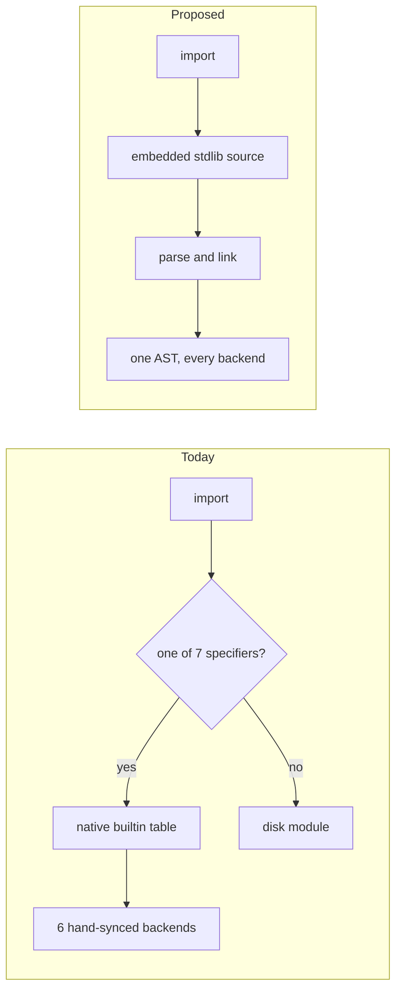

# حدود المدمجات والمكتبة القياسية — The Builtin / Stdlib Boundary

**Status: proposal, awaiting sign-off on the six decisions in §10. No code has been migrated.**

This document fixes the line between what stays a Rust compiler/runtime primitive and what
becomes self-hosted Tarqeem. It is a decision, not a survey: every name that exists today has
exactly one verdict. The census it rests on is [`builtins-inventory.md`](builtins-inventory.md).



The left path is why a name can type-check and then be missing from the interpreter, or lower to a
symbol that does not exist. The right path is one AST reaching every backend from a single
insertion point — the mechanism `مجموعات` and the `استثناء` prelude already use.

> **On «probe» references.** Claims below marked *probe X* were verified by running a short
> throwaway `.ترقيم` program under all three backends — `run`, `run --jit`, and `compile` plus
> execute — against the release binary. The programs were not kept; each is a few lines and is
> described where it is cited. Two of the findings are also pinned permanently in the test suite:
> `tests/module_execution_tests.rs:584-631` asserts the #185 native segfault, and
> `tests/oop_execution_tests.rs:937-940` documents the generic-substitution gap.
> `check` is never used as evidence — it silently degrades relative imports to `أي`.

---

## 0. Executive summary

| | |
|---|---|
| Declared names today | 185 in `Scope` (20 core + 165 across 7 modules), plus ~40 more reachable only through the codegen mangle map |
| **Final primitive registry** | **40 names** |
| Migrated to self-hosted Tarqeem | ~150 names across 9 stdlib modules |
| Dropped (alias collapse) | 26 |
| Dropped (dead — never worked in any backend) | 11 |
| Deferred out of the v1 core registry | the 12 socket primitives (شبكة) |
| ABI-internal symbols | **excluded from the budget entirely** (see §1.4) |

**The single most important empirical result** (probe `P1` vs `P1c`): the *same call* segfaults
natively when it routes through the builtin table, and returns the correct answer on all three
backends when its body is Tarqeem source in a disk module. Migration is not a stylistic
preference — it *fixes* #185 for every name migrated, and closes the 78-name interpreter hole for
free, because one Tarqeem AST reaches interpreter, JIT and native from a single insertion point.

**Three target-spec assumptions are unimplementable and are overridden here.** They are stated in
§9 so the target surface can be corrected rather than silently mis-implemented.

---

## 1. The registry — 40 primitives

### 1.1 Rules applied

1. A name stays only if it meets criterion **(a)** inexpressible / **(b)** syscall / **(c)** intrinsic.
2. **Performance is never a reason.** Every perf-motivated keep is listed in §8 as a future
   optimization candidate instead.
3. Every alias group collapses to **one** surviving spelling. Dropped spellings survive for one
   release as a `م`-category (مهمل) warning, then are removed.
4. An existing Arabic name is reused wherever the capability already exists. Each `new` entry
   states why no existing name covers it.
5. **Standing completeness rule for every row below:** a primitive needs a `Scope` entry **and** a
   `register_builtin_return_types` entry **and** interpreter + debug-interpreter arms. Any two of
   the three is a landmine. Proof: `وقت_الآن` had the Scope entry only, so `وقت_الآن() > 0`
   type-checked and then failed native codegen with *«لا يمكن ترتيب مرجعين بالعامل Gt»*. (The
   example has since been repaired — #241 registered both time builtins' return types and arms —
   but the rule it proved stands; noted at #373 so no future increment re-plans that repair.)

   > **Amendment (#342): the return-type clause does not apply to a `فراغ` primitive, and
   > applying it does harm.** The clause protects a *value* — an unregistered call carries the
   > `Ptr(Void)` sentinel and something downstream misreads it. A `فراغ` primitive has no value,
   > and both halves of that were measured for `أنهِ_البرنامج`:
   >
   > - **Registering `IrType::Void` buys nothing observable.** Unregistered, codegen emits
   >   `%v = call ptr @trq_exit(i64 …)` beside `declare void @trq_exit(i64)`, and clang
   >   **accepts** it — under opaque pointers a direct call carries its own function type, so a
   >   signature mismatch is no longer a parse error. Same stdout, same status, both ways.
   > - **Registering it costs cross-backend agreement.** Codegen's `is_void` branch emits the
   >   call and creates no value for `dest` while the IR still references that `dest`, so
   >   `متغير س = أنهِ_البرنامج(٣)` fails native compilation (ت٠٠٠١) while both interpreters
   >   exit 3. Unregistered, all three agree.
   >
   > That second defect is [#343](https://github.com/osama1998H/tarqeem/issues/343) and predates
   > the name — a plain `دالة ف() { }` with `متغير س = ف()` reproduces it with no builtin
   > involved, because a user function's missing return type *is* an `IrType::Void`. Register the
   > entry once #343 lands. Until then a `فراغ` primitive is complete with **three** of the four:
   > `Scope`, both interpreter arms, and the codegen mapping.
   >
   > Generalisable, and it is the third defect class this document has found in its own rows
   > after expiring criterion-(a) claims (#312, #322, #333, #336) and unimplementable contracts
   > (#333): **a rule can be right about the mechanism it was written for and wrong about a
   > mechanism that had not appeared yet.** `جذر` is loud unregistered because `اطبع`
   > *dereferences* its result — predict from the **use site**, never from the declare.

### 1.2 Category 1 — Memory & object model: **0 primitives**

Deliberately empty, and this is a verdict, not an omission.

- Value/object construction is **syntax**: `جديد`, `[…]`, string literals. No name is involved.
- **Reference identity already works** and needs no new name. Probe `هوية`: two separately
  constructed objects with equal fields compare `خطأ`; an alias compares `صحيح`; identical in
  interpreter and native. Probe `هوية2` confirms arrays are genuine reference types (mutation
  through an alias is visible through the original). Proposing an identity primitive would violate
  the binding rule against inventing a name for an implemented capability.
- Allocation and refcounting (`trq_alloc`, `trq_retain`, `trq_release`, `trq_free`) are
  **ABI-internal** — see §1.4. They must never become language-visible.

### 1.3 The 40

Legend for **status**: `unchanged` · `renamed` · `narrowed` · `new`.

#### Category 2 — Arithmetic & logic intrinsics (12)

| الاسم | التوقيع | الحالة | التبرير |
|---|---|---|---|
| `عدد` | `(أي) -> عدد` | unchanged | Type-directed at build time: `FloatToInt` / `BoolToInt` are inline IR representation changes with no Tarqeem expression; the string leg is the *checked* parse. Criterion (a)+(c). |
| `عدد_عشري` | `(أي) -> عدد_عشري` | unchanged | `IntToFloat` is a machine instruction; correctly-rounded decimal→f64 is not expressible. Criterion (a)+(c). |
| `نص` | `(أي) -> نص` | unchanged | The **string-coercion intrinsic** that `+` depends on (LANGUAGE_SPEC §5.6). `convert_to_string` selects a formatter from the *static* `IrType`; that selection is exactly what stdlib cannot express. Criterion (c). |
| `منطقي` | `(أي) -> منطقي` | unchanged | `build_truthiness` emits a different comparison per static type. Each branch is writable in Tarqeem; the *selection* is not, and its `أي` parameter is refused by native codegen (ت٠٣٠١). Criterion (c). |
| `جذر` | `(عدد_عشري) -> عدد_عشري` | unchanged | IEEE-754 §5.4.1 lists squareRoot among the **correctly-rounded** operations, beside `+ − × ÷`; one instruction (`sqrtsd`/`fsqrt`) on every supported target. Provably not substitutable by `**`: probe `p3` shows `جذر(-0.0) = -0.0` while `(-0.0) ** 0.5 = 0.0`. Criterion (a). |
| `بتات_و` | `(عدد، عدد) -> عدد` | new | No bitwise capability exists in any spelling — the lexer has no `& \| ^ << >> ~` token and grep finds no Arabic bitwise vocabulary in `stdlib/` or `docs/`. Nothing to reuse. Arrives as a **function**, per the no-syntax-change constraint. Criterion (a). |
| `بتات_أو` | `(عدد، عدد) -> عدد` | new | Same. |
| `بتات_أو_حصري` | `(عدد، عدد) -> عدد` | new | Same. `أو_حصري` describes the function (exclusive or) rather than transliterating XOR. |
| `بتات_نفي` | `(عدد) -> عدد` | new | Same. Distinct from the logical `ليس`, which operates on `منطقي`. |
| `بتات_إزاحة_يسار` | `(عدد، عدد) -> عدد` | new | Same. `إزاحة` is the ordinary Arabic noun for a shift. |
| `بتات_إزاحة_يمين` | `(عدد، عدد) -> عدد` | new | **Arithmetic** (sign-propagating). Correct for 32-bit-masked SHA-256/CRC words. |
| `بتات_إزاحة_يمين_منطقية` | `(عدد، عدد) -> عدد` | new | **Logical** (zero-fill). Required, not redundant: `عدد` is signed i64 and every backend's `Shr` is arithmetic, so a self-hosted xorshift64 or DEFLATE bit reader silently produces wrong numbers *consistently across all three backends* without it. Named to contrast explicitly, since confusing the two is the failure mode. |

> The `بتات_` prefix is chosen over bare `و_بتي` / `أو_ثنائي` for two reasons: it keeps the family
> clear of `و` / `أو`, which are keywords and so cannot be names on their own, and `ثنائي` is
> already taken — it is this codebase's word for *byte array* (`بصمة_ثنائي`, `اضغط_ثنائي`,
> `ثنائي_إلى_ست_عشري`).
>
> **Correction (#302):** an earlier wording here said the prefix avoids *opening* an identifier
> with `و` / `أو`. That is false — an identifier may begin with either letter, as `وقت` and
> `أولوية` do. Only the bare one-letter names are unavailable.
>
> **Correction (#322):** `بتات_إزاحة_يمين_منطقية`'s row claims criterion (a), inexpressible. That
> was true when written and **expired when `بتات_إزاحة_يمين` landed** (#320) — the operation became
> composable from the six names that already existed, pinned by
> `test_logical_right_shift_matches_the_composition_it_names`:
>
> ```tarqeem
> بتات_أو(
>     بتات_إزاحة_يمين(بتات_و(س، 9223372036854775807)، ن)،
>     بتات_و(بتات_إزاحة_يمين(س، 63)، بتات_إزاحة_يسار(1، 63 - ن)))
> ```
>
> The verdict is unchanged and the name shipped as a primitive, on `بتات_نفي`'s grounds (#312) plus
> one this family did not have before: the bitwise names are **core tier**, and §5.2 keeps a
> no-import name a builtin until **B12** is fixed, so stdlib was not an available home. Every
> remaining row asserting criterion (a) should be re-checked against what has landed since, not
> trusted.
>
> **Correction (#333):** `ثنائي_إلى_نص`'s row required that it *not* validate UTF-8, so a socket or
> file read would round-trip. **That is unimplementable across backends**, and the requirement is
> withdrawn rather than mis-built. The interpreter holds a string as `Value::String(Rc<String>)`
> (`src/interpreter/value.rs:20`) — a Rust `String`, which cannot *be* invalid UTF-8 — and natively
> `trq_print` is `if let Ok(text) = std::str::from_utf8(slice)` (`runtime-rs/src/io.rs:27`), so such a
> string prints **nothing** with no error. Honoring the clause needs a value-representation change,
> which §9's binding constraints forbid. Truncating out-of-range elements to the low byte, the house
> convention in `trq_sha256_bytes`, was rejected for the same reason in miniature: `[300]` would
> answer `","` and collide with `[44]`.
>
> **Consequence, recorded so it is not rediscovered:** Increment K cannot use `ثنائي_إلى_نص` to carry
> arbitrary socket bytes. Nothing regresses today — all 23 `شبكة` names already fail. Whoever takes
> Increment K needs either a byte-array-native API — `اقرأ_مجرى`/`اكتب_مجرى` already have byte-array
> signatures, so that route costs nothing new — or the representation change. Filed as
> [#334](https://github.com/osama1998H/tarqeem/issues/334).
>
> Generalisable, and this is the *second* kind of §1.3 defect after the expiring criterion-(a) claims:
> a row can also state a **contract** that no implementation can satisfy. Check the contract against
> the value representation, not only the criterion against the language.
>
> **Criterion (a) also expired for it, making three (#333).** Indexing over `مصفوفة<عدد>` (#330), the
> seven bitwise names, and `رمز_إلى_حرف` (#326) together make UTF-8 decoding writable in Tarqeem;
> `test_bytes_to_string_matches_the_decoder_it_names` runs a hand-written decoder beside the builtin
> in all three backends and they agree. It shipped anyway on `بتات_نفي`'s grounds — core tier, and
> §5.2 keeps a no-import name a builtin until **B12** — with one addition the earlier expiries did not
> have: the *validating* half stays materially harder to hand-write, which is what the primitive buys.
>
> **Correction (#336).** `قص_حروف`'s row above
> claimed it is "the only way self-hosted Tarqeem can reach the i-th character at all", citing
> probes p4/p7. Both halves of that were true when written; the **first expired** when the byte
> bridge closed. `نص_إلى_ثنائي` (#330) and `ثنائي_إلى_نص` (#333), with indexing over `مصفوفة<عدد>`
> and the bitwise family, make a codepoint slicer writable in Tarqeem — the **fourth** row to expire,
> after `بتات_نفي` (#312), `بتات_إزاحة_يمين_منطقية` (#322) and `ثنائي_إلى_نص` (#333) — pinned by
> `test_substr_chars_matches_the_slicer_it_names`, which runs a hand-written one beside the builtin
> in all three backends and finds them equal, out of range included. It shipped anyway on `بتات_نفي`'s
> grounds — core tier, and §5.2 keeps a no-import name a builtin until **B12** — plus one this
> document had not seen before: it was a **repair of a registered name**, not a new registration, so
> the alternative to shipping was not "leave it in stdlib" but "leave it half-wired".
>
> **The `س[i]` half did *not* expire, and that matters more than the criterion.** **B6** is still
> open, so the two things the claim rested on have come apart: the operation became expressible while
> the *idiomatic* route to it stayed broken. Do not read one as the other.
>
> **Deviation recorded (#336): `قص_نص` was removed outright, not deprecated.** §1.3's "deliberate
> cut" says both `طول_نص` and `قص_نص` "survive as call-compatible stdlib functions", and §1.1 rule 3
> gives dropped spellings one release of `م`-warnings. Neither happened for `قص_نص` — it left the
> registry in the same change, on the owner's decision. This is recorded rather than argued because
> the failure mode is a later increment planning against a promise the registry no longer keeps.
> `طول_نص` is untouched. Note the removal is what *forced* the fix to `stdlib/نص/اساسي.ترقيم`
> described in §1.3 below, so the trap that section cites as its motivating example no longer exists
> in checked-in code.

> **First re-check under that rule, and it passed (#324).** `حرف_إلى_رمز` was re-derived before
> implementation rather than read off its row, and criterion (a) **holds**: `نص_إلى_ثنائي` does not
> exist (**B9**), `س[i]` and `لكل ح في س` still yield an untyped `Ptr(Void)` (**B6**), and nothing
> in the registry or in `string.rs` turns a character into a number — `حرف_في` returns a
> one-character `نص`, which cannot be compared against a range. So the rule is not "the claim has
> always expired"; it is that the claim has to be *checked*, and the answer differs per name.

**Cost note (headline finding, gap analysis):** all seven bitwise names lower in
`build_core_builtin_call` to `Instruction::Binary` / `Instruction::Unary`, whose variants already
exist and already have arms in the interpreter, the debug interpreter, both JIT tiers, LLVM
codegen and the constant folder. **Two files** — `src/semantic/scope.rs` and
`src/ir/builder/expr_builder.rs` — not nine. Zero `runtime-rs` work.
`بتات_إزاحة_يمين_منطقية` composes existing IR ops, so it too costs zero backend work — though not
by the sketch this note used to give (`(أ >> 1) & 0x7FFF…FFFF` then `>> (ن-1)`, with `ن==0`
returning `أ`), which needs a select on `ن==٠`. #322 shipped a branchless equivalent instead:
clear the sign bit, shift the rest, and place the bit at `٦٣-ن`.

#### Category 3 — String primitives (5)

| الاسم | التوقيع | الحالة | التبرير |
|---|---|---|---|
| `قص_حروف` | `(نص، عدد، عدد) -> نص` | narrowed — **مُنفَّذ (#336)** | **The** codepoint accessor. Requires UTF-8 boundary walking over the raw buffer. Subsumes `حرف_في`, which becomes a one-line stdlib wrapper. **Narrowed** because it moves from the `نص` module tier to the core tier (no import) — see §4.3. Criterion (a) **expired** before it shipped, the fourth row to do so (correction below); it ships on §5.2/**B12** plus the fact that it was a *repair*, not a new registration. Total: a negative start, a start past the end and a non-positive length all answer `""`, and a length past the end clamps. |
| `حرف_إلى_رمز` | `(نص) -> عدد` | new — **مُنفَّذ (#324)** | Codepoint of the first character; `-1` for empty. Nothing in the 235 declared names or the 42 `string.rs` exports returns a numeric character code — the nearest, `حرف_في`, returns a one-character `نص`. **The single highest-leverage missing primitive:** case conversion, digit parsing, character classification, hex encoding, sorting and hashing are all inexpressible without it. Arity 1 so it composes as `حرف_إلى_رمز(قص_حروف(س، ي، ١))` — one unit throughout, so it cannot participate in the byte/char trap. |
| `رمز_إلى_حرف` | `(عدد) -> نص` | new — **مُنفَّذ (#326)** | Inverse. Required to *build* strings from computed characters, which is what number formatting is. Rejects surrogates and values > U+10FFFF rather than emit invalid UTF-8 — the rejection answers `""`, mirroring `حرف_إلى_رمز`'s `-1`, so the pair is total in both directions instead of leaving a hole. |
| `نص_إلى_ثنائي` | `(نص) -> مصفوفة<عدد>` | new — **مُنفَّذ (#330)** | UTF-8 octets of a string. No bridge existed; the payload buffer is behind the `TrqString` ABI. `ثنائي` is existing vocabulary for a byte array and the `X_إلى_Y` shape matches `ثنائي_إلى_ست_عشري` exactly — reuse of vocabulary, not invention. Criterion (a), re-derived at implementation time and **held**: reaching the i-th character is the only way to encode a string in Tarqeem, and no backend-portable way to do that exists while **B7** is open. `""` and `لا_شيء` both answer an **empty array** — a value, not a sentinel, since a string with no bytes has one unambiguous encoding. |
| `ثنائي_إلى_نص` | `(مصفوفة<عدد>) -> نص` | new — **مُنفَّذ (#333)** | Inverse. **The "must not validate UTF-8" clause written here was wrong and is overridden** — see the correction below. It validates and answers `""` for an element outside 0-255 or a byte sequence that is not an encoding; `[]` and `لا_شيء` answer `""` as a value. Criterion (a) **expired** before it shipped (correction below); it ships as a primitive on §5.2/**B12** plus tier symmetry with its inverse. |

> `نص` is simultaneously the category-3 formatter selector, but it is counted **once**, in
> category 2, and is not repeated here.

**Deliberate cut — `طول_نص` and `قص_نص` are NOT primitives.** This overrides the نص classifier,
which kept both and designated only `قص_نص` as the budget cut. Reasons:

1. Both are derivable once the byte bridge exists: `طول_نص(س) = طول(نص_إلى_ثنائي(س))`,
   `قص_نص(س،ب،ط)` = array-slice the bridge output and rebuild. The only cost is allocation, and
   **performance is not a valid keep reason at this stage.**
2. It makes the primitive string surface **uniformly codepoint-indexed**, which structurally kills
   the byte/char composition trap. That trap is not hypothetical: `stdlib/نص/اساسي.ترقيم:21`
   declares a parameter named `عدد_احرف` and then calls the *byte* slicer `قص_نص`, so
   `قص("مرحباً بالعالم"، ٠، ٦)` returns 3 Arabic characters, not 6. That is checked-in,
   hand-written self-hosted code, and it is the only hand-written self-hosted `نص` code that exists.
   **Fixed in #336** — removing `قص_نص` left that line nothing to call but `قص_حروف`, which is the
   argument of this paragraph carried out rather than restated.

Both names survive as call-compatible stdlib functions. Byte-level work happens only through
`نص_إلى_ثنائي` / `ثنائي_إلى_نص` and ordinary array indexing.

**Also cut:** `بايت_عند` (proposed by the نص classifier) — a non-allocating byte read whose only
advantage over the bridge is allocation avoidance. Perf-only, therefore cut.

#### Category 4 — Array primitives (3)

| الاسم | التوقيع | الحالة | التبرير |
|---|---|---|---|
| `طول` | `(أي) -> عدد` | unchanged | Reads the length field of the core array/string representation; the header layout (`TrqArray` 32B / `TrqString` 24B) is not addressable from Tarqeem. Already correctly polymorphic on the live path (`Instruction::ArrayLen` → `trq_string_len_chars` for strings, `trq_array_len` otherwise), verified identical across backends. **Absorbs `طول_مصفوفة`**, which shares literally the same match arm. Criterion (a). |
| `ألحق` | `(مصفوفة<ن>، ن) -> فراغ` | renamed — **مُنفَّذ (#375)** | Appending may reallocate the payload and rewrite the header's len/cap — inexpressible in Tarqeem. Criterion (a), re-derived at implementation time and **held**: a Tarqeem function can build a *new* array, but nothing can grow one in place so the mutation stays visible through every alias, which is what push *is*. The rename is **not an invention**: `ألحق` is the spelling README and LANGUAGE_SPEC §14.3 already document *and* the spelling the live member form already implements (`method_resolver.rs:99`). Before #375 the two forms disagreed — `الحق(أ،٤)` worked but `أ.الحق(٤)` failed; `ألحق(أ،٤)` failed but `أ.ألحق(٤)` worked. Unifying on `ألحق` fixed both halves and corrected an orthographic error (`ألحق` is the imperative of أَلْحَقَ). **Deviation (#375):** `الحق` was removed **outright**, not retained one release as a `م`-warning alias as this row promised — the `م` category has no emission plumbing anywhere in the compiler, and #336 (`قص_نص`) and #368 (`انقل_ملف`) recorded the same deviation. Both forms lower to the name-free `Instruction::ArrayPush`, so the unification cost four name-table sites and zero dispatch or runtime work; the member form's skipped widening and the null-through-`أي` push divergence were found while probing and filed as [#376](https://github.com/osama1998H/tarqeem/issues/376) and [#377](https://github.com/osama1998H/tarqeem/issues/377) rather than folded in. |
| `احذف_آخر` | `(مصفوفة<ن>) -> ن` | new (name pre-existing) | The one genuine category-4 hole. Verified missing in every form and every backend: `د٠٠٠١` as a global, «دالة غير معرّفة» as a member; the type checker's alternative spelling `احذف` type-checks and then dies at runtime. The name is **not coined** — LANGUAGE_SPEC §14.3 already documents it and `trq_array_pop` already exists, unused. Criterion (a). |

`new`, `get` and `set` need no names: array literals and `أ[i]` / `أ[i] = v` are syntax, verified
working in all three backends (probe `مصفوفة_دوال`). `trq_array_set` is dead — native element
assignment is lowered directly as GEP+store.

#### Category 5 — Map / hash primitives: **0 primitives**

Category 5 **does not apply**. Maps are not a core runtime type and no hash primitive is needed:

- `runtime-rs` exports zero `trq_map_*` / `trq_dict_*` / `trq_hash_*` symbols.
- `IrType` has no map variant (ten variants, none of them a map), so a map cannot survive into IR.
- The interpreter `Value` enum has no `Map` variant either.
- `Type::Map` exists **only** in the semantic type system; `قاموس<م،ق>` lowers to `Ptr(Void)` and its
  subscript degenerates into `trq_array_get` with a string key. Probe `قاموس_حرفي` fails in all three
  backends.

Maps are already correctly self-hosted as `صنف خريطة<م، ق>` over two parallel arrays in
`stdlib/مجموعات/قاموس.ترقيم`. A future self-hosted hash map needs a hash function, which needs
character codes — independent motivation for `حرف_إلى_رمز`, not for a hash primitive.

*Separately:* the `قاموس` annotation type-checks, compiles, and then misbehaves. That is a bug to
file, not a primitive to add.

#### Category 6 — Introspection & errors (3)

| الاسم | التوقيع | الحالة | التبرير |
|---|---|---|---|
| `نوع` | `(أي) -> نص` | unchanged | Type introspection is explicitly criterion (c). **Loud caveat: it is NOT a dispatch mechanism.** Natively it folds at build time to a constant read off the static `IrType`; through an `أي` parameter even the interpreter returns `كائن` for an `عدد`. No stdlib design may depend on it. Should be fixed to report dynamically in the interpreter during this work, since today it silently disagrees with itself. |
| `توقف` | `(نص) -> فراغ` | unchanged | Abort-with-message: writes to stderr and `process::exit(1)`. No Tarqeem construct can halt the process. Criteria (b)+(c). Fix while here: the stderr text diverges between backends («توقف: X» vs «خطأ فادح: X / Panic: X») though the exit code agrees. |
| `أنهِ_البرنامج` | `(عدد) -> فراغ` | new — **مُنفَّذ (#342)** | Terminate with an **explicit exit status**, no message. Nothing in the system exposed an exit code — the only three `process::exit` calls are all hardcoded to 1 and none was named in Arabic. Without it no Tarqeem program can signal a status to its caller, which makes the language unusable for CLI tools and for the project's own CI. Criterion (b), re-derived at implementation time and **held** — `exit(2)` is an OS service and, per #338's note, a syscall claim cannot expire. Total: the status is `حالة & ٢٥٥`, so `٣٠٠` → 44, `-١` → 255, `٢٥٦` → 0. Uncatchable by `حاول`. Shipped with the kasra-less spelling `أنه_البرنامج` — **two spellings, one budget slot** (deviation recorded below). |

**Deviation recorded (#342): `أنهِ_البرنامج` ships in two spellings.** §1.1 rule 3 collapses every
alias group to one surviving spelling, and §1.5 drops 26 names on that basis. The kasra-less
`أنه_البرنامج` is registered anyway, on the owner's decision, because it is not the kind of alias
that rule is about: the 26 are *different words* for one operation (`جا`/`جيب`, `طباعة`/`اطبع`),
while this is one word with and without the diacritic marking its dropped ya — the pairing the
**keyword table** already carries for `ارمِ`/`ارم`, `أرجع`/`ارجع`, `إذا`/`اذا`, `أخيراً`/`اخيرا`,
`صدّر`/`صدر` and `عيّن`/`عين`. `normalize_name` is NFC only and does not strip tashkeel, so the two
cannot share one entry.

The consequence to carry forward: **the registry's name count and its capability budget have come
apart by one.** The 40 in §1.3 counts capabilities; `Scope::core_builtin_names()` and
`CORE_BUILTINS` in `tests/builtin_registry_guard_tests.rs` count names, and are 33 rather than 32.
Recorded rather than argued, the way #336's `قص_نص` removal is, because the failure mode is a later
increment reconciling the two numbers and "fixing" the difference.

`ارمِ` is a **statement**, not a builtin function, so it consumes no budget. Its machinery stays
compiler-side (criterion c). It remains refused by native codegen with `ت٠٣٠٣` — see §7.

#### Category 7 — I/O syscall wrappers (11)

| الاسم | التوقيع | الحالة | التبرير |
|---|---|---|---|
| `اطبع` | `(أي) -> فراغ` | unchanged | **A compiler intrinsic, and irreducibly so** — see §9.1. Its `Instruction::Print` lowering selects among the print symbols on the static `IrType`; *that selection is the dispatch*, and it cannot exist in Tarqeem. Criterion (c). |
| `اطبع_خطأ` | `(أي) -> فراغ` | unchanged | Same intrinsic, differing only in destination stream. Cannot be a stdlib wrapper over `اطبع` either — the wrapper would need an `أي` parameter and hit `ت٠٣٠١`. |
| `اكتب_مجرى` | `(عدد، مصفوفة<عدد>) -> عدد` | new — **مُنفَّذ (#347)** | `write(2)`. **One** write primitive for stdout, stderr and any open handle. Replaces eight formatting-in-Rust exports. Criterion (b), re-derived at implementation time and **held** — a syscall claim cannot expire (#338). Total: `١` stdout, `٢` stderr, `٣`+ a handle; `٠`, a negative descriptor, one the table does not hold, and an element outside `٠`-`٢٥٥` all answer `-١`, which is collision-free because a count is never negative. An empty or `لا_شيء` array answers `٠` as a value. Rejection is **complete** — the array is validated before the first byte goes out. **The "short writes stay visible" clause is withdrawn** — see the correction below. |
| `اقرأ_مجرى` | `(عدد، عدد) -> مصفوفة<عدد>` | new — **مُنفَّذ (#350)** | `read(2)`. Byte-oriented so a multi-byte Arabic codepoint straddling a chunk boundary survives — decoding happens once, in stdlib. Line framing moves out of Rust. Criterion (b), re-derived at implementation time and **held** — a syscall claim cannot expire (#338). Total: `٠` stdin, `٣`+ a handle; `١`, `٢`, a negative descriptor, one the table does not hold, a non-positive count, and EOF **all** answer an empty array. **The "a zero-length result *is* EOF" clause is withdrawn as written** — see the correction below. The read loops until the count or EOF, mirroring `اكتب_مجرى`'s `write_all`. |
| `افتح_ملف` | `(نص، عدد) -> عدد` | new — **مُنفَّذ (#362)** | `open(2)`. Folds `trq_file_open_read/write/append` into one; the mode is `٠` قراءة / `١` كتابة / `٢` إلحاق, and `stdlib/ملفات/ملف.ترقيم` already declares those three as named `ثابت`s. **It also declares a fourth, `وضع_قراءة_كتابة = ٣`, which is refused** — see the correction below. Criterion (b), re-derived at implementation time and **held** — a syscall claim cannot expire (#338). Total: the mode is settled before the path, so an unknown one creates nothing; a handle is always `٣`+; a **directory is refused in every mode**, deliberately unlike `open(2)`, so the answer does not depend on the platform; and an absent or unreadable path, an empty name and `لا_شيء` all answer **`-١`, never `٠`**. |
| `اغلق_ملف` | `(عدد) -> منطقي` | new — **مُنفَّذ (#364)** | `close(2)`, and the name that makes written bytes land *sooner* than program end rather than at it. **The "reused unchanged" clause is withdrawn** — see the correction below. Criterion (b), re-derived at implementation time and **held** — a syscall claim cannot expire (#338). Folds nothing: `trq_file_flush`, `read_line`, `write_line` and `eof` stay nameless orphans. Total: the console streams `٠`/`١`/`٢` are **not** closable (deliberately unlike `close(2)`), and a handle already released, one never opened, a negative one and a failed flush all answer `خطأ`, indistinguishably. A released number is never handed out again. |
| `حالة_مسار` | `(نص، عدد) -> عدد` | new — **مُنفَّذ (#352)** | `stat(2)`, one field per call, so the answer stays an `عدد` and no struct crosses the FFI. `حقل ٠` = kind, `حقل ١` = size. **Folds four syscall wrappers into one** — `ملف_موجود`, `هل_ملف`, `هل_مجلد`, `حجم_ملف` all become stdlib one-liners. Criterion (b), re-derived at implementation time and **held** — a syscall claim cannot expire (#338). **Renamed from `حالة_ملف`, and the kind gained a fourth value; the size clause was completed** — see the correction below. Total: the field is settled before the path, symlinks are followed, and an absent path, an unreadable one, an empty name and `لا_شيء` all answer `٠` / `-١`. |
| `احذف_مسار` | `(نص) -> منطقي` | new — **مُنفَّذ (#355)** | `unlink(2)` for a file, `rmdir(2)` for an empty directory, chosen by **`lstat`** — **the row said `stat`, and that was wrong; see the correction below.** Folds two symbols; `احذف_ملف` and `احذف_مجلد` survive as stdlib wrappers, each with one documented delta. Criterion (b), re-derived at implementation time and **held** — a syscall claim cannot expire (#338). Total: an absent path, an empty name, `لا_شيء`, an unreadable path and a non-empty directory all answer `خطأ`, indistinguishably. Not recursive. |
| `انشئ_مجلد` | `(نص) -> منطقي` | narrowed — **مُنفَّذ (#366)** | `mkdir(2)`. No composition of open/read/write/close/stat creates a directory. Recursive creation becomes a stdlib loop, not a second primitive. **Narrowed** because it moves from the `ملفات` module tier to the core tier (no import), the promotion `قص_حروف` made at #336. Criterion (b), re-derived at implementation time and **held** — a syscall claim cannot expire (#338). Total: `صحيح` means this call created it; an existing entry of any kind — a dangling symlink included, since the *entry* blocks the name and the target is never consulted — a missing parent, an empty name and `لا_شيء` all answer `خطأ`, indistinguishably. |
| `قائمة_مجلد` | `(نص) -> مصفوفة<نص>` | narrowed — **مُنفَّذ (#370)** | `readdir(3)`. Directory entries are not readable through a byte stream. One array-returning primitive is a smaller surface than an opendir/readdir/closedir triple. **Narrowed** because it moves from the `ملفات` module tier to the core tier (no import), the #336/#366/#368 promotion with the spelling unchanged. Criterion (b), re-derived at implementation time and **held** — a syscall claim cannot expire (#338). **Its two contract silences were decided at planning time** — see the correction below. Total: entries are bare names **sorted by code point**, `.`/`..` excluded, a non-UTF-8 name decoded lossily rather than dropped; an absent path, a file, an unreadable directory, an empty name and `لا_شيء` all answer the **empty array**, indistinguishable from an empty directory; the path follows symlinks the way `حالة_مسار` does, so a dangling link lists as absent. |
| `انقل_مسار` | `(نص، نص) -> منطقي` | renamed — **مُنفَّذ (#368)** | `rename(2)` is **atomic**; copy-then-delete is not, and the difference is observable. A capability that cannot be composed from the others is exactly criterion (b), re-derived at implementation time and **held** — a syscall claim cannot expire (#338). **Renamed from `انقل_ملف`, and its destination rule was decided where the row was silent** — see the correction below. Total: acts on the *name* at both ends, so a symlink moves as itself, dangling included; an existing destination is replaced only when it is a **regular file**, and any other occupied destination — directory, symlink, device — answers `خطأ` on every platform alike; an absent source, a missing destination parent, a cross-device move, empty names and `لا_شيء` in either argument all answer `خطأ`, indistinguishably. |

> **Correction (#347): the "returns bytes written so short writes stay visible" clause is
> withdrawn.** It is not unimplementable the way #333's no-validation clause was — it is
> *unreachable*. `write_all` loops until the buffer is out or an error stops it, so a short write is
> never observed to report; the honest answer is the full count or `-١`. Exposing partial progress
> would mean calling `write` once and returning `n`, which silently truncates a large payload and
> puts the loop in every caller. The clause was written as though the primitive were a thin syscall
> shim; it is a thin syscall *operation*, and the difference is the loop.
>
> A **third** defect class for §1.3 rows, after expiring criterion-(a) claims and contracts no
> implementation can satisfy: a clause that is implementable and satisfiable but describes a state
> the operation cannot enter. Check a row's promises against the *shape of the call*, not only
> against the language and the value representation.
>
> Recorded, not silently changed, because a later increment could otherwise build a stdlib retry
> loop against a partial count that never arrives.
>
> **One property the row did not anticipate, and it is the primitive's point.** `اكتب_مجرى` puts
> bytes on a stream **without decoding them**, which no print builtin can: `trq_print` is
> `if let Ok(text) = std::str::from_utf8(slice)`, so a byte sequence that is not UTF-8 prints
> *nothing*, with no error (`runtime-rs/src/io.rs:27`). A lone `٢٥٥` is therefore unreachable
> through `اطبع` and ordinary through this. So the byte-out direction #334 was filed to find needs
> no value-representation change after all — though this name reaches files and the console, not
> sockets, so Increment K still owes its own destination. See §6.7.2.

> **Correction (#350): `اقرأ_مجرى`'s "a zero-length result *is* EOF" clause is withdrawn as
> written.** It is not unimplementable (#333) and not unreachable (#347) — it is **incomplete**, and
> it was written as though EOF were the only way to get a zero-length answer. It is not: an
> unreadable descriptor, a handle the table does not hold and a non-positive count all produce one
> too, and **an array return has no value left over to distinguish them.** `اكتب_مجرى` could answer
> `-١` because a byte count is never negative; every array, empty included, is a legitimate read.
>
> A **fourth** defect class for §1.3 rows, then, after expiring criterion-(a) claims, contracts no
> implementation can satisfy, and clauses describing a state the operation cannot enter: **a row
> whose return type has no spare value cannot report a refusal at all.** Check what the return type
> leaves room for before promising that a particular answer means a particular thing.
>
> The conflation is kept rather than worked around, because `runtime-rs` already made the same
> choice one layer down: `trq_file_read_line` answers `""` for EOF, for a read error *and* for an
> unknown handle, and `trq_file_eof` answers `true` for a handle that was never opened
> (`runtime-rs/src/io.rs:510-531,569-576`). `متغير_بيئة`'s indistinguishable set-empty and unset is
> the same shape in §1.3 itself. A caller that must tell them apart checks the descriptor it passed.
>
> Also settled here, before the fact rather than corrected after it: the read **loops** until the
> count or EOF. #347 had to withdraw the mirror-image clause on the write side; reading once would
> answer whatever a pipe happened to hold, so the length would depend on buffering and one program
> would answer differently between runs and between backends. That is a flake, not a bug, and
> `compare-backends` would surface it as one.

> **Correction (#352): `حالة_ملف` is renamed `حالة_مسار`, its kind gains a fourth value, and its
> size clause is completed.** Three changes to one row, and none of them is a defect class this
> document has seen before.
>
> - **The name.** `مسار`, not `ملف`: the operation reports on a path, which may hold a file, a
>   directory or neither, and a directory is not a `ملف`. Its own category-7 sibling `احذف_مسار`
>   already uses `مسار` for the identical file-or-directory scope, as do `مسار_اب`, `ادمج_مسار` and
>   `فاصل_مسار`. A naming correction on the #302 precedent, taken by the owner before the work.
> - **The kind needs `٣`.** The row lists three values — `٠` absent / `١` file / `٢` dir — and
>   promises to fold four names. It cannot: `ملف_موجود` is `Path::exists()` and answers **true** for
>   `/dev/null`, while `هل_ملف` answers false for the same path, so no three-value encoding
>   reproduces both. Verified rather than argued — `runtime-rs/src/io.rs:243` and the unit test
>   `test_path_status_marks_a_device_as_neither_file_nor_directory`. Hence `٣` = exists and is
>   neither, and `ملف_موجود` reduces to `!= ٠` rather than `== ١`.
> - **The size of a directory.** The row says `حقل ١` = size, "`-١` if absent", and says nothing
>   about a directory. `trq_file_size` answers the OS `st_size` there — 4096 on ext4, 64–96 on APFS
>   — which no test and no golden file can assert. So the size is the byte length of a **regular
>   file** and `-١` for everything else. A documented delta the future `حجم_ملف` wrapper inherits.
>
> A **fifth** defect class for §1.3 rows, after expiring criterion-(a) claims, contracts no
> implementation can satisfy (#333), clauses describing an unreachable state (#347) and a return
> type with no spare value for a refusal (#350): **a row promising to fold N names must have enough
> *range* in its return to reproduce all N.** It is close to #350's and genuinely distinct — #350 is
> about a return type having no value left to signal a *refusal*, this is about it having too few
> values to express the *answers*. Check a fold claim against every name it folds, one at a time; the
> one that breaks it here is the least specific of the four.

> **Correction (#355): `احذف_مسار` is chosen by `lstat`, not `stat`, and its fold is approximate at
> exactly the edge where the two disagree.**
>
> The row's selector is wrong, and reading the two names it folds is what shows it:
> `trq_file_delete` is `remove_file`, which unlinks a symlink whatever it points at, and
> `trq_dir_delete` is `remove_dir`, which refuses one. So `metadata` (stat, which follows) sends a
> symlink-to-directory to `remove_dir` and answers `خطأ` where `احذف_ملف` answers `صحيح` today.
> Measured, not argued: `stat` on such a link reports `is_dir() == true`, `remove_dir` on it fails
> and `remove_file` succeeds leaving the target intact.
>
> Worse, and this is what settles it: `حالة_مسار` reads a **broken** symlink as absent, so a
> `stat`-based selector would find nothing to delete and strand every dangling link permanently. The
> selector is `symlink_metadata`. **This name acts on the *name*; its sibling answers about the
> *target*.** They disagree about symlinks deliberately.
>
> A **sixth** defect class, adjacent to #352's fifth and genuinely distinct. #352: a fold claim needs
> enough *range* in its return to reproduce all N names. Here the range is ample — both folded names
> return `منطقي`. What breaks is the **dispatch**: a row that names its own selection mechanism can
> name the wrong one. The same cheap check finds both — *read each folded name's implementation, one
> at a time* — which is now two consecutive increments where that check paid for itself.
>
> **And the fold is approximate, which is recorded rather than papered over.** `احذف_مسار` is
> strictly more permissive than either name it folds, so the wrappers need a kind check, and the only
> kind available comes from `حالة_مسار`, which follows symlinks. So `احذف_ملف` refuses a
> symlink-to-directory where `remove_file` succeeds, and `احذف_مجلد` accepts one where `remove_dir`
> fails — one edge, two faces. Closing it needs a non-following kind, which nothing in the registry
> answers. Blast radius is nil: neither name has an interpreter arm, so neither ever worked outside
> native compilation, and no test or example uses either.

> **Correction (#362): `افتح_ملف` answers `-١`, not the `٠` its own runtime folds; `٣` is not a
> mode; and a directory opens.** Three things the row left open, and the first is the only one that
> could have shipped as a defect.
>
> - **The failure answer.** The row says nothing about it, and the three functions it folds all
>   answer `0`. `0` cannot be inherited here: it *names stdin* in the stream pair this primitive
>   exists to feed, so a failed open answering `0` would send a later `اقرأ_مجرى(٠، ن)` to the
>   keyboard **and succeed**. `-١` is already refused by both stream primitives and is what
>   `اكتب_مجرى` answers, so the family stays consistent. Mapped at the boundary; the three openers
>   keep their `0` under standing rule 3.
> - **The fourth mode.** The row says the modes are "exported from stdlib as named `ثابت`s", and
>   `stdlib/ملفات/ملف.ترقيم:12-24` does declare `وضع_قراءة` / `وضع_كتابة` / `وضع_اضافة` matching
>   `٠`/`١`/`٢` exactly — **and a fourth, `وضع_قراءة_كتابة = ٣`, that nothing can serve**: a
>   `FileHandle` is `Reader | Writer`, and a read-write variant would touch all eight functions that
>   read `FILE_HANDLES`. Refused with every other unknown mode rather than served silently by one of
>   its halves.
> - **A directory is refused in every mode, deviating from `open(2)` deliberately.** Found by
>   *running* the CI example, not by reasoning: the line `افتح_ملف(".", ٠)` was written expecting `-١`
>   and answered a handle, because `File::open` succeeds on a directory under POSIX. Keeping that
>   would have put a **platform** split in a contract row — Windows refuses the same open, since
>   `CreateFile` needs a flag `std` does not pass — and `cargo test` never runs on Windows, so nothing
>   could have caught it. Refused on both sides instead, checked through the *opened handle* so there
>   is no window between test and open, and provably a no-op where the open already failed. The shape
>   #355 chose over a `cfg(windows)` arm: one documented behaviour, one implementation. Devices and
>   FIFOs are **not** refused. It is also why that line left the example.
>
> No new defect class. The first point is #352's and #360's shape again — a row whose prose leaves a
> contract question open — and it is worth noting *which* question: the row named what the primitive
> **folds** and not what it **answers**, and the folded implementations' answer was the one value the
> new signature could not reuse. **When a row folds N functions, check what they return, not only
> what they do** — the same "read each folded name's implementation" check that paid off at #352 and
> #355, applied to the return value rather than the dispatch.

> **Correction (#368): `انقل_ملف` is renamed `انقل_مسار`, and its destination rule is decided
> where the row was silent.** Two changes, and both are shapes this document has seen.
>
> - **The name.** `مسار`, not `ملف`: `rename(2)` acts on the *name* and moves files, directories
>   and symlinks alike, never following links — the #352 naming correction applied to the mover,
>   taken by the owner before the work, and the family's own vocabulary (`حالة_مسار`,
>   `احذف_مسار`). The old spelling leaves the registry outright in the same change; the
>   one-release `م`-warning of §1.1 rule 3 is skipped on the #336 `قص_نص` precedent. **Deviation
>   recorded**, not argued: blast radius is nil — the name never had an interpreter arm, no test
>   or example used it, and its one caller is the non-loadable `stdlib/ملفات/ملف.ترقيم:181`,
>   updated in the same change. The `trq_file_move` **symbol** stays, per §1.4's standing rule.
> - **The destination.** The row said nothing about an occupied destination, and `std::fs::rename`
>   answers differently per platform: POSIX replaces a regular file, replaces a symlink, and
>   replaces an *empty directory* with a directory; Windows replaces only the file. Documenting
>   the split would put a platform answer into a contract row that `cargo test` can never check
>   on Windows (#355 f.6 / #362, the same class both times). So the rule is platform-invariant
>   and checked on the name: **an existing destination is replaced only when it is a regular
>   file** (`symlink_metadata`), which keeps the atomic write-temp-then-rename idiom — the
>   primitive's point — and refuses every other occupied destination identically everywhere.
>   Corollary, decided rather than inherited: file-onto-itself `صحيح`, directory-onto-itself
>   `خطأ`. The guard is the one contract change `trq_file_move` needed (#364's `+1` shape); it
>   was a bare `fs::rename(..).is_ok()`.
>
> No new defect class. The first point is #352's rename repeating; the second is the
> row-leaves-a-contract-question-open shape from #352, #360 and #362 — answered before the work
> this time, because the question ("what does the syscall do to an occupied destination, per
> platform?") is the one #362's directory refusal taught this family to ask.

> **Correction (#370): `قائمة_مجلد`'s answer is sorted, and a non-UTF-8 name is kept rather
> than skipped.** Two contract decisions where the row was silent, both taken at planning time
> on the #368 pattern, plus one conflation kept deliberately.
>
> - **The order.** The row said nothing about it, and the implementation returned raw
>   `read_dir` order — filesystem-dependent and run-dependent, which no golden file and no
>   `compare-backends` leg can tolerate; it was one of the two recorded deferral reasons. The
>   contract is **sorted ascending by Unicode code point** (bytewise UTF-8 sort — one
>   comparison, every platform), applied in both kernels after the lossy decode so the two sort
>   the same strings.
> - **The lossy decode.** `trq_dir_list` silently *dropped* an entry whose name is not valid
>   UTF-8 (`to_str()` guard), so `طول` lied about the directory. The contract is
>   `معاملات_البرنامج`'s argv rule — decoded lossily (U+FFFD), never dropped — with the
>   honesty clause recorded where argv did not need one: a lossy name does **not** round-trip
>   (`حالة_مسار` on it answers absent), and two distinct non-UTF-8 names may decode to the same
>   string. قصدٌ لا سهو.
> - **The refusal conflation is kept.** Absent, a file, unreadable, empty and `لا_شيء` all
>   answer the empty array, indistinguishable from an empty directory — an array return has no
>   spare value for a refusal (#350's class), the choice `اقرأ_مجرى` already made. A caller
>   distinguishes through `حالة_مسار`.
>
> No new defect class. Both decisions are the row-leaves-a-contract-question-open shape from
> #352, #360, #362 and #368 — answered before the work, as #368 taught; the read-the-reused-
> implementation check (#364's) is what surfaced the drop-vs-decode question.

#### Category 8 — Environment & time (6)

| الاسم | التوقيع | الحالة | التبرير |
|---|---|---|---|
| `وقت_الآن` | `() -> عدد` | unchanged | `clock_gettime(CLOCK_REALTIME)`, epoch ms. Every date value in the language descends from this one read. **Also the entropy source** the stdlib RNG seeds from — that is literally what `runtime-rs` does today, so no separate entropy primitive is proposed. ~~**Repair required now:** register its IR return type (see §1.1 rule 5)~~ — **already done**: #241 registered it (`src/ir/builder/mod.rs`) and gave both interpreters arms, pinned cross-backend by `tests/builtins_execution_tests.rs`; the claim expired unnoticed and is corrected at #373. Criterion (b). |
| `وقت_أداء` | `() -> عدد` | unchanged | `clock_gettime(CLOCK_MONOTONIC)`. A distinct OS service from the wall clock. **Its body is wrong today** — `trq_performance_now` serves the monotonic promise from the wall clock (a shared `epoch_millis()` over `SystemTime`, mirrored in both interpreters), so it moves backwards on an NTP step. The return-type half of the old repair note landed at #241; the monotonic fix is the part still open, and it must land in the runtime and both interpreters at once or the backends diverge. A name that lies is worse than a missing name. Criterion (b). |
| `نم` | `(عدد) -> فراغ` | unchanged | `nanosleep(2)`. A busy-wait over `وقت_أداء` burns a core and cannot yield. Already a clean monomorphic wrapper. Criterion (b). |
| `متغير_بيئة` | `(نص) -> نص` | new — **مُنفَّذ (#338)** | `getenv(3)`, `""` when unset. **New Arabic name over an already-implemented orphan symbol** (`trq_env_get`) — implemented, linkable, and unreachable before #338 because no name mapped to it. `مجلد_مستخدم` reduces to it exactly (`trq_dir_home` is `getenv("HOME")`); `مجلد_مؤقت` does **not** — `trq_dir_temp` calls `std::env::temp_dir()`, which falls back to `/tmp` when `TMPDIR` is unset. Criterion (b), re-derived at implementation time and **held** — see the note below. Total: an absent variable, an empty name and `لا_شيء` all answer `""`, so set-but-empty is indistinguishable from unset. |
| `مجلد_حالي` | `() -> نص` | narrowed — **مُنفَّذ (#373)** | `getcwd(2)` is **process state**, not an environment variable. Deriving it from `$PWD` is wrong: PWD is shell-maintained, absent under non-shell parents, and stale after any chdir. Criterion (b), re-derived at implementation time and **held** — a syscall claim cannot expire (#338). **Narrowed** because it moves from the `ملفات` module tier to the core tier (no import), the #336/#366/#370 promotion with the spelling unchanged — **the row said `unchanged` and was silent on the tier; see the correction below.** Total: zero arguments; the answer is the directory as the OS reports it, verbatim — no resolution or normalization of the primitive's own — decoded lossily on `معاملات_البرنامج`'s argv rule; a cwd the OS cannot report answers `""`, which unlike `متغير_بيئة`'s conflated `""` is collision-free, since no legitimate working directory is the empty string. |
| `معاملات_البرنامج` | `() -> مصفوفة<نص>` | new — **مُنفَّذ (#360)** | Command-line arguments, **excluding `argv[0]`** — see the correction below. Nothing in the system exposed them: `runtime-rs/src/runtime.rs` declared `main(_argc, _argv)` and discarded both. Criterion (b), re-derived at implementation time and **held** — a syscall claim cannot expire (#338), and argv is neither the environment `متغير_بيئة` reads nor a stream `اقرأ_مجرى` reads. Total: no failure mode. No arguments answers an **empty array** — a value, not a sentinel — as does a launch that bypasses the CLI run path, indistinguishably. Arguments are carried verbatim, an invalid-UTF-8 one decoded lossily, and repeated calls answer the same list: this is state read, not consumed. |

> **The first re-derivation that could not have failed (#338).** Four §1.3 rows have had criterion
> (a) expire under them — `بتات_نفي` (#312), `بتات_إزاحة_يمين_منطقية` (#322), `ثنائي_إلى_نص` (#333)
> and `قص_حروف` (#336) — and §6.1 made re-derivation a standing rule because of it. `متغير_بيئة` is
> the first name to be checked whose criterion is **(b)**, and the check is structurally different:
> criterion (a) asserts something about *the language*, which every landed increment changes, while
> (b) asserts that a capability lives in the operating system, which nothing in Tarqeem can move.
> **A syscall claim cannot expire.** Worth stating because the standing rule reads as "re-derive
> every row", and for the (b) rows the honest answer is that the derivation is one sentence and will
> stay true. Re-check the (a) rows; the (b) rows only need their *contract* checked against the
> value representation, which is the second defect class #333 identified.
>
> **Correction (#360): `معاملات_البرنامج` excludes `argv[0]`, and the row's cost note understated
> the path.** Two changes, and the first is a contract decision the row never made.
>
> - **The program's own name is not one of its arguments.** The row says only "command-line
>   arguments" and is silent on `argv[0]`. It cannot stay silent: natively `argv[0]` is the compiled
>   binary's path, and under the interpreter the nearest equivalent is the `.ترقيم` source path, so
>   including it would put a permanent divergence in the one place `compare-backends` cannot excuse.
>   Excluding it makes the no-argument case an empty array identically on all three backends, which
>   is also what makes a CI example possible — §6.7.4's rule needs a row invariant under where the
>   program runs, and this is the only one. The name agrees: «معاملات البرنامج» is what it is given,
>   not what it is called.
> - **"Capture argv at init *plus* the full nine-site path" was right about the shape and low about
>   the count.** It cost thirteen — see §6.7.6. The two it did not anticipate are that the CLI had no
>   syntax to *pass* arguments at all, and that the interpreter needed somewhere to keep them.
>
> No new defect class. The first point is the #352 naming correction repeating — a row whose prose
> leaves a contract question open — and the second is #342's caveat firing exactly as predicted, for
> the first time since it was written.

> The contract check did find something, though not a defect: `trq_env_get` was read rather than
> trusted, because the orphan precedent in this document is `trq_performance_now` — implemented,
> linkable, and lying about being monotonic. This one is honest. All five of its paths (null pointer,
> null data, empty name, invalid UTF-8, unset variable) already return `trq_string_new(null, 0)`, an
> empty `TrqString` rather than a null pointer, so the row's `""`-when-unset clause was satisfied by
> code that predated the row. **Read an orphan before planning on it; the two in this document
> disagree about whether they work.**

> **Correction (#373): `مجلد_حالي` is a promotion, and its row's neighbours' "repair required"
> claims had already expired.** Two findings, neither a new defect class.
>
> - **The tier.** The row said `unchanged` and was silent on where the name lives; it lived in the
>   `ملفات` module tier, so "unchanged" would have left a `مدمج`-verdict name import-gated — and
>   §3.1 forbids a stdlib wrapper bearing a still-registered builtin's name, so the Increment G
>   module flip needs it out first. It ships `narrowed`, the #336/#366/#370 promotion with the
>   spelling unchanged. The row-leaves-a-contract-question-open shape from #352 onward, answered at
>   planning time as #368 taught. Its contract was also decided there: verbatim answer (no
>   resolution or normalization of the primitive's own — whether symlinks are resolved is the OS's
>   report, which is the only wording that is both platform-invariant and honest), lossy decode with
>   the `قائمة_مجلد` honesty rider (the lossy answer does not round-trip through `حالة_مسار`), and
>   `""` for a cwd the OS cannot report. Reading `trq_dir_current` found it already honest on all
>   three clauses — the second honest pre-existing body after `trq_env_get` — so the symbol needed
>   zero contract changes and the cost was #366's bare six.
> - **The stale sibling claims.** §1.1 rule 5's proof and `وقت_الآن`'s row both instructed
>   "register its IR return type" — a repair #241 had already landed (`src/ir/builder/mod.rs`
>   registers both time builtins, both interpreters carry arms, and
>   `tests/builtins_execution_tests.rs` pins them cross-backend). Corrected in place rather than
>   left to send a future increment planning a no-op; `وقت_أداء`'s *monotonic* defect is real and
>   remains open. A doc-accuracy finding of the #364-review kind: the risk lives in prose no test
>   can fail.

#### Category 9 — Optional: **0 primitives in the v1 core**

No module loading, FFI, concurrency or GC primitive is proposed. **Sockets are deferred here and
counted separately** — see §1.5.

### 1.4 ABI-internal symbols are excluded from the budget

`runtime-rs` exports 218 `#[no_mangle]` symbols; roughly 22 are compiler plumbing that Tarqeem
source can never name. They do **not** count toward the 40.

The boundary is structural, not a judgement call: `src/semantic/scope.rs` never mentions a `trq_*`
symbol — it registers an Arabic name and a type signature, purely for name resolution. The
name→symbol binding happens two layers later, in codegen. There is no dynamic symbol lookup
anywhere in the codebase, so **every symbol reachable only from codegen emission is by construction
invisible to Tarqeem source.**

Must remain invisible: `trq_alloc`, `trq_free`, `trq_retain`, `trq_release`, `trq_string_new`,
`trq_string_concat` (the `+` operator), `trq_string_equals` (`==`), `trq_string_compare` (`<` `>`),
`trq_string_char_at` (**the `س[i]` operator** — survives even though its Arabic name `حرف_في`
migrates), `trq_array_new`, `trq_array_get`, `trq_pow_int` / `trq_pow_float` (**the `**` operator** —
survive even though `قوة` / `قوة_عدد` migrate), and the `trq_print_*` family behind `اطبع`.

> **General principle for the whole refactor:** *"runtime symbol the compiler emits"* and *"declared
> name in the registry"* are two different surfaces. Only the second is being shrunk. Deleting
> `trq_pow_int` because `قوة` migrated would silently break `**` for every program.

### 1.5 What was cut, and why

| Cut | Count | Reason |
|---|---|---|
| **Socket primitives** (`نقل_*` × 7, `حزم_*` × 4, `حل_عنوان`) | 12 | Deferred to a separate later registry outside the 35-45 core. **Zero regression:** all 23 `شبكة` names already fail at `tarqeem run`, and natively they are *silently wrong* — probe: `اتصل_خادم(…)` compiles, links, runs, exits 0 and prints **nothing**. No working program can regress. Recommended, but listed in §8 as an owner decision. |
| `بتات_من_عشري` / `عشري_من_بتات` (float↔bits) | 2 | Only float hashing/serialization needs them, and float→string formatting stays behind the `نص` intrinsic, so nothing in the migration set depends on them. They are also the *only* proposed pair that cannot be closed in the IR builder — `Bitcast` is a no-op value copy in the interpreter, pointer-only in LLVM, and absent from both JIT tiers. |
| `بايت_عند` | 1 | Allocation avoidance only. Perf is not a keep reason. |
| `طول_نص`, `قص_نص` | 2 | Derivable from the byte bridge; cutting them makes the primitive string surface uniformly codepoint and kills the byte/char trap. §1.3. |
| `طباعة`, `اطبع_سطر`, `طول_مصفوفة`, `الحق` | 4 | Exact aliases sharing the same match arm. Note these **cannot** be demoted to stdlib wrappers: an `أي` parameter is refused natively (`ت٠٣٠١`), so the choice is binary — extra builtin arm, or removal. Removal, with one release of `م`-warnings. **`الحق` left at #375 — outright, no `م`-warning (the deviation §1.3's `ألحق` row records); `طباعة`/`اطبع_سطر`/`طول_مصفوفة` are still pending.** |
| Math aliases (`جا`, `جتا`, `ظا`, `ظتا`, `قا`, `قتا`, `لوغ10`, `أس`, `تقريب`, `أدنى`, `أقصى`, `راديان`, `درجات`, `عشوائي`, `عشوائي_بين`, `جا_عكسي`, `جتا_عكسي`, `بذرة_عشوائية`) | 18 | `.claude/rules/arabic-philosophy.md` §4 deprecates `جا`/`جتا`/`ظا` **by name**; the informative full word survives. They are kept as one-line stdlib wrappers at zero cost, so no user code breaks. |
| `نص_يحتوي`, `نص_يبدأ_بـ`, `نص_ينتهي_بـ` | 3 | Duplicate spellings; the `نص_` prefix is a flat-namespace artefact. Philosophy rule 3 favours the bare interrogative. |
| `نقل_اقبل_مع_مهلة`, `حزم_اغلق`, `احصل_عنوان_محلي`, `حمّل_ويب`, `فك_رمز_رابط` | 5 | Socket-family aliases; moot under the deferral, recorded for completeness. |
| **Dead names** — `كرر`, `بذرة_عشوائية`, `تاريخ_اليوم`, `حلل_تاريخ`, `تاريخ_من_طابع`, `أضف_أيام`, `أضف_أشهر`, `حلل_وقت`, `تاريخ_ووقت_من_طابع`, `حلل_تاريخ_ووقت`, `trq_datetime_now` | 11 | Type-check clean and then fail in **every** backend. Probe `P5`: `كرر` gives «دالة غير معرّفة» interpreted and JIT'd, and natively clang rejects *"use of undefined value `@_U0643__U0631__U0631_`"*. The nine date names return field-bearing structs with no representation below the semantic layer (#298). Their capability is not lost — it is composition of `وقت_الآن` with pure civil-calendar arithmetic, which the self-hosted classes already want to be. |

**Budget check: 12 + 5 + 3 + 0 + 3 + 11 + 6 = 40.** Inside 35-45, all nine categories answered.
(`نص` counted once, in category 2.)

---

## 2. Stdlib layout

Nine modules. `فهرس.ترقيم` is the package entry in each; sub-files carry the implementations.

| Module | Files | Fate | Migrated names |
|---|---|---|---|
| `stdlib/رياضيات/` | `فهرس` · `اساسي` · `ثوابت` · `عشوائي` · `مثلثات` | **revive + rewrite** | 44 canonical + 18 deprecated alias wrappers |
| `stdlib/نص/` | `فهرس` · `اساسي` · `بناء` · `تنسيق` | **rewrite** (the wrappers are unit-buggy; the flat stub's bodies are placeholders returning `خطأ`) | 34 + `طول_نص` + `قص_نص` = 36 |
| `stdlib/ملفات/` | `فهرس` · `ملف` · `مجلد` · `مسار` | **rewrite** on the new syscall primitives | 17 |
| `stdlib/طرفية/` | `فهرس` · `اساسي` · `الوان` · `تنسيق` | **repair + extend** (fix the و٠١٠١ duplicate export first) | 4 (`ادخل`, `ادخل_رسالة`, `ادخل_عدد`, `ادخل_عشري`) |
| `stdlib/وقت/` | `فهرس` · `تاريخ` · `وقت` | **rewrite** (`date.rs` is 8/8 pure civil-calendar arithmetic) | 8 pure + 9 dead names replaced by class methods |
| `stdlib/تشفير/` | `فهرس` · `بصمة` · `ترميز` | **NEW — no `.ترقيم` file exists today** | 10 (8 registry + the 2 unreachable base64 names) |
| `stdlib/ضغط/` | `فهرس` · `جزيب` | **NEW — no `.ترقيم` file exists today** | 6 |
| `stdlib/أخطاء/` | `فهرس` | **repair** (`فهرس.ترقيم:21` fails to parse) | 2 (`تأكد`, `تأكد_رسالة`) — gated on the linker fix |
| `stdlib/مجموعات/` | 7 files | **unchanged** — the one module that loads and type-checks clean today | 0 (blocked on generics, §7) |
| `stdlib/شبكة/` | `فهرس` · `اتصال` · `خادم` · `ويب` | **deferred** with the socket registry | ~40 later |

### 2.1 Deletions and scrubbing — required, not optional

**Delete the seven flat stubs.** `stdlib/أخطاء.ترقيم`, `اختبار.ترقيم`, `رياضيات.ترقيم`,
`شبكة.ترقيم`, `ملفات.ترقيم`, `نص.ترقيم`, `وقت.ترقيم` each duplicate a `فهرس.ترقيم` package and
compete for the same specifier. Resolution order is unsettled, so today *the stub can win* — and the
stubs are placeholders: `stdlib/نص.ترقيم` implements `يحتوي` as `أرجع خطأ` and `كرر` as
`أرجع نص` (returns its own argument). Deleting them resolves the ambiguity in favour of the
packages.

**Scrub three known collisions** before the corresponding module is flipped to disk:

1. `stdlib/نص/اساسي.ترقيم:170` exports `طول(سلسلة: نص) -> عدد`. Module merging is **fatal** on
   collision (`و٠١٠١`), never shadowing — this will break every importer that also uses the core
   `طول`. The file's own comment at line 167 shows this was noticed and papered over.
2. `stdlib/وقت/تاريخ.ترقيم:220-221` defines `عام دالة أضف_أشهر` whose body calls `أضف_أشهر(…)`.
   Once `أضف_أشهر` is no longer a builtin that is unconditional infinite self-recursion. The body
   must be rewritten as arithmetic.
3. `stdlib/شبكة/فهرس.ترقيم` re-exports `صدّر * من "./http"` but the file on disk is `ويب.ترقيم`.
   The module cannot load until that is corrected.

Also: `stdlib/رياضيات/عشوائي.ترقيم` calls `عشوائي_نطاق` and `عشوائي_عشري_نطاق`, **neither of which
exists** (the real names are `عشوائي_بين` / `عشوائي_عشري_بين`). It compiles today only because the
specifier never touches disk. The moment it goes live this breaks. Budget the repair into the
same increment.

---

## 3. Naming convention: primitives vs public API

### 3.1 The hard constraint

Probe `P4` (`دالة طول(س: نص) { أرجع طول(س) }`) is decisive and worse than documented:
interpreter and JIT stop with a bilingual «تجاوز المكدس»; **the native binary compiles cleanly,
exits 0 from `compile`, and then SIGSEGVs with no diagnostic whatsoever.** There is no syntax to
reach a shadowed builtin, so a stdlib wrapper may never bear the name of a still-registered builtin.

### 3.2 Recommended convention: **role-disjoint naming + delete-then-define**

Two rules, and together they make same-name collision structurally impossible:

1. **Primitives are named for the MECHANISM; stdlib is named for the TASK.** The primitive tier is
   deliberately lower-level, so it is naturally differently named. This is already how the
   proposed registry reads:

   | Primitive (mechanism) | Stdlib (task) |
   |---|---|
   | `اكتب_مجرى` | `اطبع_ملف`, `اكتب_ملف`, `الحق_ملف` |
   | `حالة_مسار` | `ملف_موجود`, `هل_ملف`, `هل_مجلد`, `حجم_ملف` |
   | `احذف_مسار` | `احذف_ملف`, `احذف_مجلد` |
   | `قص_حروف` | `قص`, `اول_حروف`, `حرف_في`, `موضع` |
   | `نص_إلى_ثنائي` | `احسب_بصمة`, `إلى_ست_عشري`, `اضغط` |
   | `حرف_إلى_رمز` | `كبير`, `صغير`, `رقمي`, `عربي`, `نص_لعدد` |
   | `بتات_أو_حصري` | `عشوائي_عدد`, CRC32 |

2. **Where a public name must survive unchanged and its implementation moves to stdlib**
   (`مطلق`, `جيب`, `يحتوي`, `اقرأ_ملف`, …), the builtin registration is **deleted in the same
   commit** that defines the stdlib function. Never a wrapper over a live builtin of the same name.
   The probe verdict states this precisely: *"A full replacement may keep the public name if the
   builtin is simultaneously deleted from all registration sites."*

### 3.3 Rejected alternative

**Today's convention — "import the native under its own name, export a differently-spelled thin
wrapper"** (`stdlib/رياضيات/اساسي.ترقيم:14`; `مثلثات.ترقيم` defines `جا` as a wrapper calling
`جيب`). Rejected because it is precisely what produced the 50 alias groups covering 106 of 235
names: every wrapper needs a second public spelling that means nothing, and the whole scheme is
load-bearing on the alias surviving. `مثلثات.ترقيم` works *only* because `جا` and `جيب` are two
registry names for the same symbol; the moment either alias is dropped, every wrapper in the file
becomes an infinite self-call — which is why that file must be rewritten in the same commit that
drops the aliases, not after.

A second alternative — decorating primitives (`مدمج_طول`, `أصلي_طول`) — was rejected because it
renames every existing public name for no capability gain and reads as an English-shaped
transliteration convention rather than description.

---

## 4. Bundling — how stdlib source reaches a compiled program

### 4.1 Recommendation: **`include_str!` embedding, injected through the existing synthetic-module path, with `TARQEEM_HOME` retained as a development override.**

Compile every `stdlib/**/*.ترقيم` into the binary with `include_str!`, and register the modules
through the **same** `ModuleLoader::insert_synthetic_module` machinery the `استثناء` prelude already
uses. Resolution order becomes: relative path → **embedded stdlib** → `TARQEEM_HOME` override (opt-in,
for stdlib development) → package cache.

### 4.2 Why not the other two

**Disk search path (status quo).** It works — `مجموعات` genuinely loads and type-checks clean — but:

- `TARQEEM_HOME` **silently shadows** the repo's own stdlib; the project already had to work around
  this with `env -u TARQEEM_HOME` in CLI verification.
- **LSP and DAP get zero search paths**, so disk-loaded stdlib silently degrades to `أي` in the
  editor (#230). Migrating 150 names to disk today would turn the entire stdlib into `أي` for every
  user of the language server — a large, invisible regression.
- `check` degrades relative imports to `أي` silently, so it cannot be trusted as evidence.
- Shipping requires the user to have the stdlib tree at a known path; a single-binary install breaks.

**Prelude for everything.** The mechanism is fully general (`insert_synthetic_module` takes any
path/source/AST; `prelude_ast()` parses a `&str` constant, so size is unbounded; the guard permits
`FuncDecl`). But prelude declarations are *merged*, and a merge collision is fatal `و٠١٠١` — see
§5. Using it for the whole stdlib would make every stdlib name un-shadowable, a much larger
semantic change than this refactor is allowed to make.

### 4.3 What it costs

| Cost | Size |
|---|---|
| Stdlib changes require a compiler rebuild for end users | Real; acceptable for a compiled language, and matches Rust/Go |
| Binary grows by the stdlib source text | Tens of KB — negligible |
| The loader needs a new embedded-source resolution tier ahead of disk | One change in `src/semantic/modules.rs`, mirroring `insert_synthetic_module` |
| Stdlib parse cost is paid on every compile | Mitigable later by caching the parsed AST; **not** a reason to choose differently now |

**What it buys:** LSP and DAP get real types instead of `أي` (fixes #230 for the stdlib half), no
env-var shadowing, hermetic and reproducible builds, and one code path shared by interpreter, JIT,
native, LSP and DAP — the same property that makes migration worth doing at all.

### 4.4 The specifier flip is per-module and atomic

`src/semantic/analyzer/stmt_analyzer.rs:1122-1128` short-circuits **by specifier**, not by name, and
`src/semantic/modules.rs:299` then skips loading it. So `"رياضيات"` cannot be half table and half
disk: the moment it leaves `Scope::get_stdlib_modules()`, **all 64 of its names must resolve from
the module**. This shapes the migration order — see §6.2.

---

## 5. Prelude — how no-import names stay call-compatible

### 5.1 What the probe established (TEST 3), not speculation

| Observation | Result |
|---|---|
| Mechanism generality | `insert_synthetic_module` takes any (path, source, AST); nothing special-cases `استثناء`; `prelude_ast()` merely parses a `&str`, so size is unbounded; the guard permits `ClassDecl \| InterfaceDecl \| FuncDecl \| EnumDecl` — **functions are injectable** |
| Redeclaring a **prelude class** (`صنف استثناء`) | **Fatal `ص٠٦٠٢`** in all three backends (`P3_collision`) |
| Duplicate top-level name across merged modules | **Fatal `و٠١٠١`** in all three backends (`P3_linkercollide`) |
| Redeclaring a **builtin** (`دالة نوع`) | **Legally shadows** — prints `دالتي` in all three backends (`P3b`) |
| Redeclaring `اطبع` | Shadows correctly in interpreter and native (`p3_shadow`) |

**Conclusion: moving a no-import name from the builtin tier into the prelude is a semantic
regression.** It converts documented, working `LANGUAGE_SPEC §4.9` shadowing into a hard compile
error.

### 5.2 The rule

> **A name that must work with no import stays a compiler builtin (last lookup tier, shadowable)
> until `src/semantic/linker.rs` learns to treat prelude-origin top-level declarations as
> displaceable by a user declaration of the same name — mirroring the builtin tier — rather than
> emitting `و٠١٠١`.**

Consequences, applied uniformly:

- **All 40 registry primitives stay builtins.** None moves to the prelude. In particular `اطبع` —
  the name users are most likely to shadow — never moves.
- **`ادخل`, `ادخل_رسالة`, `تأكد`, `تأكد_رسالة`, `فاصل_مسار` are prelude-gated.** Until the linker
  change lands, they **stay builtins**. There is no interim break and no interim import
  requirement.
- Once the linker change lands, they move into prelude-injected synthetic modules (`طرفية` for the
  input pair, `أخطاء` for the assertion pair, `منصة` for the platform constant), and become
  ordinary self-hosted Tarqeem visible with no import.
- Precedent that the prelude *can* be special-cased already exists: redefining `استثناء` yields the
  bespoke `ص٠٦٠٢`, not the generic `و٠١٠١`. The linker already distinguishes prelude origin; it
  just currently uses that knowledge to produce a *better error* rather than to allow displacement.

`فاصل_مسار` is the cleanest illustration of what the prelude is *for*: it is a compile-time platform
constant, not a computation and not a syscall. Tarqeem source cannot compute it, and inventing an
`اسم_المنصة()` primitive for one character is disproportionate. A synthetic `منصة` module whose
source text is built from the target triple already known to `src/codegen/target.rs` emits
`صدّر ثابت فاصل_مسار = "/"` or `"\\"` — target-correct, zero runtime symbols, zero primitives.

---

## 6. Migration order

Each increment is independently shippable with the full suite green. Ordered lowest-risk /
highest-proof first.

### 6.0 Increment 0 — Blocker clearance

Not a migration. See §7. Nothing below may start until items B1-B5 are done.

### 6.1 Increment A — the seven bitwise primitives

**Complete: 7 of 7 landed.** `بتات_و` (#302), `بتات_أو` (#306), `بتات_أو_حصري` (#309),
`بتات_نفي` (#312), `بتات_إزاحة_يسار` (#317), `بتات_إزاحة_يمين` (#320) and
`بتات_إزاحة_يمين_منطقية` (#322) — a `Scope` entry each plus a `build_core_builtin_call` arm: one
shared arm emitting `BinaryOp::BitAnd` / `BitOr` / `BitXor` over `IrType::Int`, a second for
`UnaryOp::BitNot`, and one per shift over a shared range guard. The two-file cost estimate below
held exactly, seven times: no `runtime-rs` work, no runtime symbol, no interpreter or
debug-interpreter arm (an intercepted builtin emits no `Call`), and no
`register_builtin_return_types` entry (`var_types` carries `Int` directly). All seven verified in
all four executing backends — interpreter, JIT, native, and the DAP debug interpreter. #312
extended the estimate to the `Unary` shape and #317 to a **multi-instruction chain**, which were
the two untested assumptions in it; #320 added nothing new to it, which is itself the result — the
second shift cost no new mechanism and, after the guard was shared, no extra instruction either:
both tails are three ops over the same six-op guard. #322's tail is nine ops over that same
guard, the longest of the three and still no new mechanism, so the estimate now covers the whole
range of shapes the family has.

With XOR landed the three logic operations were complete, and with them the bitwise
complement: `بتات_أو_حصري(س، -1)` flips every bit, which neither AND nor OR can do. `بتات_نفي`
therefore landed as a **spelling for an already-reachable operation**, not as a new capability
— its case was call-site readability and registry completeness, and its execution probes
assert agreement with the XOR form rather than treating it as independent. The verdict in
§1.3 is unchanged; the justification recorded there is.

`بتات_إزاحة_يمين_منطقية` (#322) is the **second** name in that position, and it is the more
instructive one because its row claimed criterion (a) rather than convenience. Landing
`بتات_إزاحة_يمين` made the logical shift composable from the six names that existed, so by the
time the seventh was written its own justification had expired — see the §1.3 correction. It
shipped anyway, on `بتات_نفي`'s readability grounds plus §5.2: the family is core tier and a
no-import name cannot live in stdlib until **B12** is fixed. Its probes assert the equivalence
with the composition instead of asserting a capability it no longer adds.

**Generalisable, and it applies to the rest of this document:** an inexpressibility claim is a
statement about the language *at the time of writing*, and every increment that lands changes what
is expressible. Two of the 21 `new` rows have now had that claim expire under them. Re-derive
criterion (a) at the start of each increment rather than reading it off §1.3.

One caveat found while landing #302 and confirmed unchanged by #306, #309, #312, #317, #320 and
#322: an intercepted builtin **segfaults natively as an element of an array literal** (#304). It
predates all seven — the same call in any other position is correct in every backend, and
`طول_مصفوفة` reproduces it — so it gates nothing here, but self-hosted stdlib written on these
primitives must avoid that shape until it is fixed.

A second caveat, surfaced by #317 because its chain is the first lowering to read one operand
**twice**: codegen unboxes a narrowed optional only on that operand's *first* scalar use, so the
second emits the raw pointer and clang rejects the module (#318). Reachable from ordinary source
as `س + س` inside `إذا (س != لا_شيء)`, so it predates the shift; the workaround is to copy the
amount once (`أ | ٠`), and since #320 it lives in the guard both shifts share. Any later lowering
that reads an operand more than once must do the same until #318 is fixed.

#322 is the first shift to read the **value** twice as well, and it shows the workaround has a
cheaper form when the lowering already needs a mask: `س & keep` is one instruction that both unboxes the
value and applies the out-of-range answer, so no separate copy is emitted. Prefer folding the copy
into work the arm already does over adding an `أ | ٠`. Either form is load-bearing and neither is
an optimizable identity — a peephole for `x | 0` or `x & -1` would silently restore #318.

**Why first:** highest ratio of unblocking to risk in the whole plan. Two files
(`scope.rs` + `expr_builder.rs`), zero backend work, zero `runtime-rs` work, zero migration — the IR
variants, the interpreter arms, both JIT tiers, LLVM codegen and the constant folder all already
exist and are already unit-tested. It unblocks تشفير, ضغط, the RNG and hex/base64 outright.

**Gate:** unit tests per name at all three backends, an `examples/` program exercising all seven that
the CI backend-diff job runs, and explicit range-check documentation.

**Range contract — decided in #317, amended in #320.** Unguarded the divergence is four ways, not
the three recorded here before: both interpreters raise «مقدار الإزاحة خارج النطاق», LLVM's
`shl i64` is poison, Cranelift's `ishl` masks, and the constant folder's `wrapping_shl` masks — so
native disagreed with the interpreter *and with itself*, depending on whether the amount was a
literal. The IR builder therefore emits a shared guard chain (`ن >> ٦` is zero exactly on 0-63;
`high | -high` spreads the sign to a -1/0 mask; the amount is masked to 0-63 before the shift),
which costs no backend arm and leaves the interpreters' range errors unreachable from the
builtin. The guard is branchless and uses only ops with arms in all six consumers; in particular
it avoids `BoolToInt`, which **neither JIT tier implements**.

#317 stated the resulting contract as *"an amount outside 0-63 yields `٠`, and the whole family
inherits it verbatim"*. **The number does not generalise; the reasoning does.** #317 chose `٠`
because `٠` is what a left shift by 64 or more genuinely produces — every bit leaves the word and
zeros fill behind it — and rejected masking the amount mod 64 (C's and Cranelift's behaviour,
under which `بتات_إزاحة_يسار(١، ٦٤) == ١`) as transliterated rather than described. An
**arithmetic** right shift refills from the sign, so shifting everything out leaves the sign, not
zero. Carrying the constant across while dropping the reasoning would put a cliff between
`بتات_إزاحة_يمين(-١، ٦٣) == -١` and `بتات_إزاحة_يمين(-١، ٦٤) == ٠`, which is exactly the sentinel
#317 refused.

So the contract is one clause, stated one level up:

> **An amount outside 0-63 is a complete shift, and the vacated bits are filled the way that
> shift always fills them.**

Zeros for `بتات_إزاحة_يسار`, so `٠` — #317's behaviour is unchanged. The sign for
`بتات_إزاحة_يمين`, so `٠` for a non-negative operand and `-١` for a negative one. Zeros again for
`بتات_إزاحة_يمين_منطقية`, so `٠` — the amendment changed the behaviour of exactly one of the three
names. Negative amounts fold into the same clause rather than getting a second one.

#322 shipped that third answer unchanged, which is the amendment's own test: the criterion was
written before the name it predicted, and produced `٠` for a *negative* operand where its sibling
produces `-١`. The two right shifts therefore agree on the rule and disagree on the number, out of
range exactly as in range.

It also gives the right shift the counterpart of the identity documented for the left one: a left
shift is multiplication by powers of two bounded by the sign bit, and a right shift is **floor**
division by powers of two — `بتات_إزاحة_يمين(س، ن) == floor(س / ٢**ن)` at every `ن ≥ ٠`, with no
boundary at 64. Under the inherited wording that identity would hold to 63 and then stop.

Implementation difference: the left shift masks the *result* to zero out of range, the arithmetic
right shift saturates the *amount* to 63. `guard.amount | (٦٣ & out_of_range)` saturates without a
select, because the guard's masked amount already fits in those six bits. Three instructions — the
same number the left shift's tail costs, so the two lower to identical instruction counts.

The logical right shift masks the **value** instead, which is the only one of the three positions
that works for it: it needs a zero result out of range like `يسار`, but it reads the value twice,
so zeroing the value zeroes every term below *and* serves as the #318 copy. Its tail is `س & keep`,
then the sign bit separated (`& ٩٢٢٣٣٧٢٠٣٦٨٥٤٧٧٥٨٠٧`) and shifted, then re-placed at `٦٣-ن` —
nine instructions, and `٦٣-ن` reads the guard's *masked* amount so it too stays in range.

**Lexer check — done (#309), extended (#322), and it passed both times.** `بتات_أو_حصري` lexes as
**one identifier**: the greedy identifier scan neither stops at the embedded `أو` nor resumes after
it. The mid-name
position was the harder shape — a split there would have parsed as a logical-or between
`بتات_` and `_حصري` rather than failing outright. Pinned by
`lexer::tests::test_identifier_containing_a_keyword_stays_one_token`, which covers all five
spellings that embed one — `بتات_نفي` was added to it because `في` is also a keyword
(`TokenKind::In`), in the same suffix position as `و` and `أو`. `بتات_إزاحة_يسار` and
`بتات_إزاحة_يمين` embed no keyword, so #317 and #320 deliberately left that test alone rather than
diluting what it tests.

`بتات_إزاحة_يمين_منطقية` **does** embed one, so #322 extended it — and in the one shape the other
four do not cover: `منطقي` is followed by a *letter* (`ة`) rather than by `_` or the end of the
name, so a scan that resumed after a keyword match would split a word rather than a separator. Both
conclusions are recorded because "the previous ones left it alone" is exactly the kind of pattern
that gets copied without checking; the check is per name, and the answer changed on the seventh.

### 6.2 Increment B — the character/byte bridge, and repairing `قص_حروف`

Four new primitives (`حرف_إلى_رمز`, `رمز_إلى_حرف`, `نص_إلى_ثنائي`, `ثنائي_إلى_نص`) plus moving
`قص_حروف` to the core tier with its IR return type registered and interpreter + debug arms written.
Five names × the full nine-site path — the most registration work in the plan, and the last time it
is paid at scale.

**Complete: 5 of 5 landed.** `حرف_إلى_رمز` (#324), `رمز_إلى_حرف` (#326), `نص_إلى_ثنائي` (#330),
`ثنائي_إلى_نص` (#333) and `قص_حروف` (#336), which closes **B7**. **Not one atomic change** — the
increment landed a name at a time, as Increment A did, and each name's criterion (a) was re-derived
when its turn came rather than trusted from §1.3. **Three of the five held** on re-derivation —
#324, #326 and #330 — and two had expired, #333 and #336.

**What #324 measured, since Increment A's cost note does not transfer.** The seven bitwise names
were IR-intercepted and cost two files each; `حرف_إلى_رمز` is the first *new* symbol-mapped core
builtin, and it cost the full path: a `runtime-rs` function, a `Scope` entry, a
`register_builtin_return_types` entry, `is_builtin` **and** a dispatch arm in *both* interpreters,
and an LLVM `declare` **plus** a `get_runtime_function_name` entry. `expr_builder.rs` — the whole
native story for seven consecutive increments — needed **no** edit: a core builtin absent from
`build_core_builtin_call` falls through to `Instruction::Call { func: FuncId(arabic_name) }` on its
own, carrying the *Arabic* name to codegen, so both interpreters key their arms on that name and
neither needs a `trq_*` arm. The template for this shape is `توقف`/`تأكد`, not `بتات_و`.

Three things #324 found that the plan did not state:

1. **`Type::compat` lets an un-narrowed `نص?` into a `نص` parameter** (`types.rs:83`), and native
   lowers it to `ptr null`, where a runtime null guard answers. An interpreter arm keyed only on
   `Value::String` would therefore raise a type error on source that native runs fine — a
   cross-backend divergence reachable from two ordinary lines. Every symbol-mapped primitive whose
   runtime function guards null needs a matching `Value::Null` arm in both interpreters.
2. **`as_str` (`runtime-rs/src/string.rs`) trims**, so reusing it in a new char-level primitive
   would silently disagree with the interpreter's `chars().next()` on a leading space. The
   char-aware family's own convention — raw `from_raw_parts` plus the private `utf8_char_len` — is
   the one to follow.
3. **Decode only the first character's bytes, never the whole buffer.** `from_utf8` over the whole
   slice fails when *any* later byte is invalid, which would throw away a perfectly decodable first
   character. The reason given here was that `ثنائي_إلى_نص` would not validate, which #333 withdrew;
   the guidance survives its own rationale, because a `TrqString` can hold invalid UTF-8 natively
   anyway — `trq_string_new` takes raw bytes, and nothing on the way in validates them. (The
   rationale as first written also cited `قص_نص` cutting on byte boundaries; #336 removed that
   name, and the guidance survives that too — the same rewording landed in `string.rs`.)

**What #326 added, and one correction to the above.** `رمز_إلى_حرف` cost the same nine sites and
found nothing new about the path, which is the result. Its criterion (a) was re-derived and
**held** for the second consecutive name: `نص(٦٥)` formats the digits `"65"`, the byte bridge is
still absent (**B9**), and `س[i]` is still `Ptr(Void)` (**B6**).

Finding 1 above is stated too broadly and is narrowed here: *"any symbol-mapped primitive whose
runtime function guards null needs a matching `Value::Null` arm"* holds only where the parameter
is a **pointer** and the runtime guard is a designed answer. For an `عدد` parameter there is no
null to guard — codegen turns `لا_شيء` into `0` above the runtime — so mirroring it would encode
an artifact as contract. `رمز_إلى_حرف` therefore has **no** `Null` arm, matching `نم` and
`بتات_نفي`, which diverge identically on the same source. The underlying defect is filed as
**#327**: a *narrowed* optional passed as a call argument emits the raw pointer natively, the
module is valid LLVM IR, and the binary runs to completion with a wrong answer. A plain
user-defined function reproduces it, so it belongs to the call-argument path rather than to any
builtin — and it is worse than #318, which at least fails to compile.

Generalisable: before mirroring a sibling's edge-case arm, check whether the mechanism that
produced the sibling's answer exists for this name. Here it did not, and the two names differ in
the one place the family otherwise looks uniform.

**What #330 added: the first core builtin returning an array — and the nine sites did not grow.**
`نص_إلى_ثنائي` was expected to be the expensive one, because no core-tier name had returned a
`مصفوفة` before. It cost the same nine sites, plus one lexer test, and **zero new mechanism**: the
stdlib tier had already paid for array returns, and `اضغط` is `(نص) -> مصفوفة<عدد>` — this name's
exact signature — with `IrType::Array(Box::new(IrType::Int), 0)` registered since #241 and
`examples/تشفير_وضغط.ترقيم` composing such a result with `طول` across all three backends in CI.
The lesson is the reverse of Increment A's: **check whether a "first" is a first for the
*mechanism* or only for the *tier*.** Here it was only the tier.

Four things #330 found that the plan did not state:

1. **A missing `register_builtin_return_types` entry is *quieter* for an array than for a scalar.**
   §1.1 rule 5 and the `جذر` note describe the failure as a signature mismatch — `call ptr` against
   a `declare i64`. For an array return there is no mismatch to catch: `Ptr(Void)` and `Array` both
   map to LLVM `ptr`, so the module is valid, links, and runs. Verified by deleting the entry:
   indexing still answered `65` and `اطبع` still printed the array, and the only assertion that
   failed was `نوع(…)`, which returned `مؤشر` instead of `عدد`. That is why the composition test
   asserts `نوع` and indexing rather than printing alone — and printing would have passed.
2. **`نص(<array>)` is a live cross-behaviour divergence — filed as #331 — and it runs the opposite
   way round from the prediction.** `convert_to_string` has no `Array` arm and falls through to
   `trq_int_to_string`. The expectation was that native would reject the module and the interpreters
   would print `[104، 105]`; **measured, it is the reverse.** Both interpreters raise
   «متوقع عدد، وُجد array», and **native compiles, runs, prints the pointer as a decimal integer
   (`4353416272`) and exits 0** — the silent-wrong-output mode, not a build failure. The `ptr`
   argument is simply dropped into the `i64` slot, because `runtime_scalar_param`'s unboxing fires
   only for `Ptr(Int)`. `"…" + <array>` is refused cleanly by `binary_result_type`, so `نص` is the
   only way in. Nothing in the tests or the example uses it. **Worth stating as method:** this claim
   was written from a source trace and was wrong in the direction that matters; running it took one
   file and three commands. Trace to form the hypothesis, run to record the behaviour.
3. **The `Value::Null` arm was required here, and #326's narrowing predicted it correctly.** The
   parameter is a **pointer**, so the runtime's null guard is a designed answer rather than the
   integer-zero artifact `رمز_إلى_حرف` faced. With the arm, an un-narrowed `نص?` answers an empty
   array and exits 0 in all three backends — verified, and covered cross-backend rather than only in
   a unit test, since the shape provably agrees. The *narrowed* shape is still #327 and is untested.
4. **The keyword-embedding check changed its answer a third time.** `نص_إلى_ثنائي` is the first name
   in either family whose embedded keyword — `نص`, `TokenKind::TypeString` — **opens** the name.
   Every previous case in `test_identifier_containing_a_keyword_stays_one_token` has the keyword in
   suffix or mid-name position. A longest-keyword-prefix scan would emit `TypeString` then
   `_إلى_ثنائي`, which is a *plausible* pair (a type followed by a name) and so would fail somewhere
   later rather than at the name. The test was extended. Three names, three different answers — the
   check is per name, and "the last one needed nothing" remains worthless as evidence.

**Gate:** a **composition** test, not a print test. `"X" + حرف_في(س،١)` printed `X4377631856`
natively today — printing alone passes while composition is silently wrong. The examples program
must concatenate and compare each primitive's result, across all three backends. #324's
`test_char_code_result_composes_as_an_integer` is that gate for the first name, and it is the test
that fails if the `register_builtin_return_types` entry is ever dropped.

**What #333 added: the nine sites did not grow, and the *contract* was the expensive part.**
`ثنائي_إلى_نص` cost the same nine sites as its three siblings plus one lexer case, with zero new
mechanism — `trq_sha256_bytes(*const TrqArray) -> *mut TrqString` is this signature exactly, so like
#330 the "first" was only a first for its tier. What actually cost time was discovering that the row's
stated contract could not be implemented (see the §1.3 correction). Four things it found that the plan
did not state:

1. **A missing `register_builtin_return_types` entry is *louder* for a `نص` return than for an
   array.** #330 measured that only `نوع` caught the array case. Measured here by deleting the entry:
   `اطبع` still printed «مرحبا» correctly, but `نوع` answered `مؤشر`, `"X" + …` printed
   `X4340804192`, and `== "﷽"` answered `خطأ`. Three of five assertions caught it rather than one,
   because concatenation and comparison both degrade visibly on a string where indexing and printing
   did not on an array. **The composition test must still assert all three** — printing alone passes
   either way.
2. **`مصفوفة<عدد>؟` does not parse** — `ب٠١٠١` at the `?`, even though §5.3's grammar admits
   `نمط_اختياري := نمط '?'`. So the route that made a `Value::Null` arm load-bearing for
   `نص_إلى_ثنائي` (an un-narrowed `نص?` slipping through `Type::compat`) does not exist here. The arm
   is still required, reached instead through an **`أي` holder**, where both backends agree on `""`.
   Refines #326's rule a third time: ask not only whether the parameter is a pointer, but *how a null
   can be written at all* — the answer differed per name for the third consecutive name.
3. **The array-literal-as-argument shape works.** Probed before writing fixtures, because #304 (an
   intercepted builtin *inside* a literal) and #327 (the call-argument path) both live next door.
   `ثنائي_إلى_ست_عشري([104، 105])` is correct in all three backends, so `ثنائي_إلى_نص([217، 133])` is
   a safe fixture. Worth keeping: the probe cost one file and confirmed a shape three siblings never
   exercised.
4. **Sharing one decode helper beat duplicating the arm.** `bytes_to_string` is `pub(crate)` in
   `interpreter::executor::builtins` and re-exported for the debug interpreter, the way
   `Value::to_display_string` already is, so the rejection rule cannot drift between them. Prefer this
   to a second copy whenever the logic — not just the dispatch — is identical.

**What #336 added: the nine sites shrank to six, and the quiet site got louder.** `قص_حروف` was the
first of the five that already had a `runtime-rs` function, a codegen mapping and a `declare`, so it
cost only the *semantic and interpreter* half: a `Scope` move, a `register_builtin_return_types`
entry, and `is_builtin` plus a dispatch arm in both interpreters. That is the shape every remaining
`~` row in the inventory has — 216 names are already mapped in `get_runtime_function_name` — so it is
the cheaper half of the path, and the one that repairs a half-wired name rather than adding one.

Four things it found that the plan did not state:

1. **The missing-return-type failure is *not* monotonic in loudness, and it is worst for this
   name.** #330 measured one caught assertion for an array and #333 measured three for a `نص`. Here
   **four of five** caught it — because `طول` did, answering `6` where `3` was right. The sentinel
   sends `ArrayLen` to `trq_array_len`, which reads `TrqArray.len`; a `TrqString`'s first field is
   its *byte* length, and the two structs' layouts make that a clean misread rather than a crash. So
   the specific failure mode of dropping this name's entry is that **the codepoint slicer starts
   counting bytes** — the one thing it exists not to do, and indistinguishable from a correct answer
   on ASCII. Generalisable: predict *which* assertion catches a missing entry from the return type's
   struct layout, not from a loud/quiet dichotomy.
2. **Sharing the whole dispatch beat sharing the computation.** #333 shared `bytes_to_string`, the
   decode, and each interpreter kept its own argument checks. Here the checks *are* most of the
   contract — three parameters, a null arm on one of them and not the other two — so
   `call_substring_by_chars` is `pub(crate)` and each interpreter's arm is one line. Prefer sharing
   at the widest point where the two backends must agree, which is the dispatch, not the kernel.
3. **The keyword-embedding check found its fourth distinct shape, and it passed.** `قص_حروف` embeds
   `و` inside `حروف` with a *letter* on each side (`ر` and `ف`). Every earlier case has a `_` or a
   name boundary on at least one side, so this is the only one where a scan treating a keyword match
   as a boundary would cut a word into three. Four names, four shapes, four separate answers — the
   check stays per-name.
4. **`ك` is unusable as a loop variable, and the parse error does not say so.** A counted inner loop
   written with `ك` fails as «ب٠٢٠١: متوقع اسم المتغير» pointing at the `=`, because `ك` is the
   contextual alias keyword. §6.6 already warns about this for Increment F; it fired here first, in a
   *test fixture*, which is where it will keep firing.

### 6.3 Increment C — `رياضيات`

Flip `"رياضيات"` out of `get_stdlib_modules()` **once**, in this increment. Because the flip is
atomic (§4.4), the disk module must answer all 64 names on day one. It does so in two layers:

- **Wave 1 (real implementations, ~19 names)** — `مطلق`, `علامة`, `أقل`, `أكبر`, `حصر`, `باقي`,
  `قاسم_مشترك`, `مضاعف_مشترك`, `عاملي`, `قوة`, `أرضية`, `سقف`, `قرّب`, `اقتطع` and the `_عدد`
  siblings. **These already exist and ship** in `stdlib/رياضيات/اساسي.ترقيم`. This is the increment
  probe `P1` literally ran: pure-Tarqeem `قيمة_مطلقة` / `الأكبر` / `الأصغر` / `محصور` in a disk
  module, byte-identical on interpreter, JIT and native — while the builtin-table control `P1c`
  segfaulted natively.
- **Scaffolding (the rest)** — trig, log/exp and the RNG remain thin wrappers over the *still-registered
  alias* builtins (`جيب` → `جا`, exactly as `مثلثات.ترقيم` does today). The alias pairs are the
  scaffolding that makes the atomic flip possible.

Waves 2 and 3 then replace scaffolding **in place**, and each alias builtin is deleted in the same
commit as its replacement — never before, or the wrapper self-recurses.

> **Unverified assumption — run this probe before starting Increment C.** The scaffolding assumes a
> name in the *stdlib-builtin table* (tier 165, e.g. `جا`) resolves **without an import** from
> inside a disk-loaded module. Nothing in the Phase-2 transcript verifies that. The lookup order is
> محلي ← محيط ← وحدة ← مستورد ← مدمج, and the shipped wrapper convention is worded as
> "*import* the native under its own name" — so the table names may be import-only. If they are,
> then after the flip `استورد … من "رياضيات"` resolves to the disk package itself and every
> scaffolding wrapper's callee becomes unresolvable: the flip fails at type-check, loudly but late.
> **Probe:** a disk module calling `جا(٠.٥)` bare, with no import, on all three backends.
> **Fallback if it fails:** temporarily promote the ~15 scaffolding aliases into `core_builtins`
> for the transition, deleting each in the same commit as its wave-2/3 replacement — consistent
> with §11 rule 1, and reversible.

**Gate:** a value oracle across dense samples *including signed zeros, subnormals, infinities, NaN,
and the 2^52 / 2^63 boundaries*, on all three backends. Extend `.github/workflows/examples.yml`,
which already diffs the three, rather than inventing a mechanism. #185's native segfault regression
test flips to passing.

### 6.4 Increment D — `وقت` (date arithmetic)

`date.rs` is 8/8 pure — explicit proleptic-Gregorian civil-day arithmetic that never reads a clock —
so all eight migrate, and the nine struct-returning dead names are replaced by `مشترك دالة` methods
on the existing `صنف تاريخ` / `صنف وقت`, all rooted in the `وقت_الآن` primitive.

**Contract to inherit verbatim:** weekdays `0 = الأحد` … `6 = السبت`; ISO-8601 week numbering;
Arabic day/month names for `DDD`/`MMM`; the `YEAR_LIMIT` clamp that keeps `days_from_civil`'s
`era * 146097` term from overflowing. Fix `أضف_أشهر`'s self-call (§2.1) in this increment.

### 6.5 Increment E — `تشفير` hex + base64 codecs

Requires A + B. Pure byte↔character mapping, trivial per name. `ترميز_أساس64` / `فك_أساس64` gain a
registry entry for the first time — they are implemented and lowered today but unreachable, and
`stdlib/شبكة/ويب.ترقيم:291` already calls one of them.

### 6.6 Increment F — `نص`

Requires B **and blocker B6** (the character-binding inference defect). 34 names. Two behaviour
changes to document: `موضع` / `موضع_اخير` / `عدد_مرات` return **codepoint** indices instead of byte
offsets (blast radius ≈ 0 — all three are native-only today and sentinel-broken in composition), and
`قارن_نص` normalizes to `-1/0/1`.

**Hard authoring rules for this increment:** index by codepoint via `قص_حروف` only; use an *indexed*
`لكل` loop, never `لكل ح في س`; annotate every character binding `: نص`; keep `كبير`/`صغير`/`عنوان`
ASCII-only, the whitespace set ASCII-only, and `رقمي` ASCII-digits-only — matching current behaviour
is the mandate. Avoid `ك` and `و` as loop identifiers; they are contextual keywords and produce
misleading parse errors.

### 6.7 Increment G — `ملفات` + `طرفية`

Requires the seven new I/O primitives; **six have landed** — `اكتب_مجرى` (#347, §6.7.2) and
`اقرأ_مجرى` (#350, §6.7.3), the byte-level stream pair, `حالة_مسار` (#352, §6.7.4) and
`احذف_مسار` (#355, §6.7.5), the path pair, `افتح_ملف` (#362, §6.7.7), which is what made the
stream pair reach anything but the console, and `اغلق_ملف` (#364, §6.7.8), its release half. That is
every row Category 7 marks `new`, so **the plan's figure of seven no longer matches the table and
needs a recount** rather than a claim of completion — the failure mode §1.3 names, a later increment
reconciling two numbers by "fixing" the difference. 21 names. **20 after #338**, which landed `متغير_بيئة` ahead
of this increment: `مجلد_مستخدم` reduces to it, so it becomes a stdlib one-liner rather than a syscall
wrapper — `trq_dir_home` is `getenv("HOME")` and nothing else. `مجلد_مؤقت` does **not** collapse with
it: `trq_dir_temp` calls `std::env::temp_dir()`, which falls back to `/tmp` when `TMPDIR` is unset and
walks `TMP`/`TEMP`/`USERPROFILE` on Windows, so `متغير_بيئة("TMPDIR")` would answer `""` on the common
Linux case. It stays a syscall wrapper. Both symbols stay live under their own Arabic names until then.

**What #338 measured, and it is a fourth cost shape.** Increment A cost two files per name, #324 cost
the full nine sites, and #336 cost six by repairing a half-wired name. `متغير_بيئة` cost **eight**:
everything on the nine-site path except the `runtime-rs` function, because the symbol already existed
as an orphan. So the path has four measured shapes now, and the discriminator is not the tier or the
return type — it is **which half of the path already exists**. Check that before estimating.

Two things it found that the plan did not state:

1. **The missing-`register_builtin_return_types` failure mode is predictable from the struct layout,
   and this name's prediction held exactly.** #336 asked for that prediction rather than a
   loud/quiet dichotomy, and here it produced the right answer in advance: four of five assertions
   catch it, `طول` included, answering **10 where 5 was right** for the value «مرحبا». The sentinel
   sends `ArrayLen` to `trq_array_len`, which reads offset 0, and a `TrqString`'s field at offset 0
   is its *byte* length. Printing passed, as it has every time. **The Arabic test value is what makes
   `طول` able to catch it at all** — on an ASCII value the byte count and the character count agree
   and that assertion passes either way. A `نص`-returning builtin tested only on ASCII silently loses
   one of its four catchers.
2. **A cross-backend harness cannot set an environment variable in-process.** `cargo` runs tests as
   threads in one process, so `std::env::set_var` races every other test. All three backend legs are
   already child processes, so the variable goes on the child:
   `tarqeem_with_env` / `execute_with_env` / `assert_prints_with_env` were added as additive wrappers
   and the existing `tarqeem` / `execute` / `assert_prints` became one-liners over them, leaving all
   147 existing call sites untouched. The native leg must put the variables on the **executed
   binary**, not on `compile` — the compiler reads no environment on that path.

Reserve stream ids `٠/١/٢` and start `NEXT_FILE_HANDLE` at 3 — it starts at 1 today and would
collide with stdout the moment streams unify, silently redirecting a file write to the terminal.
**Done in #347**, which is the increment that made descriptor `١` mean stdout, so it is the change
that needed it. Blocker **B15** is closed.

**This increment is nearly all upside:** 19 of the 21 `ملفات` names have no interpreter arm, and the
family segfaults natively today (probe `p4_files`: the binary prints two lines then dies on
`اطبع(ملف_موجود(م))`, exit 139).

**One documented regression:** `انسخ_ملف` loses permission preservation, since `std::fs::copy`
carries the mode across and a byte loop does not.

### 6.7.1 `أنهِ_البرنامج` — landed ahead of Increment G (#342)

Category 6, not category 7, and it landed here because it needs none of Increment G's syscall
primitives: `exit(2)` composes with nothing. Recorded next to G because it is the second name (after
`متغير_بيئة`) taken out of order for the same reason — a criterion-(b) primitive whose OS service
has no dependency on the rest of the plan.

**A fifth cost shape, and the discriminator §6.7 named still holds.** The four measured shapes were
2 files (IR-intercepted), 9 sites (new symbol + new name), 8 (symbol already exists) and 6 (repair a
half-wired name). This one cost **11**: the nine, *minus* the `register_builtin_return_types` entry
(see the §1.1 rule 5 amendment), *plus* three the plan did not anticipate —
`ErrorKind::ProgramExit(i32)` and its constructor, and three call sites in
`src/cli/commands/mod.rs`. So "which half of the path already exists" still predicts most of it, but
it does not predict the plumbing a *new kind of effect* needs. `فراغ` was not new; **terminating the
process from the interpreter** was.

Four things it found that the plan did not state:

1. **A `فراغ` primitive must not register its return type**, and the reason is a defect that
   predates it (#343). The full measurement is in the §1.1 rule 5 amendment; the short version is
   that registering it turns a program both interpreters run into a native compile failure, and
   *not* registering it costs nothing observable because clang accepts the `call ptr`/`declare void`
   mismatch under opaque pointers. **The next `فراغ` primitive inherits this.** (Not
   `اكتب_مجرى`, which returns `عدد`, and — corrected at #362, confirmed at #364 — not
   `اغلق_ملف` either: its row says `(عدد) -> منطقي`, so rule 5 applied to it in full.)
2. **The interpreter cannot honour an arbitrary exit status on its own.** It runs in-process and
   `src/main.rs` maps every `Err` to status 1, so the status has to travel as a signal and be
   honoured at the CLI boundary — *before* the «Runtime error» report, or the interpreter prints a
   diagnostic to stderr where the native binary prints nothing. `compare-backends` diffs stdout
   only, so that divergence would not have been caught in CI; the execution helper asserts empty
   stderr for exactly that reason. `توقف` gets away with an `Err` because its status is always 1,
   which is what the error path already produces — do not read it as a template for a status the
   program chooses.
3. **Uncatchability is structural, and worth asserting anyway.** `take_propagating_exception`
   (`src/interpreter/executor/mod.rs:282`) routes only `ErrorKind::UnhandledException` to a frame's
   `try_stack`, so an exit signal walks past every `حاول`. That is free today, but it is one
   `matches!` away from being wrong, and the failure would be `التقط` swallowing an exit interpreted
   while native still terminated.
4. **The composition gate inverts for a `فراغ` name, and the first attempt at one was
   confounded.** Every primitive since #324 has been gated on composing its result. This one has no
   result, so the natural substitute — "assert that using it as a value is rejected" — fails twice
   over: the call exits before anything is observable, and the analyzer does not reject a `فراغ`
   result bound to a variable at all (#343). What replaced it asserts a **non-zero** status through
   a bound call, so only the call actually running can produce the answer. Pick the assertion so
   that exactly one behaviour produces it.

Also: the keyword-embedding lexer check does **not** apply (the name embeds no keyword — checked
against the full list), but a new one does. `أنهِ_البرنامج` is the first builtin name carrying a
**diacritic**, and the kasra sits between a letter and a `_`, where a scan ending the identifier at
any non-letter would silently yield `أنه` — a perfectly good identifier one invisible codepoint
short of the right one. Pinned by `lexer::tests::test_identifier_with_a_diacritic_stays_one_token`.

### 6.7.2 `اكتب_مجرى` — the first Increment G primitive (#347)

**The cost shape was the #324 nine, and it held exactly — the first time it was *forecast* rather
than matched afterwards.** Five shapes had been measured (2 files IR-intercepted, 9 new symbol +
new name, 8 symbol already exists, 6 repair a half-wired name, 11 for a `فراغ` effect), and §6.7's
discriminator — *which half of the path already exists* — was applied here **before** the work:
neither half existed, so nine. It cost nine, plus the B15 one-line fix this primitive's own contract
requires. #320 and #326 also cost what their predecessors cost and recorded that as the result, but
neither was a prediction — the discriminator was only named at #338, so those two agreed with the
estimate in retrospect. #342's caveat is what keeps the forecast non-trivial: the discriminator does
not cover a **new kind of effect**, and writing bytes to a stream is not one — `trq_print` has
always done it.

Four things it found that the plan did not state:

1. **The missing-return-type failure mode is not "loud or quiet" — for a scalar it is
   *fatal*, and printing catches nothing at all.** #330 measured one caught assertion for an array,
   #333 three for a `نص`, #336 and #338 four. Measured here: `== ٠` and `+ ١` make **native
   compilation fail** — `ت٠١٠١`, clang «'%v13' defined with type 'i64' but expected 'ptr'» — because
   a scalar return has no struct for the `Ptr(Void)` sentinel to misread, and an `icmp`/`add` on a
   `ptr` is not valid IR at all. `نوع` answers `مؤشر` as always. And `اطبع` is **quieter than in any
   previous name**: it prints *nothing* for the count, taking the pointer path, where the string and
   array names at least printed something wrong. So #336's rule generalises past struct layouts —
   predict from the return type's **representation**: a pointer-shaped return degrades silently, a
   scalar one cannot even be assembled.
2. **The interpreter's descriptor `٣`+ answer agrees with native for a *reason*, not by
   construction.** Both answer `-١`, because nothing in the language opens a handle yet, so the
   runtime's table is provably empty and the interpreter has no table to consult. That agreement is
   load-bearing and temporary: `افتح_ملف` must give the interpreter a handle table in the same
   increment it lands, or the two backends diverge the moment a handle exists. **Done at #362**, and
   the prediction was right about the requirement and short of one: the table was needed *and* so was
   a flush, since a `BufWriter` nobody closes is dropped natively and kept interpreted.
3. **#334's *shape* is answered here, though not its destination.** #333 recorded that
   `ثنائي_إلى_نص` cannot carry arbitrary bytes — a `TrqString` that is not UTF-8 prints as nothing —
   and filed #334 to find a byte-array path. `اكتب_مجرى` demonstrates that path works: bytes leave
   the language without being decoded, verified on a lone `٢٥٥`. What it does **not** do is reach a
   socket: the descriptor is resolved against `FILE_HANDLES`, which holds files, so Increment K still
   needs its sockets in a table this can see or its own send primitive. Recorded precisely because
   the tempting summary — "#334 is half done" — would send a later increment looking for a
   capability that is not there. What is settled is that the byte-out direction needs no new value
   representation.
4. **A raw-byte primitive constrains its own CI example.** Bytes that are not valid UTF-8 reach
   stdout intact, so an example that wrote `٢٥٥` would commit a golden file that is not text, and
   `scripts/جدد_المتوقع.sh` merges stderr into it (`2>&1`), so writing to descriptor `٢` there would
   make the file depend on interleaving. Both are covered in unit tests reading the streams apart
   instead. The general rule for the remaining Increment G names: **an example demonstrates the
   contract's *text* rows; the byte and stream rows belong where the streams can be read
   separately.**

### 6.7.3 `اقرأ_مجرى` — the second Increment G primitive (#350)

**The forecast held again, and this is the second consecutive one made before the work.** §6.7's
discriminator — *which half of the path already exists* — said nine: no `trq_read_stream` symbol, no
registered name. It cost nine, plus the harness change its own contract requires (stdin, below).
#342's caveat was checked and does not apply: reading bytes from a stream is not a new kind of
effect, `trq_input` has always done it. So the discriminator now has two forecasts and two hits,
which is what makes it worth trusting rather than re-measuring each time.

Four things it found that the plan did not state:

1. **The missing-return-type failure mode is not a property of the return type — it is a property
   of the *use site*, and #330's finding does not generalise even to another name with the same
   return type.** #330 measured "only `نوع` catches it" for `نص_إلى_ثنائي` and this document has been
   refining a loudness ranking ever since (one catcher for an array, three for a `نص`, four for
   `قص_حروف` and `متغير_بيئة`, fatal for `اكتب_مجرى`'s scalar). Measured here with the entry deleted,
   an array return produces **three different modes at once**:

   | use | interpreters | native |
   |---|---|---|
   | `اطبع(بايتات)` | correct | prints **nothing** — silent wrong output |
   | `طول(بايتات)` | correct | correct — `ArrayLen` routes to `trq_array_len` regardless |
   | `ثنائي_إلى_نص(بايتات)` | correct | correct — a `ptr` parameter takes the sentinel unchanged |
   | `نوع(بايتات)` | `مؤشر` — caught | `مؤشر` — caught |
   | `اطبع(بايتات[٠])` | correct | **run-time abort** — «misaligned pointer dereference … 0x41» |
   | `بايتات[٠] + ١` | correct | **compile failure**, ت٠١٠١ |
   | `بايتات[٣] == ٦٨` | correct | **compile failure**, ت٠١٠١ |

   The abort is the interesting row: with `Ptr(Void)` the *element* is a pointer too, so `trq_print`
   dereferences the byte value `65` as an address. So the honest rule is the one §1.1's own note
   already gives — **predict from the use site, never from the declare** — and the loud/quiet
   ranking this document has been building is the thing that obscured it. An array whose elements
   are only counted or handed on hides the sentinel completely; one whose elements are arithmetic
   cannot be assembled at all.

2. **A composition test over a *refusal* proves nothing, and that is a trap specific to a primitive
   whose empty answer is a contract row.** Every name since #324 is gated on composing its result,
   and the natural fixture here — a descriptor the primitive refuses — needs no stdin and so is much
   easier to write. It is also worthless: an empty array cannot be indexed, and `طول` answers `0`
   with or without the entry, so all three assertions pass on a sentinel. The gate has to run over
   bytes actually read, which is what forced the harness change below to land *first*.

3. **The harness gained stdin, and the null default turned out to be a contract row for free.**
   `cargo` runs tests as threads in one process, so a test cannot redirect its own stdin any more
   than it can `set_var` (#338). The bytes go on the child, through one shared innermost driver with
   `_with_stdin` peers, leaving all existing call sites untouched. Two things worth keeping: the
   parameter is `&[u8]`, not `&str`, because one contract row is a byte sequence that is not text;
   and `Command::output`'s default stdin is **null**, not inherited, so the EOF row is assertable
   through the plain `assert_prints` with no piping at all. The native leg pipes to the executed
   binary, never to `compile` — #338's lesson transposed.

4. **An input primitive's CI example is the inverse of #347's, and strictly worse off.** #347 found
   that an output primitive's *byte* rows cannot go in the example, because the golden file is a
   `2>&1` capture. Here the *success* rows cannot: the golden is generated with stdin inherited from
   a terminal, so any positive-count read on `٠` would wait for input and never finish. The example
   therefore demonstrates only what the primitive refuses — every row it *does* cover is a zero. The
   general rule for the rest of Increment G: **an example can only exercise a primitive whose inputs
   the example itself can supply**; `افتح_ملف` and `حالة_ملف` will be able to, `اقرأ_مجرى` cannot. (#352 found that half right — see §6.7.4.)

Two smaller results, both recorded because they were *run* rather than assumed:

- **The keyword-embedding check does not apply, and this is the first name checked mechanically
  against the whole list rather than by eye.** `اقرأ_مجرى` embeds none of the 69 keywords, where its
  sibling `اكتب_مجرى` embeds `ك`. Per #317/#320 it therefore gets no row in
  `test_identifier_containing_a_keyword_stays_one_token` — adding one dilutes what that test tests.
- **A new lexer shape *was* probed, and it passed.** The name carries a precomposed hamza (`أ`,
  U+0623) whose NFD form is two codepoints, so source written decomposed must still resolve to the
  registered name. It does: the lexer normalises the file to NFC before tokenising, and the
  decomposed spelling ran and answered correctly in the interpreter. Recorded rather than pinned in
  a test, because the normalisation is a whole-file property and not specific to this name.

Finally, the `≥٣` note from §6.7.2 now applies to **both** halves of the pair: the interpreter has no
handle table and the runtime's is provably empty from Tarqeem source, so both answer an empty array
for the same reason. `افتح_ملف` must give the interpreter a handle table in the same increment it
lands, or two primitives diverge at once instead of one. **Done at #362**, which changed both arms
here rather than one.

### 6.7.4 `حالة_مسار` — the third Increment G primitive (#352)

**The forecast held a third consecutive time, and this one was the least like its predecessors.**
§6.7's discriminator — *which half of the path already exists* — said nine: no `trq_path_status`, no
registered name. It cost nine, plus the one additive harness helper its own fixtures require. #342's
caveat was checked and does not apply: reading filesystem metadata is not a new kind of effect,
`trq_file_exists` has always done it. Three forecasts, three hits — and the two before this were a
matched pair, where this one shares nothing with them but the cost shape.

Landed **ahead of `افتح_ملف`** deliberately, and that is the ordering result worth keeping: §6.7.2
and §6.7.3 both record that the opener must give the interpreter a handle table in the same increment
it lands, which makes it two primitives' worth of work under a one-per-change rule. `حالة_مسار` takes
a path, not a handle, so it needs none of that — the remaining Increment G names are not equally
sized, and the path-taking ones are the ones that can land alone.

Five things it found that the plan did not state:

1. **The row's fold promise did not fit its own return values — a fifth §1.3 defect class.** Recorded
   in full in the §1.3 correction above. The short version: `ملف_موجود` is `Path::exists()`, true for
   a device; `هل_ملف` is false for the same path; three kind values cannot answer for both. The check
   that found it was mechanical and cheap — *read each folded name's implementation, one at a time* —
   and it is the only one of the four that a plausible reading of the row would have missed, because
   the other three map onto `١`/`٢`/size directly.

2. **The missing-return-type mode was *predicted* correctly for the first time from a sibling's
   measurement.** #347 measured a scalar return and found it fatal natively on arithmetic and silent
   on printing; that transferred here exactly, where #330's array measurement did **not** transfer to
   #350's array. Measured with the entry deleted:

   | use | interpreters | native |
   |---|---|---|
   | `اطبع(…)` | `2` | prints **nothing**, exit 0 |
   | `نوع(…)` | `مؤشر` — caught | `مؤشر` — caught |
   | `… + ١` | `3` | **compile failure**, ت٠١٠١ |
   | `… == ٢` | `صحيح` | **compile failure**, ت٠١٠١ |
   | bound to a variable, then printed | `2` | prints nothing, exit 0 |

   One detail worth the line: the two compile failures report the mismatch in **opposite directions**
   — «'%v2' defined with type 'ptr' but expected 'i64'» for `+`, and «'%v3' defined with type 'i64'
   but expected 'ptr'» for `==`, because in the comparison the typed operand is the literal. So the
   refined rule from #350 stands and now has a positive case: predict from the **use site**, and a
   *scalar* use site is predictable across names in a way an array one is not.

3. **A contextually reserved keyword in a builtin name needs a parser check, not only the lexer
   row.** `حالة_مسار` opens with `حالة`, which is `TokenKind::Case` — the first embedded keyword in
   this family that is reserved in exactly one construct. The lexer row proves the name stays one
   token; it cannot prove the parser accepts the name *inside* `تطابق`, where the token it embeds is
   actually a keyword. Both were checked — the mechanical substring sweep over all 69 keywords found
   `حالة` and nothing else, and `test_path_status_is_callable_inside_a_match` calls the name in the
   scrutinee and in an arm body. **It passed**, so there is no parser defect to file; recorded anyway,
   because the check is new and the next contextual keyword (`احصل`, `عيّن`, `ك`) will need it too.

4. **The example's input capability was half of what §6.7.3 predicted, and the split is not the one
   that section drew.** #347 found an output primitive cannot put its *byte* rows in the example;
   #350 found an input primitive cannot put its *success* rows there; both split along what the
   golden file can represent. Here the line falls somewhere else: the example supplies the
   *directory* and *absent* rows perfectly — `"."` exists wherever a program runs — and cannot supply
   a **regular file**, because nothing in the language creates one yet and a relative path into the
   repository would make the golden depend on the working directory. `/dev/null` is out for a third
   reason again: it is Unix-only and the golden is regenerated on a developer machine. So the rule
   generalises one level up: **an example can exercise the rows whose inputs are invariant under
   where and on what the program runs** — not "inputs the example can supply", which `"."` also is.
   `افتح_ملف` was expected to move this line, since a program that can create a file can then stat
   it. **It did not** (#362): the example runs from the repository root, so a file it creates is an
   effect there — and a handle's *number* would go into the golden besides.

5. **The one primitive so far whose logic is duplicated across the crate boundary, and it is
   structural.** Every name since #324 either lowered to an IR instruction or delegated to one
   `runtime-rs` function with the interpreters keying on the Arabic name. This one has a *kernel* —
   the kind/size mapping — that both sides must compute, and the root crate does not depend on
   `tarqeem-runtime` (verified: no such dependency in `Cargo.toml`), while an `extern "C"` function
   taking a `*const TrqString` could not read a `Value` anyway. So there are two copies by
   construction, and the only thing holding them together is that **every row × both fields is
   asserted cross-backend** rather than in one implementation's unit tests. #336's "share at the
   widest point where the two backends must agree" is still followed *within* the compiler —
   `call_path_status` is one `pub(crate)` dispatch shared by both interpreters — which keeps the count
   at two copies rather than three.

One smaller result: `trq_string_to_path` (`runtime-rs/src/io.rs`) guards a null pointer and null
`data` but **not a negative `len`**, which then reaches `from_raw_parts` as a huge `usize`. It is
unreachable from compiled code today — lengths come from real strings — and the helper is shared by
every path function, so it was left alone rather than changed here. Filed as
[#353](https://github.com/osama1998H/tarqeem/issues/353).

### 6.7.5 `احذف_مسار` — the fourth Increment G primitive (#355)

**The forecast held a fourth consecutive time.** §6.7's discriminator — *which half of the path
already exists* — said nine: no `trq_path_delete`, `trq_unlink` or `trq_rmdir` anywhere, and no
registered name. It cost nine, plus the harness change its own contract requires (below). #342's
caveat was checked and does not apply: deleting a path is not a new kind of effect, `trq_file_delete`
has always done it. Four forecasts, four hits — the discriminator is now worth trusting rather than
re-measuring, which is what §6.7 hoped for when it named it.

Landed as the **second** path-taking primitive rather than the opener, on §6.7.4's ordering result,
which now has a second instance behind it (and #362 settled it): `افتح_ملف` owed the interpreter a handle table in
the same change, and the ground confirms why that is two primitives' work — every shared interpreter
helper (`call_write_stream`, `call_read_stream`, `call_path_status`, `call_path_delete`) is a
**stateless free function** taking `&[Value]`, so a handle table would be the first cross-interpreter
mutable state in the codebase.

Five things it found that the plan did not state:

1. **The row named the wrong syscall — a sixth §1.3 defect class.** Recorded in full in the §1.3
   correction above. The short version: the selector must be `lstat`, because the two names this
   folds disagree about symlinks and because a `stat`-based selector could never delete a broken link
   at all. The check that found it is the *same* one #352 used — read each folded name's
   implementation, one at a time — which is the first time a check from a previous increment has paid
   for itself twice. Prefer it to reading a row's prose.

2. **A `منطقي` return loses the arithmetic catcher entirely, and that is a property of the *semantic*
   type, not the IR representation.** Every measurement since #347 has used `+ ١` as one of its
   missing-return-type catchers. It is unavailable here: `منطقي + عدد` is refused in the **semantic
   analyzer** («لا يمكن تطبيق العامل '+' على منطقي و عدد»), which never sees the IR return type at
   all, so the row cannot be written. `ليس` takes its place. Measured with the entry deleted:

   | use | interpreters | native |
   |---|---|---|
   | `اطبع(…)` | `خطأ` | prints **nothing**, exit 0 |
   | `نوع(…)` | `مؤشر` — caught | `مؤشر` — caught |
   | `… + ١` | *unreachable* — semantic error either way | *unreachable* |
   | `… == خطأ` | `صحيح` | **compile failure**, ت٠١٠١ |
   | `ليس …` in `إذا` | takes the branch | **compile failure**, ت٠١٠١ |

   The two failures again report in **opposite directions** — «'%v2' defined with type 'i1' but
   expected 'ptr'» for the comparison, where the typed operand is the literal, and «'%v1' defined
   with type 'ptr' but expected 'i1'» for the negation. So #347's scalar prediction transferred a
   second time, and #350's rule sharpens once more: predict from the **use site**, and check which
   use sites the *semantic* layer even admits before planning the measurement.

3. **The fixture harness could not express this primitive's rows, in two independent ways, and both
   were found by reading it rather than by a red test.** `assert_prints_with_files` wrote fixtures
   **once, before** `for backend in Backend::ALL` — invisible for a primitive that only reads, and
   fatal for one that deletes: the interpreter leg consumes the fixture and the JIT and native legs
   then run against an absent path. And `fs::write` makes plain files only, so the directory and
   symlink rows had nowhere to live, and the program cannot create them itself because `انشئ_مجلد`
   has no interpreter arm. Both fixed in one additive `assert_prints_with_tree` with a `File` /
   `EmptyDir` / `Symlink` spec re-materialized per leg, `assert_prints_with_files` becoming one line
   over it — the fourth consecutive increment whose contract forced a harness change (env #338,
   stdin #350, files #352, a **restored** tree here). **Generalisable: ask what the harness does
   between backend legs, not just what it can create.**

4. **A destructive primitive's CI example is more constrained than either #347's or #350's, and the
   line is not where §6.7.4 predicted.** #347 could not put its byte rows in the example (the golden
   is a `2>&1` capture) and #350 could not put its success rows there (the golden is generated with
   stdin inherited); §6.7.4 generalised that to *rows whose inputs are invariant under where and on
   what the program runs*, and predicted `افتح_ملف` would move the line by making a file creatable.
   (#362 settled that: it does **not** move, for a third reason again — a file the example creates is
   an effect in the repository the example runs from.)
   **For a destructive name the line does not move at all**: an example must not delete anything,
   whatever the language can create. Every row it covers is a refusal. The rule generalises one
   level further: an example covers rows that are invariant **and** whose effects are none.

5. **A banner collision and a redeclared variable, both caught only by running the example.** The
   `متغير غائب` this section wanted is already declared in `متغير_بيئة`'s section — `د٠١٠١` at
   *parse* time, because `examples/مدمجات.ترقيم` is one flat scope 1200 lines long — and its `أغلفة`
   banner would have duplicated `حالة_مسار`'s in the golden. Neither is a language defect and both
   are cheap; recorded because the file's single-scope shape makes both inevitable again, and the
   next section should suffix its own names the way `تركيب الناتج (حذف)` already does.

6. **`lstat` is not portable the way the contract needed, and a review pass found it — the first
   *platform* gap this family has had.** `symlink_metadata().is_dir()` is false for a symlink whatever
   it targets, and on Unix `unlink` then removes it. On Windows a **directory** symlink or junction is
   a directory reparse point: `DeleteFileW` refuses it and only `RemoveDirectoryW` unlinks it. So the
   contract LANGUAGE_SPEC states unconditionally — «الوصلة تُحذف بنفسها ولا تُرمَد» — would have held
   on Unix and failed on Windows, in **both** kernel copies, with every symlink test `#[cfg(unix)]`
   so nothing caught it. Fixed portably rather than with a `cfg(windows)` branch:
   `remove_file(p).is_ok() || remove_dir(p).is_ok()`, which is a **provable no-op** off Windows — the
   second call runs only when the first failed, and `remove_dir` on anything `lstat` called a
   non-directory fails too. Preferred over a `cfg` branch because one documented behaviour should have
   one implementation, and because a `cfg(windows)` arm cannot be compile-checked on this machine.
   **Generalisable: a `cfg(unix)`-gated test suite cannot see a contract that the *docs* state
   unconditionally.** Check each platform's syscall against the promise, not just each backend's.

One smaller result: the keyword-embedding check does not apply. `احذف_مسار` embeds none of the 77
Arabic keyword literals in `src/lexer/keywords.rs`, swept mechanically the way #350 did rather than by
eye, so it gets **no** row in `test_identifier_containing_a_keyword_stays_one_token` — adding one
dilutes what that test tests. No diacritic either, and no contextual keyword, so neither #342's lexer
check nor #352's parser check applies.

### 6.7.6 `معاملات_البرنامج` — the CLI-tool half `أنهِ_البرنامج` was missing (#360)

Category 8, landed out of Increment G's order for the third time, on the reason §6.7.1 records:
a criterion-(b) primitive whose OS service has no dependency on the rest of the plan. It is the
**companion** §1.3 names — *"without it, and without `أنهِ_البرنامج`, Tarqeem cannot write a CLI
tool"* — and the other half landed at #342.

Chosen over `افتح_ملف`, then still the nominal next name and landed at #362, on the ordering result §6.7.4 established and
§6.7.5 confirmed: the opener owes the interpreter a handle table in the same change, which makes it
two primitives' work. This one takes no handle and needs none.

**The forecast held a fifth consecutive time, and it is the first since #342 that was not nine.**
§6.7's discriminator said nine — no `trq_program_args`, no registered name — and #342's caveat was
checked rather than assumed: *program arguments reaching the interpreter* **is** a new kind of
effect, the way terminating the process was, because nothing in the CLI could pass an argument to a
program at all. So the forecast was **nine plus effect plumbing, ≈14**. It cost **thirteen**. The
caveat has now fired twice in fourteen increments, and both times it was visible before the work
from the same question: *does the effect have anywhere to arrive?*

The five things it found that the plan did not state:

1. **A `مصفوفة<نص>` return is a first for the *mechanism*, and #330's rule about "first for the tier"
   is what says so.** #330 asked whether a first is a first for the mechanism or only the tier, and
   answered "only the tier" for its own array. Here the answer is the other one:
   `IrType::Array(Box::new(IrType::String))` appears **nowhere** in `src/` — every registered array
   return is `Array(Int)`. It still cost no new mechanism, because ordinary array literals already
   produce the type, but the *measurement* below could not be borrowed from either array name before
   it. Ask the question; do not assume the answer repeats.

2. **The missing-return-type mode is a third distinct one for an array, and the two backends fail the
   same use site in opposite manners.** #330 measured one catcher for `Array(Int)`; #350 measured
   three modes at once for another; neither transfers. Measured here with the entry deleted:

   | use | interpreters | native |
   |---|---|---|
   | `طول(م)` | correct | correct — `ArrayLen` routes to `trq_array_len` regardless |
   | `اطبع(م[٠])` | correct | correct — the element survives being printed alone |
   | `نوع(م)` | `مؤشر` — caught | `مؤشر` — caught |
   | `م[٠] + "!"` | **run-time type error** «متوقع عدد، وُجد string», exit 1 | **`4376042720!`**, exit 0 |
   | `م[٠] == "أول"` | *unreached* | **`خطأ`**, exit 0 |

   The `+` row is the one worth keeping: the interpreter stops loudly and native prints a pointer and
   succeeds, so the *same* source is caught on one backend and silently wrong on the other. Every
   previous measurement had both backends failing in the same register or native alone failing. So
   #350's rule — predict from the use site — needs one more clause: **a use site can be loud on one
   backend and silent on another**, and a test that runs only the interpreter would have called this
   caught.

3. **The two implementations read genuinely different sources, which is a shape this family has not
   had.** `حالة_مسار` and `احذف_مسار` each duplicate a kernel across the crate boundary and are held
   together only by cross-backend tests (§6.7.4 finding 5). Here `trq_program_args` reads the argv
   its own `main` was handed while `call_program_args` reads what the CLI recorded — **nothing is
   shared, so nothing can drift**, and the pairing is enforced by the two paths having to agree on
   observable output rather than on a copied algorithm. Worth stating because "duplicated kernel" had
   started to look like the rule for a syscall primitive; it is the rule only when both sides compute
   the same thing.

4. **A `cfg(unix)`-shaped platform trap was avoided by choosing the source, not by branching.** #355
   found `lstat` portable in name and not in behaviour. The same trap is here: the C `argv` handed to
   `main` is the ANSI code page on Windows, so capturing it would honour «تُنقل كما هي» on Unix and
   mangle an Arabic argument on Windows, invisibly to a `cfg(unix)` suite. `std::env::args_os()` is
   `GetCommandLineW`-derived there and `_NSGetArgv` on macOS, and neither depends on Rust's
   `lang_start`, which this crate's `extern "C" fn main` bypasses — so one implementation covers every
   target, with the captured C argv kept only as a fallback for a target where std captured nothing.
   **Prefer changing the source over branching on the platform**; #355's rule was one documented
   behaviour, one implementation, and this is the cheaper way to reach it.

5. **A destructive primitive's example limit does not generalise to an *input* one, and the reason is
   new.** #347 could not put its byte rows in the example, #350 not its success rows, #355 none of
   its effects. Here the example runs with **no arguments**, because `examples.yml` invokes every
   example bare — so the empty row is the only one reachable, and it is reachable *because* `argv[0]`
   is excluded. The contract decision and the example's coverage are the same decision. Generalising:
   **an example covers the rows its own invocation produces**, and for a primitive that reads the
   invocation, that is a design constraint on the primitive rather than a limit on the example.

**One documented delta, found by probing the contract's own "verbatim" row rather than by a red
test.** A **leading** bare `--` is consumed by clap as its escape marker, so
`tarqeem run ب.ترقيم -- أ` answers `["أ"]` while `./مخرج -- أ` answers `["--"، "أ"]` — the compiled
binary has no parser in front of it. It is not fixable while the interpreter is reached through a
CLI and the binary is not, and it is the convention `cargo run --` already sets. It is **bounded and
escapable**: doubling it reproduces the native answer exactly, and a `--` in any later position is
carried verbatim by all three backends — which is the half a cross-backend test can pin, and does.
Worth recording as method: the row said "verbatim", and the one token that could not be verbatim was
the one the *invoking parser* owns. **When a primitive's input arrives through a parser on one
backend and not on another, enumerate what that parser reserves.**

**One bug found and filed, and it constrains this name's own tests.** `اطبع` on a non-empty
`مصفوفة<نص>` prints its elements' **addresses** natively, and on a `مصفوفة<عدد_عشري>` their IEEE-754
bit patterns — `trq_print_array` reads every element as an `i64` (`runtime-rs/src/io.rs:112`) while
codegen hands it every array type through one arm (`codegen.rs:2027`). It predates this work and
reproduces on a plain array literal; filed as
[#359](https://github.com/osama1998H/tarqeem/issues/359). The **empty** array is unaffected, since
the element loop is skipped — so the CI example may print it and the tests index instead. That
asymmetry is why the example prints `[]` and no test prints a populated array.

**Cost.** Thirteen sites: the #324 nine (`runtime-rs` function, `lib.rs` re-export, `Scope`,
`register_builtin_return_types`, `is_builtin` + dispatch in both interpreters, LLVM `declare`,
`get_runtime_function_name`), plus four the discriminator does not cover — argv capture in
`runtime-rs`'s `main`, a set-once `OnceLock` on the compiler side, the clap `trailing_var_arg` field,
and its dispatch through `run_command`. `expr_builder.rs` needed no edit, as for every symbol-mapped
name since #324.

One additive harness helper, the **fifth** consecutive increment whose contract forced one: env on
the child (#338), stdin on the child (#350), fixture files (#352), a tree restored per leg (#355),
and arguments on the child here. The split is the one #338 established and #350 transposed — on the
native leg they go on the **executed binary**, never on `compile`.

The set-once global deserves one line so it is not misread later: it is **immutable after startup**,
which is what separates it from the handle table `افتح_ملف` owed, and paid at #362. §6.7.5 flags *mutable*
cross-interpreter state as that name's blocker; this is not a precedent for it.

Two smaller results. The keyword sweep over all 77 Arabic keyword literals found **`عام`** embedded
mid-name inside «معاملات», with a letter on each side — the «حروف» shape from #336, but the first
where the embedded token introduces a *member declaration*, so a resumed scan would produce a
plausible construct inside a class body rather than a token error. It gets a row in
`test_identifier_containing_a_keyword_stays_one_token`; the lexer emits one `Identifier` and the name
parses inside a class body. No diacritic, so #342's check does not apply, and `عام` is not
contextual, so #352's does not either.

And `tarqeem pkg run` needed no wiring, checked rather than assumed: `src/cli/pm/run.rs` builds a
native binary and executes it with `Command::args`, so its arguments arrive through the runtime's
capture like any other compiled program — no interpreter path, and so no split to diverge.

### 6.7.7 `افتح_ملف` — the fifth Increment G primitive, and the handle table three increments deferred (#362)

**The forecast held a sixth consecutive time, and for the second time it was not nine.** §6.7's
discriminator said nine: no runtime symbol takes a mode — the three openers take a path and nothing
else — and no registered name. Then #342's caveat was checked rather than assumed, with the question
that has predicted it both times it fired: *does the effect have anywhere to arrive?* Natively **yes**
(`trq_write_stream` and `trq_read_stream` already resolve `٣`+ against `FILE_HANDLES`); in the
interpreter **no** — no handle table, and no `thread_local!` anywhere in `src/` to copy. So the
forecast was **nine plus handle-table and flush plumbing, ≈15-16**. It cost **sixteen**. The caveat
has now fired three times in sixteen increments, and all three were visible before the work from that
one question.

Landed as the name §6.7.4, §6.7.5 and §6.7.6 each passed over, each recording the same reason. That
reason held up: the table is the first **mutable** cross-interpreter state in the codebase, and
`معاملات_البرنامج`'s set-once global was correctly flagged as not a precedent for it.

**What the deferral got wrong, and it is the useful part.** Three increments described this as "two
primitives' work". It is not — `اغلق_ملف` did not have to come along, and the opener alone is a
complete capability. What the deferral was actually measuring is that the opener **cannot land without
the flush**, which is a different and smaller thing.

Six things it found that the plan did not state:

1. **A `BufWriter` nobody closes loses its bytes natively and keeps them interpreted — silently, and
   `compare-backends` cannot see it.** `trq_write_stream`'s handle path does not flush (deliberate,
   §6.7.2), `trq_file_close` was the only flusher, and at the time no Arabic name closed a handle
   — `اغلق_ملف` (#364) is now the one that does. Natively
   `main` is `#[no_mangle] extern "C"` and bypasses `lang_start`, so no thread-local destructor runs
   and the payload is **dropped**; the interpreter is an ordinary Rust binary whose destructors do
   run, so it writes the file. Same source, same exit status, different filesystem — and the backend
   diff compares stdout. Fixed by flushing every open writer at program end on both sides:
   `trq_runtime_cleanup` and `trq_exit` in the runtime, and the CLI's normal-completion and
   `ErrorKind::ProgramExit` paths in the interpreter. **Only those paths**, because `trq_panic` does
   not flush either — a run that died on `توقف` deliberately loses the bytes in both backends rather
   than in one.

   Generalisable, and it is the reason the deferral kept feeling like two primitives: **a primitive
   that hands out a resource inherits every question about when that resource is released**, and the
   answer has to be the same on every backend even when nothing in the language can ask for it.

2. **The row named what it folds and not what it answers, and the folded answer was the one value the
   new signature could not reuse.** `0` means failure in all three openers and *stdin* in the stream
   pair. See the §1.3 correction; the check that finds it is #352's and #355's, applied to the return
   value.

3. **A directory is refused in every mode, and running the example is what found the question.**
   Written expecting `-١`, it answered a handle: `File::open` succeeds on a directory under POSIX and
   fails on Windows, where `CreateFile` needs a flag `std` does not pass. Documenting the split was
   the first answer and it was the wrong one — `cargo test` never runs on Windows (that job only
   builds), so the cross-backend test would have encoded a Unix-only answer with nothing able to catch
   it. **This is #355's review lesson inverted**: there, a `cfg(unix)` suite could not see a contract
   the docs stated unconditionally; here an *ungated* test could not see a platform the docs had just
   carved out. Same remedy both times — one documented behaviour, one implementation — so the
   directory is refused on both sides, checked through the opened handle. **Third increment running
   where a check on the *example* found a contract row**, after #355's banner collision and #360's
   `--`.

4. **A scalar's missing-return-type mode is predictable across names in its two composition rows and
   *not* in its printing row.** #347 measured a scalar as fatal on arithmetic and silent on printing;
   #352 and #355 confirmed the transfer. Measured here with the entry deleted, `نوع` → `مؤشر` and
   `+ ١` → native ت٠١٠١ «'%v3' defined with type 'ptr' but expected 'i64'» both transferred exactly.
   But `اطبع` did **not**: where #352's `حالة_مسار` printed nothing and exited 0, this **aborts** —
   «misaligned pointer dereference: address must be a multiple of 0x8 but is 0xffffffffffffffff»,
   exit 134. The difference is the *value* the sentinel carries: `-١` as an address is
   `0xffff…f`. So the refined rule keeps its two reliable rows and loses the third: **predict a scalar's
   `نوع` and arithmetic rows from the type, and do not predict its printing row at all.** Not a new
   defect class — a narrowing of #350's.

5. **The handle table's shape was forced by observability, not chosen.** `BufReader`/`BufWriter` on
   both sides because buffering is *visible*: a program that writes and then opens the same path for
   reading sees an unflushed buffer as an empty file, so an unbuffered `File` in the interpreter would
   have made the backends disagree on exactly the row this primitive is most likely to be used for.
   The counter is thread-local where the runtime's is a global atomic — indistinguishable to a
   single-threaded program, and it keeps a handle number in this crate's own test binary from
   depending on which other test ran first. Both start at 3, which is what makes the number
   comparable at all.

6. **The sixth consecutive contract-forced harness helper, and the first that reads rather than
   writes.** env on the child (#338), stdin on the child (#350), fixture files (#352), a tree restored
   per leg (#355), arguments on the child (#360) — and here, a fixture's **contents read back after
   the run**, because the durability row is invisible from inside the program: nothing it can print
   distinguishes "flushed at exit" from "lost". The check runs inside the backend loop, so a backend
   that drops the bytes fails on its own leg.

**Cost.** Sixteen sites: the #324 nine (`runtime-rs` function, `lib.rs` re-export, `Scope`,
`register_builtin_return_types`, `is_builtin` + dispatch in both interpreters, LLVM `declare`,
`get_runtime_function_name`), plus seven the discriminator does not cover — the interpreter's handle
table and its `store_handle`, `call_write_stream`'s `≥٣` arm, `call_read_stream`'s split condition,
`flush_program_files`, `flush_open_writers` in the runtime, and the two runtime call sites
(`trq_runtime_cleanup`, `trq_exit`) plus the two CLI ones. `expr_builder.rs` needed no edit, as for
every symbol-mapped name since #324.

The keyword sweep over all 77 Arabic keyword literals found **none** embedded in `افتح_ملف`, so it
gets no row in `test_identifier_containing_a_keyword_stays_one_token` — adding one dilutes what that
test tests. No diacritic and nothing contextual, so neither #342's nor #352's extra check applies.

**`اغلق_ملف` landed next (#364, §6.7.8)**, and its job was indeed sharper than its row said: not
"release the handle" but "make the bytes land *sooner* than program end".

### 6.7.8 `اغلق_ملف` — the sixth Increment G primitive, and the first time the caveat was forecast *not* to fire (#364)

**The discriminator got the shape right and undercounted by three; the caveat stayed quiet exactly as
forecast.** §6.7's question — *which half of the path already exists* — found the **whole runtime
half** present: `trq_file_close` defined, re-exported at `lib.rs:109`, and a live `FILE_HANDLES`
table under it. That is #338's eight-site shape minus the re-export it still had to add, so **seven**
— and it cost **ten**. The three it missed were all named before the work, so the miss is in the
discriminator's scope rather than in the estimate: it answers "which half exists" and says nothing
about a *shared dispatch* the interpreter still needs, nor about a contract defect in the half that
does exist. Then #342's caveat question
— *does the effect have anywhere to arrive?* — answered **yes on both sides** for the first time
since the handle table existed, because #362 had just built the interpreter half. So the caveat was
forecast **not** to fire, and did not. It has now fired three times in seventeen increments and been
correctly predicted quiet once, from the same question every time.

Cost **10 = 9 − 2 + 3**: the #324 nine, minus the `runtime-rs` function and its `lib.rs` re-export,
plus the interpreter's `call_file_close` and its `interpreter/mod.rs` re-export, plus the one-line
contract change below. **A ninth cost shape**, and the cheapest new registration in the sequence.
The five program-end flush sites needed **no** edits — close removes a table entry and both
flushers iterate whatever remains — which is the concrete reason this was cheap where its opener
was not.

Four things it found that the plan did not state:

1. **The row named what it *reused* and not what that code *answers*, and reading it is what found
   the defect.** §1.3 said "Existing implementation (`trq_file_close`) reused unchanged", and
   `trq_file_close` discards its flush result (`let _ = writer.flush(); true`) — so `صحيح` meant
   only "the table held this handle", and a full disk would have answered `صحيح` with the bytes
   gone. For a name whose entire job is making bytes land, that is §1.3's own `وقت_أداء` verdict:
   *a name that lies is worse than a missing name.* The answer now folds the flush.

   This is the **fourth consecutive increment** where "read each name's implementation, one at a
   time" paid — #352 found a fold needing more range, #355 a row naming the wrong syscall, #362 a
   folded return value the new signature could not reuse, and here a *reused* implementation whose
   answer did not mean what the row assumed. The check is cheap and it has never once come back
   empty.

2. **The console streams are refused, and it cost nothing to arrange.** `close(2)` closes descriptor
   1; this does not. No special arm was needed — both counters start at 3, so `٠`/`١`/`٢` were never
   in the table and the refusal falls out of the lookup. The same shape as #362's directory refusal:
   one documented behaviour, one implementation, no `cfg` arm and no platform split. It also keeps a
   program from closing the stream the CI backend diff reads its output from.

3. **`ليس` is a native-compile catcher, not merely a way to write the assertion.** #355 introduced
   it as the substitute for the `+ ١` row, because the *semantic* layer refuses `منطقي + عدد` before
   the IR return type is ever consulted — but it did not record what `ليس` does when the entry is
   missing. Measured here: `إذا (ليس اغلق_ملف(٣))` **fails native compilation** with ت٠١٠١, exactly
   as `== خطأ` does. So a `منطقي` return has **three** catchers (`نوع`, `==`, `ليس`), not two, and
   the composition test asserts all three.

   The printing row behaved as #362 said not to predict it: `اطبع` printed nothing and exited 0
   natively while both interpreters printed `خطأ` — #352's silent mode rather than #362's abort,
   because a `Ptr(Void)` standing in for a `bool` is not the `-1` that aborted there. **Measure the
   printing row; never forecast it.**

4. **The contrast row was already checked in, and reusing it beat writing one.**
   `test_file_open_does_not_promise_bytes_before_the_program_ends` (#362) is this primitive's
   flagship test minus one line: the same program, without the close, reads `0` bytes back. Adding
   `اغلق_ملف(كاتب)` makes it read `مرحبا`. So the proof that the name does its job is a one-line
   diff against an existing test rather than a new fixture — and it is observable **from inside the
   program**, which the durability rows of #362 were not.

**No harness helper was needed** — the first increment since #338 that added none.
`assert_prints_with_tree` (#355) and `assert_prints_with_tree_and_contents` (#362) between them
already cover a mutating primitive that must be observed both during and after the run. The
six-in-a-row streak of contract-forced helpers ends here, and it ends because the two most recent
ones were built general.

The keyword sweep over all 77 Arabic keyword literals found **none** embedded in `اغلق_ملف`, so it
gets no row in `test_identifier_containing_a_keyword_stays_one_token`. No diacritic and nothing
contextual, so neither #342's nor #352's extra check applies.

**Category 7's new registrations are complete.** The remaining three names in it — `انشئ_مجلد`,
`قائمة_مجلد`, `انقل_ملف` — are `unchanged` rows already in the registry, so they are repairs (no
interpreter arm) rather than new registrations. **`انشئ_مجلد` landed first (#366, §6.7.9)**, promoted
to the core tier on the #336 precedent, **the mover second (#368, §6.7.10)** — the same
promotion carrying the #352 rename, so its core name is `انقل_مسار` — **and `قائمة_مجلد` third
(#370, §6.7.11)**, spelling unchanged, its two deferral reasons (#359 and an unspecified readdir
order) answered as contract rows rather than inherited. **Category 7 is complete**, the `ملفات`
module holds 18 names, and Increment G's `ملفات` names can now be written as self-hosted Tarqeem on
top of these primitives, which is what the increment was waiting for.

### 6.7.9 `انشئ_مجلد` — the first Category-7 repair, and the first re-measured cost shape (#366)

**The discriminator's answer was a shape it had already measured, and the shape held exactly.**
§6.7's question — *which half of the path already exists?* — found the whole runtime and codegen
half present (`trq_dir_create` defined, re-exported, mapped in `get_runtime_function_name`, and
`declare`d), and the name already registered, import-gated, in the `ملفات` tier. That is #336's
promotion-repair, so the forecast was **six** — `Scope` (with the module arm and export entry
deleted in the same file), the return type, the interpreter arm and its `interpreter/mod.rs`
re-export, the debug arm, and the guard ratchets — and it cost six. Every previous increment
either added a shape or confirmed the nine; this is the first to re-hit an existing one, which is
what a measured catalogue is for. #342's caveat — *does the effect have anywhere to arrive?* —
was forecast quiet, because `std::fs::create_dir` is in-process on both sides and the runtime
already performs it, and stayed quiet: the second correct quiet forecast after #364.

Landed ahead of its two siblings deliberately: it shares `احذف_مسار`'s exact shape — path in,
`منطقي` out — so the tree harness and the three catchers transfer with no new machinery, while
`قائمة_مجلد` walks into #359 (a non-empty `مصفوفة<نص>` prints addresses natively) and an
unspecified readdir order, both contract questions this increment did not need to answer.

Four things it found that the plan did not state:

1. **What blocks the name is the directory *entry*, and that grounds an unconditional doc claim a
   `cfg(unix)` test could never carry alone.** A dangling symlink reads as absent through
   `حالة_مسار` — which follows — yet `mkdir` refuses it, and the refusal involves no `lstat` in
   the implementation at all: both POSIX and Windows refuse because the entry exists
   (`EEXIST` / `ERROR_ALREADY_EXISTS`), so whether the link dangles is never consulted. #355 f.6
   warned that a Unix-gated suite cannot see an unconditional contract; here the contract is
   *written by its mechanism* — the entry blocks, the target is not asked — so the one-platform
   test legitimately supports a no-platform claim. The refusal-despite-absent pair is pinned
   cross-backend; the link's own survival is pinned in `runtime-rs`, where `symlink_metadata` can
   see what no builtin can.

2. **The `اغلق_ملف` catcher profile held a third time, measured rather than forecast.** With the
   `register_builtin_return_types` entry deleted: `اطبع` prints nothing natively while both
   interpreters print `خطأ`, `نوع` answers `مؤشر` on all three, and `== خطأ` and `ليس` both fail
   native compilation — clang rejects the untyped `ptr` at `icmp eq` and at `xor i1`
   respectively. The printing row was measured, per #364's rule, and landed in #352's silent
   mode.

3. **The refusal-only example rule reached its sharpest case: the first primitive whose happy path
   *is* creation.** #355 established that a destructive name's example covers only refusals;
   here the success row itself is the effect the repository root cannot absorb, so the section
   demonstrates the *contract* — `"."` refused and untouched, the missing parent refused with
   nothing appearing along the way, `""` and `لا_شيء` refused — and the whole
   absent→create→observe cycle lives in the three-backend tests, where the tree fixture's
   per-leg re-materialization supplies what the example cannot: a child path that does not exist
   at each leg's start. No harness helper was needed — the second increment running — because a
   *textual* child of an `EmptyDir` fixture (`{مسار}/جديد`) is reset by the same
   `remove_dir_all` that resets the fixture.

4. **The promotion mechanics carry one trap the #336 precedent did not have to write down: the
   replacement comment must not quote the deleted arm.** `every_stdlib_signature_arm_is_exported`
   text-scans `scope.rs` for `Some(builtin(` inside each module block, so a comment that pastes
   the old line back as documentation would be counted as a live arm and fail the guard in a
   confusing direction. The comment names the move; it does not quote the code.

One smaller result, and a correction to this document's own running number: the keyword sweep
found **none** of the keyword literals embedded in `انشئ_مجلد` — `منشئ` is one letter away from
the `انشئ` prefix but is not a substring, and `من` does not occur — so it gets no row in
`test_identifier_containing_a_keyword_stays_one_token`. The sweep also recounted the map:
`src/lexer/keywords.rs` holds **69** keyword literals, not the 77 this document and `AI_NOTES`
have repeated since #350. The 69 is the source-of-truth number; earlier mentions are left as
written, per the §2 snapshot convention.

### 6.7.10 `انقل_مسار` — the second Category-7 repair, and the first overforecast (#368)

**The discriminator picked the wrong base, and the miss is the lesson.** The forecast was
**10–11**, counted from #338's eight-site shape (symbol exists, new name) plus the promotion
deletions and #364's contract change. It cost **nine**, counted from the base that was actually
nearer: #366's six-site promotion-repair — `Scope` with the module arm and export entry deleted in
the same file, the return type, the interpreter arm and its `interpreter/mod.rs` re-export, the
debug arm, and the guard ratchets — plus exactly three deltas, each one a move an earlier increment
had already measured: the `get_runtime_function_name` entry renamed (the name changed, so the
mapping had to), a one-line contract change to `trq_file_move` (#364's `+1` — the destination
guard), and the `stdlib/ملفات/ملف.ترقيم` callee fix (#336's move, forced by the removal exactly as
`قص_نص`'s was). **Pick the nearer measured shape and add its deltas; do not reach past a promotion
for the new-name shape just because the name is new.** #342's caveat was forecast quiet —
`fs::rename` is in-process on both sides — and stayed quiet, the third correct quiet forecast.

Landed as the name §6.7.9 implicitly ordered: it shares `احذف_مسار`'s and `انشئ_مجلد`'s contract
shape — paths in, `منطقي` out — so the tree harness and the three catchers transferred with no new
machinery, while `قائمة_مجلد` still owes answers to #359 and to readdir ordering.

Four things it found that the plan did not state:

1. **The destination rule was decided *before* the work, and that inverts this family's usual
   order.** #352's fold-range defect, #355's wrong syscall and #362's directory refusal were all
   found mid-increment by reading or running; here the same class of question — *what does the
   syscall do to an occupied destination, on each platform?* — was asked at planning time, because
   #362 taught it. `std::fs::rename` diverges three ways (POSIX replaces a file, a symlink, and an
   empty directory; Windows replaces only the file), so the rule became strict-and-invariant:
   replace a regular file only, refuse everything else, `symlink_metadata` on the name. The
   dir-over-empty-dir row in the cross-backend tests pins the guard **where POSIX itself would have
   answered `صحيح`** — the guard, not the syscall, is what the backends agree on.

2. **One sibling can be the observer of another's effect, and the symlink rows need it.** A moved
   dangling link is invisible to `حالة_مسار` at both ends — it follows, and the target is absent
   either way — so the cross-backend proof that the link *itself* travelled is `احذف_مسار`: `خطأ`
   at the old name, `صحيح` at the new one. First test in the suite to use one primitive's
   name-not-target selector to observe another's effect; the byte-level survival stays in
   `runtime-rs`, where `symlink_metadata` can see what no builtin can.

3. **The `اغلق_ملف` catcher profile held a fourth time, measured rather than forecast.** With the
   `register_builtin_return_types` entry deleted: `اطبع` prints nothing natively while both
   interpreters print `خطأ` (#352's silent mode — measured, per #364's rule, not predicted), `نوع`
   answers `مؤشر` on all three, and `== خطأ` and `ليس` both fail native compilation with ت٠١٠١ —
   «'%v' defined with type 'i1' but expected 'ptr'» at the comparison, the reverse at the negation.
   Four names, one profile: the `منطقي` return's three catchers are now boring, which is what a
   measured catalogue is for.

4. **`trq_file_move` had zero tests anywhere — the first folded/reused symbol in this sequence with
   *no* checked-in behaviour at all.** #352 and #355 read their folded names' implementations and
   found defects; #364 read a reused one and found a lying answer. Here the read found nothing wrong
   but also nothing *pinned*: no unit test, no integration row, one caller in a non-loadable module.
   The eight `runtime-rs` unit tests this increment adds are the symbol's first, which is worth a
   line because "already implemented" had quietly been carrying "already exercised" in this
   document, and this is the row where the two came apart.

One smaller result: the keyword sweep over the **69** literals in `src/lexer/keywords.rs` (#366's
recount) found none embedded in `انقل_مسار`, so it gets no row in
`test_identifier_containing_a_keyword_stays_one_token`; no diacritic, and nothing contextual, so
neither #342's nor #352's extra check applies. And no harness helper was needed — the third
increment running, which is #364's point about building the last two general still paying out.

### 6.7.11 `قائمة_مجلد` — the third Category-7 repair, and Category 7 complete (#370)

**The first exact hit on a re-measured shape.** §6.7's question — *which half of the path already
exists?* — found the whole runtime and codegen half present (`trq_dir_list` defined, re-exported,
mapped in `get_runtime_function_name`, `declare`d) and the name registered, import-gated, in the
`ملفات` tier: #366's promotion-repair, taken as the base per #368's rule — pick the nearer measured
shape, do not reach past a promotion because something about the name is new. Forecast **seven**:
the six, plus #364's `+1` contract change to `trq_dir_list` (the sort and the lossy decode). It
cost **seven**. Neither #368 delta applied — the mapping already existed and the unchanged spelling
forced no stdlib callee fix, so `stdlib/ملفات/مجلد.ترقيم:77` kept resolving with zero edits.
#342's caveat was forecast quiet — `std::fs::read_dir` is in-process on both sides and the runtime
already performs it — and stayed quiet, the fourth correct quiet forecast.

Landed as §6.7.9 and §6.7.10 ordered it, and on their inversion: the two questions this name had
been passed over for — #359 and the readdir order — were answered at *planning* time, the #368
move repeating. The order became a contract row (sorted by code point, in both kernels, after the
lossy decode so they sort the same strings), and #359 became a test-shape rule rather than a
blocker: everything indexes, measures `طول` or iterates, exactly as `معاملات_البرنامج`'s rows do,
and the only printed array is an empty one.

Four things it found that the plan did not state:

1. **The `Array(String)` catcher profile transferred from #360, and re-measuring it bought one row
   #360 could not see.** With the `register_builtin_return_types` entry deleted: `نوع` answers
   `مؤشر` on all three, `م[0] + "!"` is a run-time type error (exit 1) interpreted and a printed
   pointer (exit 0) natively, and `طول` and printing an element alone pass either way. The new row:
   `م[0] == "…"` — *unreached* in #360's single-program measurement because the `+` row aborted
   first — measured here in a program of its own as **`صحيح` interpreted and `خطأ` natively**, so
   the comparison catcher is real on the native leg and silent nowhere else. Measure with one row
   per program; a shared program lets an early loud row hide a late silent one.

2. **A contract row can be testable on only one platform *by the filesystem's choice*, and the
   honest gate is self-skipping, not `cfg`.** The lossy-decode row needs a file whose name is not
   UTF-8; ext4 accepts one and APFS refuses to create it. A `cfg(target_os = "linux")` gate would
   claim the row is Linux-specific — it is not; the *fixture* is — so the `runtime-rs` test tries
   to create the name and returns early if the filesystem refuses, which runs meaningfully on the
   Linux CI leg and vacuously on a Mac. The Windows question was asked at planning time (#355
   f.6's class): `read_dir` + `to_string_lossy` + a bytewise sort behave identically there —
   unpaired surrogates decode lossily the same way — so no `cfg` split exists anywhere in the
   contract or the kernels.

3. **The siblings can populate a fixture from inside the program, which retires the last reason a
   listing test needed harness help.** The sort row needs entries created in anti-sorted order;
   `اغلق_ملف(افتح_ملف("{مسار}/ب.نص"، ١))` and `انشئ_مجلد("{مسار}/أ")` build them inside the
   backend loop, so the tree helper only supplies the parent. #368 used one sibling to *observe*
   an effect `حالة_مسار` cannot see; this is the same move inverted — siblings as *builders* — and
   it is why no harness helper was needed for the third increment running (#364's point about
   building the last two general, still paying out).

4. **"Implemented" had been quietly carrying "exercised" again — #368's finding 4, one increment
   later.** `trq_dir_list`'s only checked-in exercise anywhere was `assert!(trq_array_len(entries)
   >= 1)` in a runtime integration test: no name row, no order row, no refusal row. The unit tests
   this increment adds are the symbol's first, and the read-the-implementation check (four
   increments paying, now five) is what turned up the silent `to_str()` drop the lossy-decode
   contract replaces.

One smaller result: the keyword sweep over the **69** literals in `src/lexer/keywords.rs` (#366's
recount) found none embedded in `قائمة_مجلد`, so it gets no row in
`test_identifier_containing_a_keyword_stays_one_token`; no diacritic, and nothing contextual, so
neither #342's nor #352's extra check applies.

### 6.7.12 `مجلد_حالي` — the first Category-8 promotion, and the second exact re-measured hit (#373)

**The bare promotion base, no deltas.** §6.7's question — *which half of the path already exists?* —
found the runtime and codegen half present (`trq_dir_current` defined, re-exported, mapped in
`get_runtime_function_name`, `declare`d) and the name registered, import-gated, in the `ملفات`
tier: #366's promotion-repair, taken per #368's base-picking rule. Forecast **six** — neither #368
delta (spelling unchanged, and `stdlib/ملفات/مجلد.ترقيم:184`'s `هنا()` kept resolving with zero
edits, the #370 precedent) nor #370's `+1` (reading `trq_dir_current` found the body already
honest: lossy decode on the argv rule, `""` on failure — the second honest orphan-adjacent body
after `trq_env_get`, against `trq_performance_now`'s lying one). It cost **six**. #342's caveat was
forecast quiet — `getcwd` is in-process on both sides — and stayed quiet, the fifth correct quiet
forecast.

The contract questions were answered at planning time, the #368/#370 move: verbatim answer
(symlink resolution is the OS's report, the only platform-invariant wording — POSIX `getcwd`
answers the physical path, Windows the stored one, and `cargo test` never runs on Windows), the
argv lossy-decode rule with `قائمة_مجلد`'s honesty rider, and `""` as a collision-free refusal.

Three things worth carrying:

1. **The three test legs deliberately hold three different working directories** — `execute_all`
   sets `current_dir` to the fixture directory for the interpreter and JIT legs while the native
   binary inherits the harness's own — so every cross-backend row for this name is
   value-independent by necessity, and the *value* is pinned in-process instead: the `runtime-rs`
   unit test and the debug-interpreter test each compare their kernel against `std`'s answer, and
   since both kernels are the same two-line composition over `std`, cross-backend equality follows
   transitively for any cwd. The same asymmetry is why a `حالة_مسار(مجلد_حالي() + "/…")` row
   against a repo file can never work: it answers differently per leg.

2. **The failure row is contract-only, deliberately untested** — the program cannot chdir, the
   harness cannot delete a directory out from under a running child deterministically, and
   `set_current_dir` in-process races every other test in the binary (the reason
   `tarqeem_with_env` exists). It becomes testable in-language the day a chdir primitive lands;
   the unit pins carry a tripwire sentence for that day.

3. **The `نص` missing-entry profile gained a split #360 had only seen on an array element.**
   Measured with the entry deleted, one row per program, from an Arabic-named cwd: `نوع` → `مؤشر`
   on every backend; `طول` → 118 natively against 110 interpreted (bytes vs chars, `قص_حروف`'s
   mode, silent on each leg alone); `==` on two separately-allocated returns → `خطأ` natively,
   `صحيح` interpreted; and `"X" + …` → a **run-time type error (exit 1) interpreted** against a
   printed pointer (exit 0) natively — the loud-one-side/silent-other split, previously measured
   only for `Array(String)` elements, now on a plain `نص` return. Printing the value alone stayed
   correct on both, as it has on every shape so far.

One bookkeeping note: #370's guard comment claimed the `ملفات` module was left holding only
`مكتبة`-verdict names; that overclaimed by exactly this name, and the guard comment now records
the correction. With #373 the claim is true.

### 6.8 Increment H — `أخطاء` + the prelude-gated names

Requires the linker change (§5.2) and the `stdlib/أخطاء/فهرس.ترقيم` parse fix. `تأكد` /
`تأكد_رسالة` become `إذا (ليس شرط) { توقف(رسالة) }` — **proven**: a self-hosted replacement was
written and ran identically in interpreter and native, exit 1 on failure, and both parameters are
concrete so native does not hit `ت٠٣٠١`. Document that the stderr prefix moves to `توقف`'s.

### 6.9 Increment I — SHA-256 and GZIP

Requires A + B + G. **The hard one.** See §8.

### 6.10 Increment J — `رياضيات` wave 3 (transcendentals)

Requires A. Fifteen names replacing libm implementations refined over decades. See §8.

### 6.11 Increment K — sockets (deferred, separate registry)

Only after everything above. Promotes the twelve `نقل_*` / `حزم_*` / `حل_عنوان` primitives to the
registry and rebuilds the 23 reachable `شبكة` names as call-compatible stdlib wrappers. Standing
rule for this family: **ban struct returns across the FFI** — `TrqTcpInfo` and `TrqHttpResponse` are
the same disease as the nine `#298` date constructors.

---

## 7. Blockers — must be built or fixed before migration starts

| # | Blocker | Evidence | Gates |
|---|---|---|---|
| **B1** | **Generic type-parameter substitution is broken.** `جديد قائمة<عدد>()` does not substitute `ن`: every `ق.أضف(10)` is rejected `ن٠٠٠١` «متوقع ن، وُجد عدد». It is a **language** bug, not a module bug — the same class declared locally fails identically (`P2b`), and an explicit `متغير ص: صندوق<عدد> = …` annotation fails identically too (`P2d`), so there is no workaround. A non-generic class across a disk module boundary passes on all three backends (`P2c`). | `P2`, `P2b`, `P2c`, `P2d`; `tests/oop_execution_tests.rs:937-940` documents the same gap | `مجموعات`; any stdlib using generics |
| **B2** | **Importing a generic-class module breaks native codegen.** A program that imports `مجموعات` and *never instantiates it* runs fine interpreted and JIT'd, then fails native compile: clang rejects *"base element of getelementptr must be sized"* on `%class.__anonymous__`. | `P2e` | Any embedded/disk stdlib containing a generic class |
| **B3** | **`stdlib/أخطاء/فهرس.ترقيم:21` fails to parse** — `صدّر صنف خطأ {`, and `خطأ` is the boolean-false keyword. Transitively breaks `اختبار`. | Phase 1 | Increment H |
| **B4** | **`stdlib/طرفية` duplicate-export collision (`و٠١٠١`).** One rename. | Phase 1 | Increment G |
| **B5** | **The seven flat stubs and three name collisions** (§2.1). | file listing; `نص/اساسي.ترقيم:170`, `وقت/تاريخ.ترقيم:220`, `شبكة/فهرس.ترقيم` | Every module flip |
| **B6** | **Character-binding type inference defect — the highest-severity item here.** Both `لكل ح في نص` and `س[i]` yield an untyped `Ptr(Void)`. Un-annotated: `ح == "م"` **never matches natively while working interpreted and JIT'd**, and `ج + ح` prints raw pointer integers natively while the other two backends at least error loudly. Writing `: نص` repairs it. | `ح_مساواة`, `ح_دمج`, `فهرس_حلقة` vs `فهرس_حلقة2`, `دمج_معنون`, `p7` | Increment F (`نص`) |
| ~~**B7**~~ | **Closed (#336).** `قص_حروف` is core tier with an `IrType::String` return type and arms in both interpreters. Measured before the fix, natively: `نوع` → `مؤشر`, `"X" + …` → `X4341079168`, `== "رح"` → `خطأ`, and `طول` → **6 instead of 3** — the sentinel routes it to `trq_array_len`, which reads `TrqString.len`, the byte count. `حرف_في` still has the defect and is still native-only. | `p8`; `"X" + حرف_في(س،١)` → `X4377631856` | ~~Increment B, and everything downstream~~ |
| **B8** | **No bitwise capability exists** in any spelling — no lexer token, no Arabic name, nothing to reuse. | `ثنائي_عامل` probe: `أ & ب` → `ب٠٠٠٢` at the `&` | Increments E, I, J and the RNG |
| ~~**B9**~~ | **Closed (#333).** char↔code (#324, #326), string→bytes (#330) and bytes→string (#333) all land, so the bridge is total in both directions. One caveat inherited from the contract above: the bytes→string direction **validates**, so it carries text, not arbitrary octets. | grep over all 235 names and all 42 `string.rs` exports, as of the original census | ~~Increments E, F, I~~ |
| **B10** | **`احذف_آخر` needs a new IR instruction.** The only proposed primitive requiring genuine per-backend work: `ArrayPop` plus arms in the interpreter, debug interpreter, both JIT tiers and LLVM. `trq_array_pop` already exists, unused. | `سحب` probe fails in all three | `مجموعات/مكدس`, `طابور` |
| **B11** | **Array `==` emits invalid LLVM IR.** Works interpreted (reference identity); natively clang rejects *"'%v10' defined with type 'ptr' but expected 'i64'"* at `icmp eq i64`. | `هوية3` | Any self-hosted collection that compares arrays |
| **B12** | **The linker treats prelude-origin declarations as fatal collisions** rather than displaceable. | `P3_collision`, `P3_linkercollide` vs `P3b` | Increment H; all prelude-gated names |
| **B13** | **`ارمِ` is still refused by native codegen (`ت٠٣٠٣`).** Migrated stdlib **must not use it**. Error signalling uses sentinels (`-١`, `i64::MIN`) or `توقف`. | LANGUAGE_SPEC §11.3 | All increments |
| **B14** | **`target/release/libtrq.a` is stale** — missing `trq_string_to_int_checked`, `trq_string_to_float_checked`, `trq_string_to_int`, `trq_time_now`. Produces phantom native failures. Build hygiene, not a design defect. **Distinguish a clang IR-parse error (real bug) from an `ld` undefined-symbol error (stale archive).** | `nm`/mtime; `وقت_الآن` link failure | Any native verification |
| ~~**B15**~~ | **Closed (#347).** `NEXT_FILE_HANDLE` starts at 3, reserving `٠/١/٢`, and a `runtime-rs` test asserts every handle is `≥ ٣`. Fixed in the change that made descriptor `١` mean stdout, since that is what made the collision reachable. `0` was never a valid handle — every `trq_file_open_*` returns it on failure — so nothing depended on the old numbering. | `io.rs:397` | ~~Increment G~~ |
| **B16** | **The stdlib short-circuit is per-specifier and all-or-nothing** (§4.4). A module leaves `get_stdlib_modules()` exactly when its disk/embedded file answers **every** one of its names — not before, or every existing program using it breaks at once. | `stmt_analyzer.rs:1122-1128`, `modules.rs:299` | Every module flip |

---

## 8. Honest cost

**This is not a cleanup. Parts of it are a multi-month algorithm project.** Quantified:

| Piece | Honest assessment |
|---|---|
| Increments A, B, C wave 1, D, E, H | **Genuine cleanup.** Existing implementations, existing files, mostly renaming and re-pointing. Weeks, not months. Increment A is two files. |
| Increment F (`نص`, 34 names) | **Substantial but ordinary.** ~1100 lines of `string.rs` re-expressed. The risk is not difficulty but the byte/char and untyped-binding traps, both of which have already fired in checked-in code. |
| Increment G (`ملفات` + `طرفية`, 21 names) | **Substantial, mostly upside.** The surface is broken in both backends today, so almost nothing can regress. |
| `فك_ضغط_ثنائي` (INFLATE) | **The single hardest deliverable in the plan.** It must accept dynamic-Huffman blocks from *any* encoder: canonical Huffman table construction from code-length sequences plus an MSB/LSB-correct bit reader. Unlike DEFLATE encode, **there is no stored-blocks-only shortcut** — a decompressor must accept whatever exists. |
| `اضغط_ثنائي` (DEFLATE) | Hard, but stageable: a stored-blocks-only encoder (`BTYPE=00`) produces valid, decompressible gzip with no compression and can be replaced later without an interface change. |
| SHA-256 | **A correctness cliff** — byte-exact or worthless. 64-entry round table, message scheduling, 64 rounds. |
| `رياضيات` wave 3 (15 transcendentals) | **A genuine numerical-analysis project.** Cody-Waite argument reduction, minimax polynomials, an exponent-extraction loop for `ln`. Naive Taylor series will be several ULP off and degrade badly for large arguments (`sin(1e18)` needs π to hundreds of bits). Months. |

**The sharpest regression risk is concentrated in exactly the two families that currently work.**
`تشفير` and `ضغط` are the *only* families in this batch verified correct in **both** backends today.
Every defect introduced there is a pure regression, with no offsetting repair. **Gate both on vector
tests** — SHA-256 against the empty string, `"abc"`, a >64-byte input crossing a block boundary, and
a multi-byte Arabic string; GZIP on a round trip plus a fixture produced by an external gzip — run
across interpreter, JIT **and** native before the Rust version is deleted.

**Future optimization candidates** (recorded so the option is not lost; none is a reason to keep
Rust now): SHA-256 compression, DEFLATE match finding, INFLATE bit reading, CRC32, hex encoding,
HTTP framing, byte-array boxing in `اطبع`, `طول_نص` / `قص_نص` allocation, and byte-at-a-time
`ادخل`. Each is a leaf function with a byte-array-in / byte-array-out signature, so a later
intrinsic can replace a stdlib body with no signature or call-site change.

---

## 9. Corrections to the target specification

Three stated assumptions are unimplementable under the binding constraints and are overridden above.
They are recorded here so the target surface can be corrected rather than silently mis-built.

### 9.1 "print/println are STDLIB on top of fd_write" — **unimplementable**

Three independent, verified blockers:

1. **Native codegen refuses any user function with an `أي` parameter** — `ت٠٣٠١`
   «المعامل بدون نوع محدد (النوع 'أي' لا يكفي للترجمة الأصلية)». A polymorphic stdlib print cannot
   be compiled natively at all.
2. **`نوع` cannot dispatch.** Natively it folds at build time to a constant read off the static
   `IrType`; through an `أي` parameter, *even the interpreter* returns `كائن` for an `عدد`.
3. **Generic free functions do not parse** (`ب٠٠٠٢` at the `<`), so monomorphisation cannot supply
   the concrete type either. Only generic *classes* exist.

The two escapes — runtime type tags on `أي`, or generic free functions — are a value-representation
change and a syntax change respectively, **both forbidden**. `اطبع`, `اطبع_خطأ`, `نص`, `منطقي`,
`عدد`, `عدد_عشري` and `نوع` therefore stay compiler intrinsics. `اكتب_مجرى` still earns its place
as the thin write primitive for files and for stdlib-level output, but `اطبع` does not sit on top of
it.

**Corollary with wide reach:** *no alias of an `أي`-signature builtin can be demoted to a stdlib
wrapper.* The usual "turn the alias into a one-line wrapper" move fails for `طباعة`, `اطبع_سطر` and
every other alias in that class. Those are keep-or-remove, never wrap.

### 9.2 "Map/hash primitives IF maps are a core runtime type" — **they are not**

Category 5 collapses to zero. See §1.3. Answered, not skipped.

### 9.3 "random entropy source" as a distinct primitive — **already exists**

`وقت_الآن()` is the clock *and* the entropy source: seeding from a `SystemTime` read is literally what
`runtime-rs` does today (`math.rs:32`, taken lazily on first use). Inventing an entropy primitive
would violate the reuse rule. One caveat to document: `وقت_الآن` returns epoch **milliseconds** while
`runtime-rs` seeds from **nanoseconds**, so two processes started in the same millisecond would share
a sequence — mix in a per-instance counter, or give `وقت_أداء` nanosecond precision.

---

## 10. Open decisions for the project owner

Six. Each has a recommendation; the rest of the plan is decided.

**D1 — Defer sockets out of the v1 core registry?**
*Recommended: yes.* Twelve socket primitives would push the total to ~52, over the ceiling. Cost of
deferring is **zero today**: all 23 `شبكة` names already fail under `tarqeem run`, and natively they
are silently wrong (`اتصل_خادم` exits 0 printing nothing). Trade-off: networking stays unusable
until Increment K, which it effectively already is.

**D2 — Bare-name int/float inversion for `مطلق` / `أقل` / `أكبر` / `حصر`.**
The registry says bare = **float** (`trq_abs_float`) with `_عدد` carrying the int version. The
shipped `stdlib/رياضيات/اساسي.ترقيم` says bare = **int** with `_عشري` carrying the float version.
*Recommended: follow the shipped stdlib* — it matches Arabic noun-then-adjective order and the file
that already exists, and it removes a live native type-punning hazard (today `أقل(2,3)` passes two
i64s into a function whose C ABI takes two doubles). Trade-off: four documented breaking changes for
float callers; export `مطلق_عدد` / `أقل_عدد` / `أكبر_عدد` / `حصر_عدد` as aliases for source
compatibility.

**D3 — `باقي` semantics: euclidean or truncated?**
A three-way disagreement today. Native maps it to `trq_mod`, which is **euclidean**
(`باقي(-7,3) = 2`); the interpreter has no arm at all; the shipped stdlib exports `باقي` as plain
`%` (**truncated**, `-1`) with a separate `باقي_موجب`. *Recommended: the stdlib split* — `باقي` = `%`,
`باقي_موجب` = euclidean. It matches every mainstream language and fixes the interpreter. Trade-off:
native behaviour changes; must be called out in the changelog.

**D4 — Arabic-Indic digit parsing in `عدد("٤٢")`.**
It **fails today** in both the interpreter and natively — «متوقع numeric string، وُجد invalid
string» — because both paths use Rust's ASCII-only `str::parse`. *An Arabic-first language cannot
parse its own numerals.* *Recommended: widen `نص_لعدد` / `نص_لعشري` in stdlib to accept both digit
sets (trivial once `حرف_إلى_رمز` exists), and leave the `عدد` intrinsic ASCII-only for one release
before widening it too.* Trade-off: for one release the two spellings accept different inputs. This
is user-visible behaviour in the language's core value proposition, so it is the owner's call, not
the plan's.

**D5 — `عدد("garbage")` contract: checked or lenient?**
`عدد` aborts the process (`reject_unparsable` → `exit(1)`); its synonym `نص_لعدد` returns `0`.
*Recommended: keep both, with one contract each, documented* — `عدد` = checked intrinsic,
`نص_لعدد` = lenient stdlib implemented as validate-then-`عدد`, preserving today's `0`-on-garbage
including the overflow edge (19-digit lexicographic range check). Trade-off: two behaviours under
two names, which is confusing but is the status quo made explicit rather than a new divergence.

**D6 — RNG seeded-sequence reproducibility.**
A faithful self-hosted xorshift64 (available once Increment A lands) reproduces today's sequences
bit-for-bit; an LCG fallback does not. *Recommended: xorshift64 via the bitwise primitives*, seeded
from `وقت_الآن()` mixed with a per-instance counter (§9.3). Trade-off: if the owner prefers not to
depend on the bitwise set here, seeded sequences change and any test or example relying on `بذرة`
reproducibility changes output.

---

## 11. Standing rules for every migration PR

1. **Delete the builtin registration in the same commit that defines its stdlib replacement.**
   Never a wrapper over a live builtin of the same name (§3).
2. **A primitive is not done until it has all three:** `Scope` entry, `register_builtin_return_types`
   entry, and interpreter + debug-interpreter arms.
3. **Never delete a `trq_*` symbol just because its Arabic name migrated.** Check whether the
   compiler emits it for an operator (§1.4).
4. **Gate on the CI backend-diff.** Silent wrong output — native disagreeing with the interpreter
   without erroring — is this project's documented recurring failure mode, and every trap in this
   document is an instance of it. `.github/workflows/examples.yml` already diffs the three backends;
   extend it, do not invent a mechanism.
5. **Test composition, not just printing.** Printing a sentinel-typed result passes today while
   concatenating or comparing it is silently wrong.
6. **Never use `check` as evidence** — it degrades relative imports to `أي` silently. All verdicts in
   this document rest on `run`, `run --jit`, and `compile` + execute.
