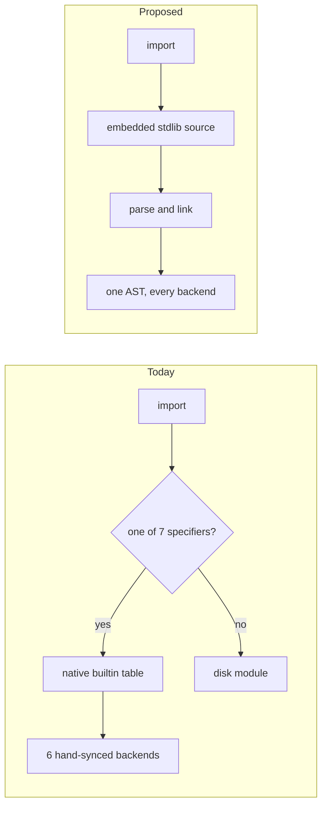

# حدود المدمجات والمكتبة القياسية — The Builtin / Stdlib Boundary

**Status: proposal, awaiting sign-off on the six decisions in §10. No code has been migrated.**

This document fixes the line between what stays a Rust compiler/runtime primitive and what
becomes self-hosted Tarqeem. It is a decision, not a survey: every name that exists today has
exactly one verdict. The census it rests on is [`builtins-inventory.md`](builtins-inventory.md).



The left path is why a name can type-check and then be missing from the interpreter, or lower to a
symbol that does not exist. The right path is one AST reaching every backend from a single
insertion point — the mechanism `مجموعات` and the `استثناء` prelude already use.

> **On «probe» references.** Claims below marked *probe X* were verified by running a short
> throwaway `.ترقيم` program under all three backends — `run`, `run --jit`, and `compile` plus
> execute — against the release binary. The programs were not kept; each is a few lines and is
> described where it is cited. Two of the findings are also pinned permanently in the test suite:
> `tests/module_execution_tests.rs:584-631` asserts the #185 native segfault, and
> `tests/oop_execution_tests.rs:937-940` documents the generic-substitution gap.
> `check` is never used as evidence — it silently degrades relative imports to `أي`.

---

## 0. Executive summary

| | |
|---|---|
| Declared names today | 185 in `Scope` (20 core + 165 across 7 modules), plus ~40 more reachable only through the codegen mangle map |
| **Final primitive registry** | **40 names** |
| Migrated to self-hosted Tarqeem | ~150 names across 9 stdlib modules |
| Dropped (alias collapse) | 26 |
| Dropped (dead — never worked in any backend) | 11 |
| Deferred out of the v1 core registry | the 12 socket primitives (شبكة) |
| ABI-internal symbols | **excluded from the budget entirely** (see §1.4) |

**The single most important empirical result** (probe `P1` vs `P1c`): the *same call* segfaults
natively when it routes through the builtin table, and returns the correct answer on all three
backends when its body is Tarqeem source in a disk module. Migration is not a stylistic
preference — it *fixes* #185 for every name migrated, and closes the 78-name interpreter hole for
free, because one Tarqeem AST reaches interpreter, JIT and native from a single insertion point.

**Three target-spec assumptions are unimplementable and are overridden here.** They are stated in
§9 so the target surface can be corrected rather than silently mis-implemented.

---

## 1. The registry — 40 primitives

### 1.1 Rules applied

1. A name stays only if it meets criterion **(a)** inexpressible / **(b)** syscall / **(c)** intrinsic.
2. **Performance is never a reason.** Every perf-motivated keep is listed in §8 as a future
   optimization candidate instead.
3. Every alias group collapses to **one** surviving spelling. Dropped spellings survive for one
   release as a `م`-category (مهمل) warning, then are removed.
4. An existing Arabic name is reused wherever the capability already exists. Each `new` entry
   states why no existing name covers it.
5. **Standing completeness rule for every row below:** a primitive needs a `Scope` entry **and** a
   `register_builtin_return_types` entry **and** interpreter + debug-interpreter arms. Any two of
   the three is a landmine. Proof: `وقت_الآن` has the Scope entry only, so `وقت_الآن() > 0`
   type-checks and then fails native codegen with *«لا يمكن ترتيب مرجعين بالعامل Gt»*.

### 1.2 Category 1 — Memory & object model: **0 primitives**

Deliberately empty, and this is a verdict, not an omission.

- Value/object construction is **syntax**: `جديد`, `[…]`, string literals. No name is involved.
- **Reference identity already works** and needs no new name. Probe `هوية`: two separately
  constructed objects with equal fields compare `خطأ`; an alias compares `صحيح`; identical in
  interpreter and native. Probe `هوية2` confirms arrays are genuine reference types (mutation
  through an alias is visible through the original). Proposing an identity primitive would violate
  the binding rule against inventing a name for an implemented capability.
- Allocation and refcounting (`trq_alloc`, `trq_retain`, `trq_release`, `trq_free`) are
  **ABI-internal** — see §1.4. They must never become language-visible.

### 1.3 The 40

Legend for **status**: `unchanged` · `renamed` · `narrowed` · `new`.

#### Category 2 — Arithmetic & logic intrinsics (12)

| الاسم | التوقيع | الحالة | التبرير |
|---|---|---|---|
| `عدد` | `(أي) -> عدد` | unchanged | Type-directed at build time: `FloatToInt` / `BoolToInt` are inline IR representation changes with no Tarqeem expression; the string leg is the *checked* parse. Criterion (a)+(c). |
| `عدد_عشري` | `(أي) -> عدد_عشري` | unchanged | `IntToFloat` is a machine instruction; correctly-rounded decimal→f64 is not expressible. Criterion (a)+(c). |
| `نص` | `(أي) -> نص` | unchanged | The **string-coercion intrinsic** that `+` depends on (LANGUAGE_SPEC §5.6). `convert_to_string` selects a formatter from the *static* `IrType`; that selection is exactly what stdlib cannot express. Criterion (c). |
| `منطقي` | `(أي) -> منطقي` | unchanged | `build_truthiness` emits a different comparison per static type. Each branch is writable in Tarqeem; the *selection* is not, and its `أي` parameter is refused by native codegen (ت٠٣٠١). Criterion (c). |
| `جذر` | `(عدد_عشري) -> عدد_عشري` | unchanged | IEEE-754 §5.4.1 lists squareRoot among the **correctly-rounded** operations, beside `+ − × ÷`; one instruction (`sqrtsd`/`fsqrt`) on every supported target. Provably not substitutable by `**`: probe `p3` shows `جذر(-0.0) = -0.0` while `(-0.0) ** 0.5 = 0.0`. Criterion (a). |
| `بتات_و` | `(عدد، عدد) -> عدد` | new | No bitwise capability exists in any spelling — the lexer has no `& \| ^ << >> ~` token and grep finds no Arabic bitwise vocabulary in `stdlib/` or `docs/`. Nothing to reuse. Arrives as a **function**, per the no-syntax-change constraint. Criterion (a). |
| `بتات_أو` | `(عدد، عدد) -> عدد` | new | Same. |
| `بتات_أو_حصري` | `(عدد، عدد) -> عدد` | new | Same. `أو_حصري` describes the function (exclusive or) rather than transliterating XOR. |
| `بتات_نفي` | `(عدد) -> عدد` | new | Same. Distinct from the logical `ليس`, which operates on `منطقي`. |
| `بتات_إزاحة_يسار` | `(عدد، عدد) -> عدد` | new | Same. `إزاحة` is the ordinary Arabic noun for a shift. |
| `بتات_إزاحة_يمين` | `(عدد، عدد) -> عدد` | new | **Arithmetic** (sign-propagating). Correct for 32-bit-masked SHA-256/CRC words. |
| `بتات_إزاحة_يمين_منطقية` | `(عدد، عدد) -> عدد` | new | **Logical** (zero-fill). Required, not redundant: `عدد` is signed i64 and every backend's `Shr` is arithmetic, so a self-hosted xorshift64 or DEFLATE bit reader silently produces wrong numbers *consistently across all three backends* without it. Named to contrast explicitly, since confusing the two is the failure mode. |

> The `بتات_` prefix is chosen over bare `و_بتي` / `أو_ثنائي` for two reasons: it keeps the family
> clear of `و` / `أو`, which are keywords and so cannot be names on their own, and `ثنائي` is
> already taken — it is this codebase's word for *byte array* (`بصمة_ثنائي`, `اضغط_ثنائي`,
> `ثنائي_إلى_ست_عشري`).
>
> **Correction (#302):** an earlier wording here said the prefix avoids *opening* an identifier
> with `و` / `أو`. That is false — an identifier may begin with either letter, as `وقت` and
> `أولوية` do. Only the bare one-letter names are unavailable.
>
> **Correction (#322):** `بتات_إزاحة_يمين_منطقية`'s row claims criterion (a), inexpressible. That
> was true when written and **expired when `بتات_إزاحة_يمين` landed** (#320) — the operation became
> composable from the six names that already existed, pinned by
> `test_logical_right_shift_matches_the_composition_it_names`:
>
> ```tarqeem
> بتات_أو(
>     بتات_إزاحة_يمين(بتات_و(س، 9223372036854775807)، ن)،
>     بتات_و(بتات_إزاحة_يمين(س، 63)، بتات_إزاحة_يسار(1، 63 - ن)))
> ```
>
> The verdict is unchanged and the name shipped as a primitive, on `بتات_نفي`'s grounds (#312) plus
> one this family did not have before: the bitwise names are **core tier**, and §5.2 keeps a
> no-import name a builtin until **B12** is fixed, so stdlib was not an available home. Every
> remaining row asserting criterion (a) should be re-checked against what has landed since, not
> trusted.
>
> **Correction (#333):** `ثنائي_إلى_نص`'s row required that it *not* validate UTF-8, so a socket or
> file read would round-trip. **That is unimplementable across backends**, and the requirement is
> withdrawn rather than mis-built. The interpreter holds a string as `Value::String(Rc<String>)`
> (`src/interpreter/value.rs:20`) — a Rust `String`, which cannot *be* invalid UTF-8 — and natively
> `trq_print` is `if let Ok(text) = std::str::from_utf8(slice)` (`runtime-rs/src/io.rs:27`), so such a
> string prints **nothing** with no error. Honoring the clause needs a value-representation change,
> which §9's binding constraints forbid. Truncating out-of-range elements to the low byte, the house
> convention in `trq_sha256_bytes`, was rejected for the same reason in miniature: `[300]` would
> answer `","` and collide with `[44]`.
>
> **Consequence, recorded so it is not rediscovered:** Increment K cannot use `ثنائي_إلى_نص` to carry
> arbitrary socket bytes. Nothing regresses today — all 23 `شبكة` names already fail. Whoever takes
> Increment K needs either a byte-array-native API — `اقرأ_مجرى`/`اكتب_مجرى` already have byte-array
> signatures, so that route costs nothing new — or the representation change. Filed as
> [#334](https://github.com/osama1998H/tarqeem/issues/334).
>
> Generalisable, and this is the *second* kind of §1.3 defect after the expiring criterion-(a) claims:
> a row can also state a **contract** that no implementation can satisfy. Check the contract against
> the value representation, not only the criterion against the language.
>
> **Criterion (a) also expired for it, making three (#333).** Indexing over `مصفوفة<عدد>` (#330), the
> seven bitwise names, and `رمز_إلى_حرف` (#326) together make UTF-8 decoding writable in Tarqeem;
> `test_bytes_to_string_matches_the_decoder_it_names` runs a hand-written decoder beside the builtin
> in all three backends and they agree. It shipped anyway on `بتات_نفي`'s grounds — core tier, and
> §5.2 keeps a no-import name a builtin until **B12** — with one addition the earlier expiries did not
> have: the *validating* half stays materially harder to hand-write, which is what the primitive buys.
>
> **First re-check under that rule, and it passed (#324).** `حرف_إلى_رمز` was re-derived before
> implementation rather than read off its row, and criterion (a) **holds**: `نص_إلى_ثنائي` does not
> exist (**B9**), `س[i]` and `لكل ح في س` still yield an untyped `Ptr(Void)` (**B6**), and nothing
> in the registry or in `string.rs` turns a character into a number — `حرف_في` returns a
> one-character `نص`, which cannot be compared against a range. So the rule is not "the claim has
> always expired"; it is that the claim has to be *checked*, and the answer differs per name.

**Cost note (headline finding, gap analysis):** all seven bitwise names lower in
`build_core_builtin_call` to `Instruction::Binary` / `Instruction::Unary`, whose variants already
exist and already have arms in the interpreter, the debug interpreter, both JIT tiers, LLVM
codegen and the constant folder. **Two files** — `src/semantic/scope.rs` and
`src/ir/builder/expr_builder.rs` — not nine. Zero `runtime-rs` work.
`بتات_إزاحة_يمين_منطقية` composes existing IR ops, so it too costs zero backend work — though not
by the sketch this note used to give (`(أ >> 1) & 0x7FFF…FFFF` then `>> (ن-1)`, with `ن==0`
returning `أ`), which needs a select on `ن==٠`. #322 shipped a branchless equivalent instead:
clear the sign bit, shift the rest, and place the bit at `٦٣-ن`.

#### Category 3 — String primitives (5)

| الاسم | التوقيع | الحالة | التبرير |
|---|---|---|---|
| `قص_حروف` | `(نص، عدد، عدد) -> نص` | narrowed | **The** codepoint accessor, and the only way self-hosted Tarqeem can reach the i-th character at all — `س[i]` and `لكل ح في س` both yield an untyped `Ptr(Void)` (probes p4/p7). Requires UTF-8 boundary walking over the raw buffer. Subsumes `حرف_في`, which becomes a one-line stdlib wrapper. **Narrowed** because it moves from the `نص` module tier to the core tier (no import) — see §4.3. |
| `حرف_إلى_رمز` | `(نص) -> عدد` | new — **مُنفَّذ (#324)** | Codepoint of the first character; `-1` for empty. Nothing in the 235 declared names or the 42 `string.rs` exports returns a numeric character code — the nearest, `حرف_في`, returns a one-character `نص`. **The single highest-leverage missing primitive:** case conversion, digit parsing, character classification, hex encoding, sorting and hashing are all inexpressible without it. Arity 1 so it composes as `حرف_إلى_رمز(قص_حروف(س، ي، ١))` — one unit throughout, so it cannot participate in the byte/char trap. |
| `رمز_إلى_حرف` | `(عدد) -> نص` | new — **مُنفَّذ (#326)** | Inverse. Required to *build* strings from computed characters, which is what number formatting is. Rejects surrogates and values > U+10FFFF rather than emit invalid UTF-8 — the rejection answers `""`, mirroring `حرف_إلى_رمز`'s `-1`, so the pair is total in both directions instead of leaving a hole. |
| `نص_إلى_ثنائي` | `(نص) -> مصفوفة<عدد>` | new — **مُنفَّذ (#330)** | UTF-8 octets of a string. No bridge existed; the payload buffer is behind the `TrqString` ABI. `ثنائي` is existing vocabulary for a byte array and the `X_إلى_Y` shape matches `ثنائي_إلى_ست_عشري` exactly — reuse of vocabulary, not invention. Criterion (a), re-derived at implementation time and **held**: reaching the i-th character is the only way to encode a string in Tarqeem, and no backend-portable way to do that exists while **B7** is open. `""` and `لا_شيء` both answer an **empty array** — a value, not a sentinel, since a string with no bytes has one unambiguous encoding. |
| `ثنائي_إلى_نص` | `(مصفوفة<عدد>) -> نص` | new — **مُنفَّذ (#333)** | Inverse. **The "must not validate UTF-8" clause written here was wrong and is overridden** — see the correction below. It validates and answers `""` for an element outside 0-255 or a byte sequence that is not an encoding; `[]` and `لا_شيء` answer `""` as a value. Criterion (a) **expired** before it shipped (correction below); it ships as a primitive on §5.2/**B12** plus tier symmetry with its inverse. |

> `نص` is simultaneously the category-3 formatter selector, but it is counted **once**, in
> category 2, and is not repeated here.

**Deliberate cut — `طول_نص` and `قص_نص` are NOT primitives.** This overrides the نص classifier,
which kept both and designated only `قص_نص` as the budget cut. Reasons:

1. Both are derivable once the byte bridge exists: `طول_نص(س) = طول(نص_إلى_ثنائي(س))`,
   `قص_نص(س،ب،ط)` = array-slice the bridge output and rebuild. The only cost is allocation, and
   **performance is not a valid keep reason at this stage.**
2. It makes the primitive string surface **uniformly codepoint-indexed**, which structurally kills
   the byte/char composition trap. That trap is not hypothetical: `stdlib/نص/اساسي.ترقيم:21`
   declares a parameter named `عدد_احرف` and then calls the *byte* slicer `قص_نص`, so
   `قص("مرحباً بالعالم"، ٠، ٦)` returns 3 Arabic characters, not 6. That is checked-in,
   hand-written self-hosted code, and it is the only hand-written self-hosted `نص` code that exists.

Both names survive as call-compatible stdlib functions. Byte-level work happens only through
`نص_إلى_ثنائي` / `ثنائي_إلى_نص` and ordinary array indexing.

**Also cut:** `بايت_عند` (proposed by the نص classifier) — a non-allocating byte read whose only
advantage over the bridge is allocation avoidance. Perf-only, therefore cut.

#### Category 4 — Array primitives (3)

| الاسم | التوقيع | الحالة | التبرير |
|---|---|---|---|
| `طول` | `(أي) -> عدد` | unchanged | Reads the length field of the core array/string representation; the header layout (`TrqArray` 32B / `TrqString` 24B) is not addressable from Tarqeem. Already correctly polymorphic on the live path (`Instruction::ArrayLen` → `trq_string_len_chars` for strings, `trq_array_len` otherwise), verified identical across backends. **Absorbs `طول_مصفوفة`**, which shares literally the same match arm. Criterion (a). |
| `ألحق` | `(مصفوفة<ن>، ن) -> فراغ` | **renamed** from `الحق` | Appending may reallocate the payload and rewrite the header's len/cap — inexpressible in Tarqeem. Criterion (a). The rename is **not an invention**: `ألحق` is the spelling README and LANGUAGE_SPEC §14.3 already document *and* the spelling the live member form already implements (`method_resolver.rs:99`). Today the two forms disagree — `الحق(أ،٤)` works globally but `أ.الحق(٤)` fails; `ألحق(أ،٤)` fails but `أ.ألحق(٤)` works. Unifying on `ألحق` fixes both halves and corrects an orthographic error (`ألحق` is the imperative of أَلْحَقَ). `الحق` retained one release as a `م`-warning alias. |
| `احذف_آخر` | `(مصفوفة<ن>) -> ن` | new (name pre-existing) | The one genuine category-4 hole. Verified missing in every form and every backend: `د٠٠٠١` as a global, «دالة غير معرّفة» as a member; the type checker's alternative spelling `احذف` type-checks and then dies at runtime. The name is **not coined** — LANGUAGE_SPEC §14.3 already documents it and `trq_array_pop` already exists, unused. Criterion (a). |

`new`, `get` and `set` need no names: array literals and `أ[i]` / `أ[i] = v` are syntax, verified
working in all three backends (probe `مصفوفة_دوال`). `trq_array_set` is dead — native element
assignment is lowered directly as GEP+store.

#### Category 5 — Map / hash primitives: **0 primitives**

Category 5 **does not apply**. Maps are not a core runtime type and no hash primitive is needed:

- `runtime-rs` exports zero `trq_map_*` / `trq_dict_*` / `trq_hash_*` symbols.
- `IrType` has no map variant (ten variants, none of them a map), so a map cannot survive into IR.
- The interpreter `Value` enum has no `Map` variant either.
- `Type::Map` exists **only** in the semantic type system; `قاموس<م،ق>` lowers to `Ptr(Void)` and its
  subscript degenerates into `trq_array_get` with a string key. Probe `قاموس_حرفي` fails in all three
  backends.

Maps are already correctly self-hosted as `صنف خريطة<م، ق>` over two parallel arrays in
`stdlib/مجموعات/قاموس.ترقيم`. A future self-hosted hash map needs a hash function, which needs
character codes — independent motivation for `حرف_إلى_رمز`, not for a hash primitive.

*Separately:* the `قاموس` annotation type-checks, compiles, and then misbehaves. That is a bug to
file, not a primitive to add.

#### Category 6 — Introspection & errors (3)

| الاسم | التوقيع | الحالة | التبرير |
|---|---|---|---|
| `نوع` | `(أي) -> نص` | unchanged | Type introspection is explicitly criterion (c). **Loud caveat: it is NOT a dispatch mechanism.** Natively it folds at build time to a constant read off the static `IrType`; through an `أي` parameter even the interpreter returns `كائن` for an `عدد`. No stdlib design may depend on it. Should be fixed to report dynamically in the interpreter during this work, since today it silently disagrees with itself. |
| `توقف` | `(نص) -> فراغ` | unchanged | Abort-with-message: writes to stderr and `process::exit(1)`. No Tarqeem construct can halt the process. Criteria (b)+(c). Fix while here: the stderr text diverges between backends («توقف: X» vs «خطأ فادح: X / Panic: X») though the exit code agrees. |
| `أنهِ_البرنامج` | `(عدد) -> فراغ` | new | Terminate with an **explicit exit status**, no message. Nothing in the system exposes an exit code — the only three `process::exit` calls are all hardcoded to 1 and none is named in Arabic. Without it no Tarqeem program can signal a status to its caller, which makes the language unusable for CLI tools and for the project's own CI. Criterion (b). |

`ارمِ` is a **statement**, not a builtin function, so it consumes no budget. Its machinery stays
compiler-side (criterion c). It remains refused by native codegen with `ت٠٣٠٣` — see §7.

#### Category 7 — I/O syscall wrappers (11)

| الاسم | التوقيع | الحالة | التبرير |
|---|---|---|---|
| `اطبع` | `(أي) -> فراغ` | unchanged | **A compiler intrinsic, and irreducibly so** — see §9.1. Its `Instruction::Print` lowering selects among the print symbols on the static `IrType`; *that selection is the dispatch*, and it cannot exist in Tarqeem. Criterion (c). |
| `اطبع_خطأ` | `(أي) -> فراغ` | unchanged | Same intrinsic, differing only in destination stream. Cannot be a stdlib wrapper over `اطبع` either — the wrapper would need an `أي` parameter and hit `ت٠٣٠١`. |
| `اكتب_مجرى` | `(عدد، مصفوفة<عدد>) -> عدد` | new | `write(2)`. **One** write primitive for stdout, stderr and any open handle. Returns bytes written so short writes stay visible. Replaces eight formatting-in-Rust exports. Criterion (b). |
| `اقرأ_مجرى` | `(عدد، عدد) -> مصفوفة<عدد>` | new | `read(2)`. A zero-length result *is* EOF. Byte-oriented so a multi-byte Arabic codepoint straddling a chunk boundary survives — decoding happens once, in stdlib. Line framing moves out of Rust. Criterion (b). |
| `افتح_ملف` | `(نص، عدد) -> عدد` | new | `open(2)`. Folds `trq_file_open_read/write/append` into one; the mode is `٠` قراءة / `١` كتابة / `٢` إلحاق, exported from stdlib as named `ثابت`s so no user writes the integer. Criterion (b). |
| `اغلق_ملف` | `(عدد) -> منطقي` | new | `close(2)`. Existing implementation (`trq_file_close`) reused unchanged. Criterion (b). |
| `حالة_ملف` | `(نص، عدد) -> عدد` | new | `stat(2)`, one field per call: `حقل ٠` = kind (٠ absent / ١ file / ٢ dir), `حقل ١` = size (`-١` if absent). **Folds four syscall wrappers into one** — `ملف_موجود`, `هل_ملف`, `هل_مجلد`, `حجم_ملف` all become stdlib one-liners. Criterion (b). |
| `احذف_مسار` | `(نص) -> منطقي` | new | `unlink(2)` for a file, `rmdir(2)` for an empty directory, chosen by stat. Folds two symbols; `احذف_ملف` and `احذف_مجلد` survive as stdlib wrappers. Criterion (b). |
| `انشئ_مجلد` | `(نص) -> منطقي` | unchanged | `mkdir(2)`. No composition of open/read/write/close/stat creates a directory. Recursive creation becomes a stdlib loop, not a second primitive. Criterion (b). |
| `قائمة_مجلد` | `(نص) -> مصفوفة<نص>` | unchanged | `readdir(3)`. Directory entries are not readable through a byte stream. One array-returning primitive is a smaller surface than an opendir/readdir/closedir triple. Criterion (b). |
| `انقل_ملف` | `(نص، نص) -> منطقي` | unchanged | `rename(2)` is **atomic**; copy-then-delete is not, and the difference is observable. A capability that cannot be composed from the others is exactly criterion (b). |

#### Category 8 — Environment & time (6)

| الاسم | التوقيع | الحالة | التبرير |
|---|---|---|---|
| `وقت_الآن` | `() -> عدد` | unchanged | `clock_gettime(CLOCK_REALTIME)`, epoch ms. Every date value in the language descends from this one read. **Also the entropy source** the stdlib RNG seeds from — that is literally what `runtime-rs` does today, so no separate entropy primitive is proposed. **Repair required now:** register its IR return type (see §1.1 rule 5). Criterion (b). |
| `وقت_أداء` | `() -> عدد` | unchanged | `clock_gettime(CLOCK_MONOTONIC)`. A distinct OS service from the wall clock. **Its body is wrong today** — `trq_performance_now` is a verbatim copy of `trq_time_now`, so a monotonic promise is served by the wall clock and moves backwards on an NTP step. Fix it in the same PR that registers its return type; a name that lies is worse than a missing name. Criterion (b). |
| `نم` | `(عدد) -> فراغ` | unchanged | `nanosleep(2)`. A busy-wait over `وقت_أداء` burns a core and cannot yield. Already a clean monomorphic wrapper. Criterion (b). |
| `متغير_بيئة` | `(نص) -> نص` | new | `getenv(3)`, `""` when unset. **New Arabic name over an already-implemented orphan symbol** (`trq_env_get`) — implemented, linkable, and unreachable today because no name maps to it. `مجلد_مستخدم` and `مجلد_مؤقت` both reduce to it. Criterion (b). |
| `مجلد_حالي` | `() -> نص` | unchanged | `getcwd(2)` is **process state**, not an environment variable. Deriving it from `$PWD` is wrong: PWD is shell-maintained, absent under non-shell parents, and stale after any chdir. Criterion (b). |
| `معاملات_البرنامج` | `() -> مصفوفة<نص>` | new | Command-line arguments. Category 8 requires them and **nothing in the system exposes them** — `runtime-rs/src/runtime.rs:346` declares `main(_argc, _argv)` and discards both. **Not a free table entry:** it needs `runtime-rs` to capture argv at init *plus* the full nine-site registration path. Without it, and without `أنهِ_البرنامج`, Tarqeem cannot write a CLI tool. Criterion (b). |

#### Category 9 — Optional: **0 primitives in the v1 core**

No module loading, FFI, concurrency or GC primitive is proposed. **Sockets are deferred here and
counted separately** — see §1.5.

### 1.4 ABI-internal symbols are excluded from the budget

`runtime-rs` exports 218 `#[no_mangle]` symbols; roughly 22 are compiler plumbing that Tarqeem
source can never name. They do **not** count toward the 40.

The boundary is structural, not a judgement call: `src/semantic/scope.rs` never mentions a `trq_*`
symbol — it registers an Arabic name and a type signature, purely for name resolution. The
name→symbol binding happens two layers later, in codegen. There is no dynamic symbol lookup
anywhere in the codebase, so **every symbol reachable only from codegen emission is by construction
invisible to Tarqeem source.**

Must remain invisible: `trq_alloc`, `trq_free`, `trq_retain`, `trq_release`, `trq_string_new`,
`trq_string_concat` (the `+` operator), `trq_string_equals` (`==`), `trq_string_compare` (`<` `>`),
`trq_string_char_at` (**the `س[i]` operator** — survives even though its Arabic name `حرف_في`
migrates), `trq_array_new`, `trq_array_get`, `trq_pow_int` / `trq_pow_float` (**the `**` operator** —
survive even though `قوة` / `قوة_عدد` migrate), and the `trq_print_*` family behind `اطبع`.

> **General principle for the whole refactor:** *"runtime symbol the compiler emits"* and *"declared
> name in the registry"* are two different surfaces. Only the second is being shrunk. Deleting
> `trq_pow_int` because `قوة` migrated would silently break `**` for every program.

### 1.5 What was cut, and why

| Cut | Count | Reason |
|---|---|---|
| **Socket primitives** (`نقل_*` × 7, `حزم_*` × 4, `حل_عنوان`) | 12 | Deferred to a separate later registry outside the 35-45 core. **Zero regression:** all 23 `شبكة` names already fail at `tarqeem run`, and natively they are *silently wrong* — probe: `اتصل_خادم(…)` compiles, links, runs, exits 0 and prints **nothing**. No working program can regress. Recommended, but listed in §8 as an owner decision. |
| `بتات_من_عشري` / `عشري_من_بتات` (float↔bits) | 2 | Only float hashing/serialization needs them, and float→string formatting stays behind the `نص` intrinsic, so nothing in the migration set depends on them. They are also the *only* proposed pair that cannot be closed in the IR builder — `Bitcast` is a no-op value copy in the interpreter, pointer-only in LLVM, and absent from both JIT tiers. |
| `بايت_عند` | 1 | Allocation avoidance only. Perf is not a keep reason. |
| `طول_نص`, `قص_نص` | 2 | Derivable from the byte bridge; cutting them makes the primitive string surface uniformly codepoint and kills the byte/char trap. §1.3. |
| `طباعة`, `اطبع_سطر`, `طول_مصفوفة`, `الحق` | 4 | Exact aliases sharing the same match arm. Note these **cannot** be demoted to stdlib wrappers: an `أي` parameter is refused natively (`ت٠٣٠١`), so the choice is binary — extra builtin arm, or removal. Removal, with one release of `م`-warnings. |
| Math aliases (`جا`, `جتا`, `ظا`, `ظتا`, `قا`, `قتا`, `لوغ10`, `أس`, `تقريب`, `أدنى`, `أقصى`, `راديان`, `درجات`, `عشوائي`, `عشوائي_بين`, `جا_عكسي`, `جتا_عكسي`, `بذرة_عشوائية`) | 18 | `.claude/rules/arabic-philosophy.md` §4 deprecates `جا`/`جتا`/`ظا` **by name**; the informative full word survives. They are kept as one-line stdlib wrappers at zero cost, so no user code breaks. |
| `نص_يحتوي`, `نص_يبدأ_بـ`, `نص_ينتهي_بـ` | 3 | Duplicate spellings; the `نص_` prefix is a flat-namespace artefact. Philosophy rule 3 favours the bare interrogative. |
| `نقل_اقبل_مع_مهلة`, `حزم_اغلق`, `احصل_عنوان_محلي`, `حمّل_ويب`, `فك_رمز_رابط` | 5 | Socket-family aliases; moot under the deferral, recorded for completeness. |
| **Dead names** — `كرر`, `بذرة_عشوائية`, `تاريخ_اليوم`, `حلل_تاريخ`, `تاريخ_من_طابع`, `أضف_أيام`, `أضف_أشهر`, `حلل_وقت`, `تاريخ_ووقت_من_طابع`, `حلل_تاريخ_ووقت`, `trq_datetime_now` | 11 | Type-check clean and then fail in **every** backend. Probe `P5`: `كرر` gives «دالة غير معرّفة» interpreted and JIT'd, and natively clang rejects *"use of undefined value `@_U0643__U0631__U0631_`"*. The nine date names return field-bearing structs with no representation below the semantic layer (#298). Their capability is not lost — it is composition of `وقت_الآن` with pure civil-calendar arithmetic, which the self-hosted classes already want to be. |

**Budget check: 12 + 5 + 3 + 0 + 3 + 11 + 6 = 40.** Inside 35-45, all nine categories answered.
(`نص` counted once, in category 2.)

---

## 2. Stdlib layout

Nine modules. `فهرس.ترقيم` is the package entry in each; sub-files carry the implementations.

| Module | Files | Fate | Migrated names |
|---|---|---|---|
| `stdlib/رياضيات/` | `فهرس` · `اساسي` · `ثوابت` · `عشوائي` · `مثلثات` | **revive + rewrite** | 44 canonical + 18 deprecated alias wrappers |
| `stdlib/نص/` | `فهرس` · `اساسي` · `بناء` · `تنسيق` | **rewrite** (the wrappers are unit-buggy; the flat stub's bodies are placeholders returning `خطأ`) | 34 + `طول_نص` + `قص_نص` = 36 |
| `stdlib/ملفات/` | `فهرس` · `ملف` · `مجلد` · `مسار` | **rewrite** on the new syscall primitives | 17 |
| `stdlib/طرفية/` | `فهرس` · `اساسي` · `الوان` · `تنسيق` | **repair + extend** (fix the و٠١٠١ duplicate export first) | 4 (`ادخل`, `ادخل_رسالة`, `ادخل_عدد`, `ادخل_عشري`) |
| `stdlib/وقت/` | `فهرس` · `تاريخ` · `وقت` | **rewrite** (`date.rs` is 8/8 pure civil-calendar arithmetic) | 8 pure + 9 dead names replaced by class methods |
| `stdlib/تشفير/` | `فهرس` · `بصمة` · `ترميز` | **NEW — no `.ترقيم` file exists today** | 10 (8 registry + the 2 unreachable base64 names) |
| `stdlib/ضغط/` | `فهرس` · `جزيب` | **NEW — no `.ترقيم` file exists today** | 6 |
| `stdlib/أخطاء/` | `فهرس` | **repair** (`فهرس.ترقيم:21` fails to parse) | 2 (`تأكد`, `تأكد_رسالة`) — gated on the linker fix |
| `stdlib/مجموعات/` | 7 files | **unchanged** — the one module that loads and type-checks clean today | 0 (blocked on generics, §7) |
| `stdlib/شبكة/` | `فهرس` · `اتصال` · `خادم` · `ويب` | **deferred** with the socket registry | ~40 later |

### 2.1 Deletions and scrubbing — required, not optional

**Delete the seven flat stubs.** `stdlib/أخطاء.ترقيم`, `اختبار.ترقيم`, `رياضيات.ترقيم`,
`شبكة.ترقيم`, `ملفات.ترقيم`, `نص.ترقيم`, `وقت.ترقيم` each duplicate a `فهرس.ترقيم` package and
compete for the same specifier. Resolution order is unsettled, so today *the stub can win* — and the
stubs are placeholders: `stdlib/نص.ترقيم` implements `يحتوي` as `أرجع خطأ` and `كرر` as
`أرجع نص` (returns its own argument). Deleting them resolves the ambiguity in favour of the
packages.

**Scrub three known collisions** before the corresponding module is flipped to disk:

1. `stdlib/نص/اساسي.ترقيم:170` exports `طول(سلسلة: نص) -> عدد`. Module merging is **fatal** on
   collision (`و٠١٠١`), never shadowing — this will break every importer that also uses the core
   `طول`. The file's own comment at line 167 shows this was noticed and papered over.
2. `stdlib/وقت/تاريخ.ترقيم:220-221` defines `عام دالة أضف_أشهر` whose body calls `أضف_أشهر(…)`.
   Once `أضف_أشهر` is no longer a builtin that is unconditional infinite self-recursion. The body
   must be rewritten as arithmetic.
3. `stdlib/شبكة/فهرس.ترقيم` re-exports `صدّر * من "./http"` but the file on disk is `ويب.ترقيم`.
   The module cannot load until that is corrected.

Also: `stdlib/رياضيات/عشوائي.ترقيم` calls `عشوائي_نطاق` and `عشوائي_عشري_نطاق`, **neither of which
exists** (the real names are `عشوائي_بين` / `عشوائي_عشري_بين`). It compiles today only because the
specifier never touches disk. The moment it goes live this breaks. Budget the repair into the
same increment.

---

## 3. Naming convention: primitives vs public API

### 3.1 The hard constraint

Probe `P4` (`دالة طول(س: نص) { أرجع طول(س) }`) is decisive and worse than documented:
interpreter and JIT stop with a bilingual «تجاوز المكدس»; **the native binary compiles cleanly,
exits 0 from `compile`, and then SIGSEGVs with no diagnostic whatsoever.** There is no syntax to
reach a shadowed builtin, so a stdlib wrapper may never bear the name of a still-registered builtin.

### 3.2 Recommended convention: **role-disjoint naming + delete-then-define**

Two rules, and together they make same-name collision structurally impossible:

1. **Primitives are named for the MECHANISM; stdlib is named for the TASK.** The primitive tier is
   deliberately lower-level, so it is naturally differently named. This is already how the
   proposed registry reads:

   | Primitive (mechanism) | Stdlib (task) |
   |---|---|
   | `اكتب_مجرى` | `اطبع_ملف`, `اكتب_ملف`, `الحق_ملف` |
   | `حالة_ملف` | `ملف_موجود`, `هل_ملف`, `هل_مجلد`, `حجم_ملف` |
   | `قص_حروف` | `قص`, `اول_حروف`, `حرف_في`, `موضع` |
   | `نص_إلى_ثنائي` | `احسب_بصمة`, `إلى_ست_عشري`, `اضغط` |
   | `حرف_إلى_رمز` | `كبير`, `صغير`, `رقمي`, `عربي`, `نص_لعدد` |
   | `بتات_أو_حصري` | `عشوائي_عدد`, CRC32 |

2. **Where a public name must survive unchanged and its implementation moves to stdlib**
   (`مطلق`, `جيب`, `يحتوي`, `اقرأ_ملف`, …), the builtin registration is **deleted in the same
   commit** that defines the stdlib function. Never a wrapper over a live builtin of the same name.
   The probe verdict states this precisely: *"A full replacement may keep the public name if the
   builtin is simultaneously deleted from all registration sites."*

### 3.3 Rejected alternative

**Today's convention — "import the native under its own name, export a differently-spelled thin
wrapper"** (`stdlib/رياضيات/اساسي.ترقيم:14`; `مثلثات.ترقيم` defines `جا` as a wrapper calling
`جيب`). Rejected because it is precisely what produced the 50 alias groups covering 106 of 235
names: every wrapper needs a second public spelling that means nothing, and the whole scheme is
load-bearing on the alias surviving. `مثلثات.ترقيم` works *only* because `جا` and `جيب` are two
registry names for the same symbol; the moment either alias is dropped, every wrapper in the file
becomes an infinite self-call — which is why that file must be rewritten in the same commit that
drops the aliases, not after.

A second alternative — decorating primitives (`مدمج_طول`, `أصلي_طول`) — was rejected because it
renames every existing public name for no capability gain and reads as an English-shaped
transliteration convention rather than description.

---

## 4. Bundling — how stdlib source reaches a compiled program

### 4.1 Recommendation: **`include_str!` embedding, injected through the existing synthetic-module path, with `TARQEEM_HOME` retained as a development override.**

Compile every `stdlib/**/*.ترقيم` into the binary with `include_str!`, and register the modules
through the **same** `ModuleLoader::insert_synthetic_module` machinery the `استثناء` prelude already
uses. Resolution order becomes: relative path → **embedded stdlib** → `TARQEEM_HOME` override (opt-in,
for stdlib development) → package cache.

### 4.2 Why not the other two

**Disk search path (status quo).** It works — `مجموعات` genuinely loads and type-checks clean — but:

- `TARQEEM_HOME` **silently shadows** the repo's own stdlib; the project already had to work around
  this with `env -u TARQEEM_HOME` in CLI verification.
- **LSP and DAP get zero search paths**, so disk-loaded stdlib silently degrades to `أي` in the
  editor (#230). Migrating 150 names to disk today would turn the entire stdlib into `أي` for every
  user of the language server — a large, invisible regression.
- `check` degrades relative imports to `أي` silently, so it cannot be trusted as evidence.
- Shipping requires the user to have the stdlib tree at a known path; a single-binary install breaks.

**Prelude for everything.** The mechanism is fully general (`insert_synthetic_module` takes any
path/source/AST; `prelude_ast()` parses a `&str` constant, so size is unbounded; the guard permits
`FuncDecl`). But prelude declarations are *merged*, and a merge collision is fatal `و٠١٠١` — see
§5. Using it for the whole stdlib would make every stdlib name un-shadowable, a much larger
semantic change than this refactor is allowed to make.

### 4.3 What it costs

| Cost | Size |
|---|---|
| Stdlib changes require a compiler rebuild for end users | Real; acceptable for a compiled language, and matches Rust/Go |
| Binary grows by the stdlib source text | Tens of KB — negligible |
| The loader needs a new embedded-source resolution tier ahead of disk | One change in `src/semantic/modules.rs`, mirroring `insert_synthetic_module` |
| Stdlib parse cost is paid on every compile | Mitigable later by caching the parsed AST; **not** a reason to choose differently now |

**What it buys:** LSP and DAP get real types instead of `أي` (fixes #230 for the stdlib half), no
env-var shadowing, hermetic and reproducible builds, and one code path shared by interpreter, JIT,
native, LSP and DAP — the same property that makes migration worth doing at all.

### 4.4 The specifier flip is per-module and atomic

`src/semantic/analyzer/stmt_analyzer.rs:1122-1128` short-circuits **by specifier**, not by name, and
`src/semantic/modules.rs:299` then skips loading it. So `"رياضيات"` cannot be half table and half
disk: the moment it leaves `Scope::get_stdlib_modules()`, **all 64 of its names must resolve from
the module**. This shapes the migration order — see §6.2.

---

## 5. Prelude — how no-import names stay call-compatible

### 5.1 What the probe established (TEST 3), not speculation

| Observation | Result |
|---|---|
| Mechanism generality | `insert_synthetic_module` takes any (path, source, AST); nothing special-cases `استثناء`; `prelude_ast()` merely parses a `&str`, so size is unbounded; the guard permits `ClassDecl \| InterfaceDecl \| FuncDecl \| EnumDecl` — **functions are injectable** |
| Redeclaring a **prelude class** (`صنف استثناء`) | **Fatal `ص٠٦٠٢`** in all three backends (`P3_collision`) |
| Duplicate top-level name across merged modules | **Fatal `و٠١٠١`** in all three backends (`P3_linkercollide`) |
| Redeclaring a **builtin** (`دالة نوع`) | **Legally shadows** — prints `دالتي` in all three backends (`P3b`) |
| Redeclaring `اطبع` | Shadows correctly in interpreter and native (`p3_shadow`) |

**Conclusion: moving a no-import name from the builtin tier into the prelude is a semantic
regression.** It converts documented, working `LANGUAGE_SPEC §4.9` shadowing into a hard compile
error.

### 5.2 The rule

> **A name that must work with no import stays a compiler builtin (last lookup tier, shadowable)
> until `src/semantic/linker.rs` learns to treat prelude-origin top-level declarations as
> displaceable by a user declaration of the same name — mirroring the builtin tier — rather than
> emitting `و٠١٠١`.**

Consequences, applied uniformly:

- **All 40 registry primitives stay builtins.** None moves to the prelude. In particular `اطبع` —
  the name users are most likely to shadow — never moves.
- **`ادخل`, `ادخل_رسالة`, `تأكد`, `تأكد_رسالة`, `فاصل_مسار` are prelude-gated.** Until the linker
  change lands, they **stay builtins**. There is no interim break and no interim import
  requirement.
- Once the linker change lands, they move into prelude-injected synthetic modules (`طرفية` for the
  input pair, `أخطاء` for the assertion pair, `منصة` for the platform constant), and become
  ordinary self-hosted Tarqeem visible with no import.
- Precedent that the prelude *can* be special-cased already exists: redefining `استثناء` yields the
  bespoke `ص٠٦٠٢`, not the generic `و٠١٠١`. The linker already distinguishes prelude origin; it
  just currently uses that knowledge to produce a *better error* rather than to allow displacement.

`فاصل_مسار` is the cleanest illustration of what the prelude is *for*: it is a compile-time platform
constant, not a computation and not a syscall. Tarqeem source cannot compute it, and inventing an
`اسم_المنصة()` primitive for one character is disproportionate. A synthetic `منصة` module whose
source text is built from the target triple already known to `src/codegen/target.rs` emits
`صدّر ثابت فاصل_مسار = "/"` or `"\\"` — target-correct, zero runtime symbols, zero primitives.

---

## 6. Migration order

Each increment is independently shippable with the full suite green. Ordered lowest-risk /
highest-proof first.

### 6.0 Increment 0 — Blocker clearance

Not a migration. See §7. Nothing below may start until items B1-B5 are done.

### 6.1 Increment A — the seven bitwise primitives

**Complete: 7 of 7 landed.** `بتات_و` (#302), `بتات_أو` (#306), `بتات_أو_حصري` (#309),
`بتات_نفي` (#312), `بتات_إزاحة_يسار` (#317), `بتات_إزاحة_يمين` (#320) and
`بتات_إزاحة_يمين_منطقية` (#322) — a `Scope` entry each plus a `build_core_builtin_call` arm: one
shared arm emitting `BinaryOp::BitAnd` / `BitOr` / `BitXor` over `IrType::Int`, a second for
`UnaryOp::BitNot`, and one per shift over a shared range guard. The two-file cost estimate below
held exactly, seven times: no `runtime-rs` work, no runtime symbol, no interpreter or
debug-interpreter arm (an intercepted builtin emits no `Call`), and no
`register_builtin_return_types` entry (`var_types` carries `Int` directly). All seven verified in
all four executing backends — interpreter, JIT, native, and the DAP debug interpreter. #312
extended the estimate to the `Unary` shape and #317 to a **multi-instruction chain**, which were
the two untested assumptions in it; #320 added nothing new to it, which is itself the result — the
second shift cost no new mechanism and, after the guard was shared, no extra instruction either:
both tails are three ops over the same six-op guard. #322's tail is nine ops over that same
guard, the longest of the three and still no new mechanism, so the estimate now covers the whole
range of shapes the family has.

With XOR landed the three logic operations were complete, and with them the bitwise
complement: `بتات_أو_حصري(س، -1)` flips every bit, which neither AND nor OR can do. `بتات_نفي`
therefore landed as a **spelling for an already-reachable operation**, not as a new capability
— its case was call-site readability and registry completeness, and its execution probes
assert agreement with the XOR form rather than treating it as independent. The verdict in
§1.3 is unchanged; the justification recorded there is.

`بتات_إزاحة_يمين_منطقية` (#322) is the **second** name in that position, and it is the more
instructive one because its row claimed criterion (a) rather than convenience. Landing
`بتات_إزاحة_يمين` made the logical shift composable from the six names that existed, so by the
time the seventh was written its own justification had expired — see the §1.3 correction. It
shipped anyway, on `بتات_نفي`'s readability grounds plus §5.2: the family is core tier and a
no-import name cannot live in stdlib until **B12** is fixed. Its probes assert the equivalence
with the composition instead of asserting a capability it no longer adds.

**Generalisable, and it applies to the rest of this document:** an inexpressibility claim is a
statement about the language *at the time of writing*, and every increment that lands changes what
is expressible. Two of the 21 `new` rows have now had that claim expire under them. Re-derive
criterion (a) at the start of each increment rather than reading it off §1.3.

One caveat found while landing #302 and confirmed unchanged by #306, #309, #312, #317, #320 and
#322: an intercepted builtin **segfaults natively as an element of an array literal** (#304). It
predates all seven — the same call in any other position is correct in every backend, and
`طول_مصفوفة` reproduces it — so it gates nothing here, but self-hosted stdlib written on these
primitives must avoid that shape until it is fixed.

A second caveat, surfaced by #317 because its chain is the first lowering to read one operand
**twice**: codegen unboxes a narrowed optional only on that operand's *first* scalar use, so the
second emits the raw pointer and clang rejects the module (#318). Reachable from ordinary source
as `س + س` inside `إذا (س != لا_شيء)`, so it predates the shift; the workaround is to copy the
amount once (`أ | ٠`), and since #320 it lives in the guard both shifts share. Any later lowering
that reads an operand more than once must do the same until #318 is fixed.

#322 is the first shift to read the **value** twice as well, and it shows the workaround has a
cheaper form when the lowering already needs a mask: `س & keep` is one instruction that both unboxes the
value and applies the out-of-range answer, so no separate copy is emitted. Prefer folding the copy
into work the arm already does over adding an `أ | ٠`. Either form is load-bearing and neither is
an optimizable identity — a peephole for `x | 0` or `x & -1` would silently restore #318.

**Why first:** highest ratio of unblocking to risk in the whole plan. Two files
(`scope.rs` + `expr_builder.rs`), zero backend work, zero `runtime-rs` work, zero migration — the IR
variants, the interpreter arms, both JIT tiers, LLVM codegen and the constant folder all already
exist and are already unit-tested. It unblocks تشفير, ضغط, the RNG and hex/base64 outright.

**Gate:** unit tests per name at all three backends, an `examples/` program exercising all seven that
the CI backend-diff job runs, and explicit range-check documentation.

**Range contract — decided in #317, amended in #320.** Unguarded the divergence is four ways, not
the three recorded here before: both interpreters raise «مقدار الإزاحة خارج النطاق», LLVM's
`shl i64` is poison, Cranelift's `ishl` masks, and the constant folder's `wrapping_shl` masks — so
native disagreed with the interpreter *and with itself*, depending on whether the amount was a
literal. The IR builder therefore emits a shared guard chain (`ن >> ٦` is zero exactly on 0-63;
`high | -high` spreads the sign to a -1/0 mask; the amount is masked to 0-63 before the shift),
which costs no backend arm and leaves the interpreters' range errors unreachable from the
builtin. The guard is branchless and uses only ops with arms in all six consumers; in particular
it avoids `BoolToInt`, which **neither JIT tier implements**.

#317 stated the resulting contract as *"an amount outside 0-63 yields `٠`, and the whole family
inherits it verbatim"*. **The number does not generalise; the reasoning does.** #317 chose `٠`
because `٠` is what a left shift by 64 or more genuinely produces — every bit leaves the word and
zeros fill behind it — and rejected masking the amount mod 64 (C's and Cranelift's behaviour,
under which `بتات_إزاحة_يسار(١، ٦٤) == ١`) as transliterated rather than described. An
**arithmetic** right shift refills from the sign, so shifting everything out leaves the sign, not
zero. Carrying the constant across while dropping the reasoning would put a cliff between
`بتات_إزاحة_يمين(-١، ٦٣) == -١` and `بتات_إزاحة_يمين(-١، ٦٤) == ٠`, which is exactly the sentinel
#317 refused.

So the contract is one clause, stated one level up:

> **An amount outside 0-63 is a complete shift, and the vacated bits are filled the way that
> shift always fills them.**

Zeros for `بتات_إزاحة_يسار`, so `٠` — #317's behaviour is unchanged. The sign for
`بتات_إزاحة_يمين`, so `٠` for a non-negative operand and `-١` for a negative one. Zeros again for
`بتات_إزاحة_يمين_منطقية`, so `٠` — the amendment changed the behaviour of exactly one of the three
names. Negative amounts fold into the same clause rather than getting a second one.

#322 shipped that third answer unchanged, which is the amendment's own test: the criterion was
written before the name it predicted, and produced `٠` for a *negative* operand where its sibling
produces `-١`. The two right shifts therefore agree on the rule and disagree on the number, out of
range exactly as in range.

It also gives the right shift the counterpart of the identity documented for the left one: a left
shift is multiplication by powers of two bounded by the sign bit, and a right shift is **floor**
division by powers of two — `بتات_إزاحة_يمين(س، ن) == floor(س / ٢**ن)` at every `ن ≥ ٠`, with no
boundary at 64. Under the inherited wording that identity would hold to 63 and then stop.

Implementation difference: the left shift masks the *result* to zero out of range, the arithmetic
right shift saturates the *amount* to 63. `guard.amount | (٦٣ & out_of_range)` saturates without a
select, because the guard's masked amount already fits in those six bits. Three instructions — the
same number the left shift's tail costs, so the two lower to identical instruction counts.

The logical right shift masks the **value** instead, which is the only one of the three positions
that works for it: it needs a zero result out of range like `يسار`, but it reads the value twice,
so zeroing the value zeroes every term below *and* serves as the #318 copy. Its tail is `س & keep`,
then the sign bit separated (`& ٩٢٢٣٣٧٢٠٣٦٨٥٤٧٧٥٨٠٧`) and shifted, then re-placed at `٦٣-ن` —
nine instructions, and `٦٣-ن` reads the guard's *masked* amount so it too stays in range.

**Lexer check — done (#309), extended (#322), and it passed both times.** `بتات_أو_حصري` lexes as
**one identifier**: the greedy identifier scan neither stops at the embedded `أو` nor resumes after
it. The mid-name
position was the harder shape — a split there would have parsed as a logical-or between
`بتات_` and `_حصري` rather than failing outright. Pinned by
`lexer::tests::test_identifier_containing_a_keyword_stays_one_token`, which covers all five
spellings that embed one — `بتات_نفي` was added to it because `في` is also a keyword
(`TokenKind::In`), in the same suffix position as `و` and `أو`. `بتات_إزاحة_يسار` and
`بتات_إزاحة_يمين` embed no keyword, so #317 and #320 deliberately left that test alone rather than
diluting what it tests.

`بتات_إزاحة_يمين_منطقية` **does** embed one, so #322 extended it — and in the one shape the other
four do not cover: `منطقي` is followed by a *letter* (`ة`) rather than by `_` or the end of the
name, so a scan that resumed after a keyword match would split a word rather than a separator. Both
conclusions are recorded because "the previous ones left it alone" is exactly the kind of pattern
that gets copied without checking; the check is per name, and the answer changed on the seventh.

### 6.2 Increment B — the character/byte bridge, and repairing `قص_حروف`

Four new primitives (`حرف_إلى_رمز`, `رمز_إلى_حرف`, `نص_إلى_ثنائي`, `ثنائي_إلى_نص`) plus moving
`قص_حروف` to the core tier with its IR return type registered and interpreter + debug arms written.
Five names × the full nine-site path — the most registration work in the plan, and the last time it
is paid at scale.

**Progress: 4 of 5 landed.** `حرف_إلى_رمز` (#324), `رمز_إلى_حرف` (#326), `نص_إلى_ثنائي` (#330) and
`ثنائي_إلى_نص` (#333). Remaining: `قص_حروف`'s repair (**B7**, still open) — a repair, not a new name,
so the four *new* primitives of this increment are complete. **Not one atomic change** — the
increment is landing a name at a time, as Increment A did, and each name's criterion (a) is
re-derived when its turn comes rather than trusted from §1.3.

**What #324 measured, since Increment A's cost note does not transfer.** The seven bitwise names
were IR-intercepted and cost two files each; `حرف_إلى_رمز` is the first *new* symbol-mapped core
builtin, and it cost the full path: a `runtime-rs` function, a `Scope` entry, a
`register_builtin_return_types` entry, `is_builtin` **and** a dispatch arm in *both* interpreters,
and an LLVM `declare` **plus** a `get_runtime_function_name` entry. `expr_builder.rs` — the whole
native story for seven consecutive increments — needed **no** edit: a core builtin absent from
`build_core_builtin_call` falls through to `Instruction::Call { func: FuncId(arabic_name) }` on its
own, carrying the *Arabic* name to codegen, so both interpreters key their arms on that name and
neither needs a `trq_*` arm. The template for this shape is `توقف`/`تأكد`, not `بتات_و`.

Three things #324 found that the plan did not state:

1. **`Type::compat` lets an un-narrowed `نص?` into a `نص` parameter** (`types.rs:83`), and native
   lowers it to `ptr null`, where a runtime null guard answers. An interpreter arm keyed only on
   `Value::String` would therefore raise a type error on source that native runs fine — a
   cross-backend divergence reachable from two ordinary lines. Every symbol-mapped primitive whose
   runtime function guards null needs a matching `Value::Null` arm in both interpreters.
2. **`as_str` (`runtime-rs/src/string.rs`) trims**, so reusing it in a new char-level primitive
   would silently disagree with the interpreter's `chars().next()` on a leading space. The
   char-aware family's own convention — raw `from_raw_parts` plus the private `utf8_char_len` — is
   the one to follow.
3. **Decode only the first character's bytes, never the whole buffer.** `from_utf8` over the whole
   slice fails when *any* later byte is invalid, which would throw away a perfectly decodable first
   character. The reason given here was that `ثنائي_إلى_نص` would not validate, which #333 withdrew;
   the guidance survives its own rationale, because a `TrqString` can hold invalid UTF-8 natively
   anyway — `trq_string_new` takes raw bytes and `قص_نص` cuts on byte boundaries.

**What #326 added, and one correction to the above.** `رمز_إلى_حرف` cost the same nine sites and
found nothing new about the path, which is the result. Its criterion (a) was re-derived and
**held** for the second consecutive name: `نص(٦٥)` formats the digits `"65"`, the byte bridge is
still absent (**B9**), and `س[i]` is still `Ptr(Void)` (**B6**).

Finding 1 above is stated too broadly and is narrowed here: *"any symbol-mapped primitive whose
runtime function guards null needs a matching `Value::Null` arm"* holds only where the parameter
is a **pointer** and the runtime guard is a designed answer. For an `عدد` parameter there is no
null to guard — codegen turns `لا_شيء` into `0` above the runtime — so mirroring it would encode
an artifact as contract. `رمز_إلى_حرف` therefore has **no** `Null` arm, matching `نم` and
`بتات_نفي`, which diverge identically on the same source. The underlying defect is filed as
**#327**: a *narrowed* optional passed as a call argument emits the raw pointer natively, the
module is valid LLVM IR, and the binary runs to completion with a wrong answer. A plain
user-defined function reproduces it, so it belongs to the call-argument path rather than to any
builtin — and it is worse than #318, which at least fails to compile.

Generalisable: before mirroring a sibling's edge-case arm, check whether the mechanism that
produced the sibling's answer exists for this name. Here it did not, and the two names differ in
the one place the family otherwise looks uniform.

**What #330 added: the first core builtin returning an array — and the nine sites did not grow.**
`نص_إلى_ثنائي` was expected to be the expensive one, because no core-tier name had returned a
`مصفوفة` before. It cost the same nine sites, plus one lexer test, and **zero new mechanism**: the
stdlib tier had already paid for array returns, and `اضغط` is `(نص) -> مصفوفة<عدد>` — this name's
exact signature — with `IrType::Array(Box::new(IrType::Int), 0)` registered since #241 and
`examples/تشفير_وضغط.ترقيم` composing such a result with `طول` across all three backends in CI.
The lesson is the reverse of Increment A's: **check whether a "first" is a first for the
*mechanism* or only for the *tier*.** Here it was only the tier.

Four things #330 found that the plan did not state:

1. **A missing `register_builtin_return_types` entry is *quieter* for an array than for a scalar.**
   §1.1 rule 5 and the `جذر` note describe the failure as a signature mismatch — `call ptr` against
   a `declare i64`. For an array return there is no mismatch to catch: `Ptr(Void)` and `Array` both
   map to LLVM `ptr`, so the module is valid, links, and runs. Verified by deleting the entry:
   indexing still answered `65` and `اطبع` still printed the array, and the only assertion that
   failed was `نوع(…)`, which returned `مؤشر` instead of `عدد`. That is why the composition test
   asserts `نوع` and indexing rather than printing alone — and printing would have passed.
2. **`نص(<array>)` is a live cross-behaviour divergence — filed as #331 — and it runs the opposite
   way round from the prediction.** `convert_to_string` has no `Array` arm and falls through to
   `trq_int_to_string`. The expectation was that native would reject the module and the interpreters
   would print `[104، 105]`; **measured, it is the reverse.** Both interpreters raise
   «متوقع عدد، وُجد array», and **native compiles, runs, prints the pointer as a decimal integer
   (`4353416272`) and exits 0** — the silent-wrong-output mode, not a build failure. The `ptr`
   argument is simply dropped into the `i64` slot, because `runtime_scalar_param`'s unboxing fires
   only for `Ptr(Int)`. `"…" + <array>` is refused cleanly by `binary_result_type`, so `نص` is the
   only way in. Nothing in the tests or the example uses it. **Worth stating as method:** this claim
   was written from a source trace and was wrong in the direction that matters; running it took one
   file and three commands. Trace to form the hypothesis, run to record the behaviour.
3. **The `Value::Null` arm was required here, and #326's narrowing predicted it correctly.** The
   parameter is a **pointer**, so the runtime's null guard is a designed answer rather than the
   integer-zero artifact `رمز_إلى_حرف` faced. With the arm, an un-narrowed `نص?` answers an empty
   array and exits 0 in all three backends — verified, and covered cross-backend rather than only in
   a unit test, since the shape provably agrees. The *narrowed* shape is still #327 and is untested.
4. **The keyword-embedding check changed its answer a third time.** `نص_إلى_ثنائي` is the first name
   in either family whose embedded keyword — `نص`, `TokenKind::TypeString` — **opens** the name.
   Every previous case in `test_identifier_containing_a_keyword_stays_one_token` has the keyword in
   suffix or mid-name position. A longest-keyword-prefix scan would emit `TypeString` then
   `_إلى_ثنائي`, which is a *plausible* pair (a type followed by a name) and so would fail somewhere
   later rather than at the name. The test was extended. Three names, three different answers — the
   check is per name, and "the last one needed nothing" remains worthless as evidence.

**Gate:** a **composition** test, not a print test. `"X" + حرف_في(س،١)` printed `X4377631856`
natively today — printing alone passes while composition is silently wrong. The examples program
must concatenate and compare each primitive's result, across all three backends. #324's
`test_char_code_result_composes_as_an_integer` is that gate for the first name, and it is the test
that fails if the `register_builtin_return_types` entry is ever dropped.

**What #333 added: the nine sites did not grow, and the *contract* was the expensive part.**
`ثنائي_إلى_نص` cost the same nine sites as its three siblings plus one lexer case, with zero new
mechanism — `trq_sha256_bytes(*const TrqArray) -> *mut TrqString` is this signature exactly, so like
#330 the "first" was only a first for its tier. What actually cost time was discovering that the row's
stated contract could not be implemented (see the §1.3 correction). Four things it found that the plan
did not state:

1. **A missing `register_builtin_return_types` entry is *louder* for a `نص` return than for an
   array.** #330 measured that only `نوع` caught the array case. Measured here by deleting the entry:
   `اطبع` still printed «مرحبا» correctly, but `نوع` answered `مؤشر`, `"X" + …` printed
   `X4340804192`, and `== "﷽"` answered `خطأ`. Three of five assertions caught it rather than one,
   because concatenation and comparison both degrade visibly on a string where indexing and printing
   did not on an array. **The composition test must still assert all three** — printing alone passes
   either way.
2. **`مصفوفة<عدد>؟` does not parse** — `ب٠١٠١` at the `?`, even though §5.3's grammar admits
   `نمط_اختياري := نمط '?'`. So the route that made a `Value::Null` arm load-bearing for
   `نص_إلى_ثنائي` (an un-narrowed `نص?` slipping through `Type::compat`) does not exist here. The arm
   is still required, reached instead through an **`أي` holder**, where both backends agree on `""`.
   Refines #326's rule a third time: ask not only whether the parameter is a pointer, but *how a null
   can be written at all* — the answer differed per name for the third consecutive name.
3. **The array-literal-as-argument shape works.** Probed before writing fixtures, because #304 (an
   intercepted builtin *inside* a literal) and #327 (the call-argument path) both live next door.
   `ثنائي_إلى_ست_عشري([104، 105])` is correct in all three backends, so `ثنائي_إلى_نص([217، 133])` is
   a safe fixture. Worth keeping: the probe cost one file and confirmed a shape three siblings never
   exercised.
4. **Sharing one decode helper beat duplicating the arm.** `bytes_to_string` is `pub(crate)` in
   `interpreter::executor::builtins` and re-exported for the debug interpreter, the way
   `Value::to_display_string` already is, so the rejection rule cannot drift between them. Prefer this
   to a second copy whenever the logic — not just the dispatch — is identical.

### 6.3 Increment C — `رياضيات`

Flip `"رياضيات"` out of `get_stdlib_modules()` **once**, in this increment. Because the flip is
atomic (§4.4), the disk module must answer all 64 names on day one. It does so in two layers:

- **Wave 1 (real implementations, ~19 names)** — `مطلق`, `علامة`, `أقل`, `أكبر`, `حصر`, `باقي`,
  `قاسم_مشترك`, `مضاعف_مشترك`, `عاملي`, `قوة`, `أرضية`, `سقف`, `قرّب`, `اقتطع` and the `_عدد`
  siblings. **These already exist and ship** in `stdlib/رياضيات/اساسي.ترقيم`. This is the increment
  probe `P1` literally ran: pure-Tarqeem `قيمة_مطلقة` / `الأكبر` / `الأصغر` / `محصور` in a disk
  module, byte-identical on interpreter, JIT and native — while the builtin-table control `P1c`
  segfaulted natively.
- **Scaffolding (the rest)** — trig, log/exp and the RNG remain thin wrappers over the *still-registered
  alias* builtins (`جيب` → `جا`, exactly as `مثلثات.ترقيم` does today). The alias pairs are the
  scaffolding that makes the atomic flip possible.

Waves 2 and 3 then replace scaffolding **in place**, and each alias builtin is deleted in the same
commit as its replacement — never before, or the wrapper self-recurses.

> **Unverified assumption — run this probe before starting Increment C.** The scaffolding assumes a
> name in the *stdlib-builtin table* (tier 165, e.g. `جا`) resolves **without an import** from
> inside a disk-loaded module. Nothing in the Phase-2 transcript verifies that. The lookup order is
> محلي ← محيط ← وحدة ← مستورد ← مدمج, and the shipped wrapper convention is worded as
> "*import* the native under its own name" — so the table names may be import-only. If they are,
> then after the flip `استورد … من "رياضيات"` resolves to the disk package itself and every
> scaffolding wrapper's callee becomes unresolvable: the flip fails at type-check, loudly but late.
> **Probe:** a disk module calling `جا(٠.٥)` bare, with no import, on all three backends.
> **Fallback if it fails:** temporarily promote the ~15 scaffolding aliases into `core_builtins`
> for the transition, deleting each in the same commit as its wave-2/3 replacement — consistent
> with §11 rule 1, and reversible.

**Gate:** a value oracle across dense samples *including signed zeros, subnormals, infinities, NaN,
and the 2^52 / 2^63 boundaries*, on all three backends. Extend `.github/workflows/examples.yml`,
which already diffs the three, rather than inventing a mechanism. #185's native segfault regression
test flips to passing.

### 6.4 Increment D — `وقت` (date arithmetic)

`date.rs` is 8/8 pure — explicit proleptic-Gregorian civil-day arithmetic that never reads a clock —
so all eight migrate, and the nine struct-returning dead names are replaced by `مشترك دالة` methods
on the existing `صنف تاريخ` / `صنف وقت`, all rooted in the `وقت_الآن` primitive.

**Contract to inherit verbatim:** weekdays `0 = الأحد` … `6 = السبت`; ISO-8601 week numbering;
Arabic day/month names for `DDD`/`MMM`; the `YEAR_LIMIT` clamp that keeps `days_from_civil`'s
`era * 146097` term from overflowing. Fix `أضف_أشهر`'s self-call (§2.1) in this increment.

### 6.5 Increment E — `تشفير` hex + base64 codecs

Requires A + B. Pure byte↔character mapping, trivial per name. `ترميز_أساس64` / `فك_أساس64` gain a
registry entry for the first time — they are implemented and lowered today but unreachable, and
`stdlib/شبكة/ويب.ترقيم:291` already calls one of them.

### 6.6 Increment F — `نص`

Requires B **and blocker B6** (the character-binding inference defect). 34 names. Two behaviour
changes to document: `موضع` / `موضع_اخير` / `عدد_مرات` return **codepoint** indices instead of byte
offsets (blast radius ≈ 0 — all three are native-only today and sentinel-broken in composition), and
`قارن_نص` normalizes to `-1/0/1`.

**Hard authoring rules for this increment:** index by codepoint via `قص_حروف` only; use an *indexed*
`لكل` loop, never `لكل ح في س`; annotate every character binding `: نص`; keep `كبير`/`صغير`/`عنوان`
ASCII-only, the whitespace set ASCII-only, and `رقمي` ASCII-digits-only — matching current behaviour
is the mandate. Avoid `ك` and `و` as loop identifiers; they are contextual keywords and produce
misleading parse errors.

### 6.7 Increment G — `ملفات` + `طرفية`

Requires the seven new I/O primitives. 21 names. Reserve stream ids `٠/١/٢` and start
`NEXT_FILE_HANDLE` at 3 — it starts at 1 today and would collide with stdout the moment streams
unify, silently redirecting a file write to the terminal.

**This increment is nearly all upside:** 19 of the 21 `ملفات` names have no interpreter arm, and the
family segfaults natively today (probe `p4_files`: the binary prints two lines then dies on
`اطبع(ملف_موجود(م))`, exit 139).

**One documented regression:** `انسخ_ملف` loses permission preservation, since `std::fs::copy`
carries the mode across and a byte loop does not.

### 6.8 Increment H — `أخطاء` + the prelude-gated names

Requires the linker change (§5.2) and the `stdlib/أخطاء/فهرس.ترقيم` parse fix. `تأكد` /
`تأكد_رسالة` become `إذا (ليس شرط) { توقف(رسالة) }` — **proven**: a self-hosted replacement was
written and ran identically in interpreter and native, exit 1 on failure, and both parameters are
concrete so native does not hit `ت٠٣٠١`. Document that the stderr prefix moves to `توقف`'s.

### 6.9 Increment I — SHA-256 and GZIP

Requires A + B + G. **The hard one.** See §8.

### 6.10 Increment J — `رياضيات` wave 3 (transcendentals)

Requires A. Fifteen names replacing libm implementations refined over decades. See §8.

### 6.11 Increment K — sockets (deferred, separate registry)

Only after everything above. Promotes the twelve `نقل_*` / `حزم_*` / `حل_عنوان` primitives to the
registry and rebuilds the 23 reachable `شبكة` names as call-compatible stdlib wrappers. Standing
rule for this family: **ban struct returns across the FFI** — `TrqTcpInfo` and `TrqHttpResponse` are
the same disease as the nine `#298` date constructors.

---

## 7. Blockers — must be built or fixed before migration starts

| # | Blocker | Evidence | Gates |
|---|---|---|---|
| **B1** | **Generic type-parameter substitution is broken.** `جديد قائمة<عدد>()` does not substitute `ن`: every `ق.أضف(10)` is rejected `ن٠٠٠١` «متوقع ن، وُجد عدد». It is a **language** bug, not a module bug — the same class declared locally fails identically (`P2b`), and an explicit `متغير ص: صندوق<عدد> = …` annotation fails identically too (`P2d`), so there is no workaround. A non-generic class across a disk module boundary passes on all three backends (`P2c`). | `P2`, `P2b`, `P2c`, `P2d`; `tests/oop_execution_tests.rs:937-940` documents the same gap | `مجموعات`; any stdlib using generics |
| **B2** | **Importing a generic-class module breaks native codegen.** A program that imports `مجموعات` and *never instantiates it* runs fine interpreted and JIT'd, then fails native compile: clang rejects *"base element of getelementptr must be sized"* on `%class.__anonymous__`. | `P2e` | Any embedded/disk stdlib containing a generic class |
| **B3** | **`stdlib/أخطاء/فهرس.ترقيم:21` fails to parse** — `صدّر صنف خطأ {`, and `خطأ` is the boolean-false keyword. Transitively breaks `اختبار`. | Phase 1 | Increment H |
| **B4** | **`stdlib/طرفية` duplicate-export collision (`و٠١٠١`).** One rename. | Phase 1 | Increment G |
| **B5** | **The seven flat stubs and three name collisions** (§2.1). | file listing; `نص/اساسي.ترقيم:170`, `وقت/تاريخ.ترقيم:220`, `شبكة/فهرس.ترقيم` | Every module flip |
| **B6** | **Character-binding type inference defect — the highest-severity item here.** Both `لكل ح في نص` and `س[i]` yield an untyped `Ptr(Void)`. Un-annotated: `ح == "م"` **never matches natively while working interpreted and JIT'd**, and `ج + ح` prints raw pointer integers natively while the other two backends at least error loudly. Writing `: نص` repairs it. | `ح_مساواة`, `ح_دمج`, `فهرس_حلقة` vs `فهرس_حلقة2`, `دمج_معنون`, `p7` | Increment F (`نص`) |
| **B7** | **`قص_حروف` has no interpreter arm, no debug arm, and no registered IR return type.** Without the return type it inherits the `Ptr(Void)` sentinel and reproduces the exact bug this refactor removes. | `p8`; `"X" + حرف_في(س،١)` → `X4377631856` | Increment B, and everything downstream |
| **B8** | **No bitwise capability exists** in any spelling — no lexer token, no Arabic name, nothing to reuse. | `ثنائي_عامل` probe: `أ & ب` → `ب٠٠٠٢` at the `&` | Increments E, I, J and the RNG |
| ~~**B9**~~ | **Closed (#333).** char↔code (#324, #326), string→bytes (#330) and bytes→string (#333) all land, so the bridge is total in both directions. One caveat inherited from the contract above: the bytes→string direction **validates**, so it carries text, not arbitrary octets. | grep over all 235 names and all 42 `string.rs` exports, as of the original census | ~~Increments E, F, I~~ |
| **B10** | **`احذف_آخر` needs a new IR instruction.** The only proposed primitive requiring genuine per-backend work: `ArrayPop` plus arms in the interpreter, debug interpreter, both JIT tiers and LLVM. `trq_array_pop` already exists, unused. | `سحب` probe fails in all three | `مجموعات/مكدس`, `طابور` |
| **B11** | **Array `==` emits invalid LLVM IR.** Works interpreted (reference identity); natively clang rejects *"'%v10' defined with type 'ptr' but expected 'i64'"* at `icmp eq i64`. | `هوية3` | Any self-hosted collection that compares arrays |
| **B12** | **The linker treats prelude-origin declarations as fatal collisions** rather than displaceable. | `P3_collision`, `P3_linkercollide` vs `P3b` | Increment H; all prelude-gated names |
| **B13** | **`ارمِ` is still refused by native codegen (`ت٠٣٠٣`).** Migrated stdlib **must not use it**. Error signalling uses sentinels (`-١`, `i64::MIN`) or `توقف`. | LANGUAGE_SPEC §11.3 | All increments |
| **B14** | **`target/release/libtrq.a` is stale** — missing `trq_string_to_int_checked`, `trq_string_to_float_checked`, `trq_string_to_int`, `trq_time_now`. Produces phantom native failures. Build hygiene, not a design defect. **Distinguish a clang IR-parse error (real bug) from an `ld` undefined-symbol error (stale archive).** | `nm`/mtime; `وقت_الآن` link failure | Any native verification |
| **B15** | **`NEXT_FILE_HANDLE` starts at 1** and collides with stdout once streams unify. | `io.rs:397` | Increment G |
| **B16** | **The stdlib short-circuit is per-specifier and all-or-nothing** (§4.4). A module leaves `get_stdlib_modules()` exactly when its disk/embedded file answers **every** one of its names — not before, or every existing program using it breaks at once. | `stmt_analyzer.rs:1122-1128`, `modules.rs:299` | Every module flip |

---

## 8. Honest cost

**This is not a cleanup. Parts of it are a multi-month algorithm project.** Quantified:

| Piece | Honest assessment |
|---|---|
| Increments A, B, C wave 1, D, E, H | **Genuine cleanup.** Existing implementations, existing files, mostly renaming and re-pointing. Weeks, not months. Increment A is two files. |
| Increment F (`نص`, 34 names) | **Substantial but ordinary.** ~1100 lines of `string.rs` re-expressed. The risk is not difficulty but the byte/char and untyped-binding traps, both of which have already fired in checked-in code. |
| Increment G (`ملفات` + `طرفية`, 21 names) | **Substantial, mostly upside.** The surface is broken in both backends today, so almost nothing can regress. |
| `فك_ضغط_ثنائي` (INFLATE) | **The single hardest deliverable in the plan.** It must accept dynamic-Huffman blocks from *any* encoder: canonical Huffman table construction from code-length sequences plus an MSB/LSB-correct bit reader. Unlike DEFLATE encode, **there is no stored-blocks-only shortcut** — a decompressor must accept whatever exists. |
| `اضغط_ثنائي` (DEFLATE) | Hard, but stageable: a stored-blocks-only encoder (`BTYPE=00`) produces valid, decompressible gzip with no compression and can be replaced later without an interface change. |
| SHA-256 | **A correctness cliff** — byte-exact or worthless. 64-entry round table, message scheduling, 64 rounds. |
| `رياضيات` wave 3 (15 transcendentals) | **A genuine numerical-analysis project.** Cody-Waite argument reduction, minimax polynomials, an exponent-extraction loop for `ln`. Naive Taylor series will be several ULP off and degrade badly for large arguments (`sin(1e18)` needs π to hundreds of bits). Months. |

**The sharpest regression risk is concentrated in exactly the two families that currently work.**
`تشفير` and `ضغط` are the *only* families in this batch verified correct in **both** backends today.
Every defect introduced there is a pure regression, with no offsetting repair. **Gate both on vector
tests** — SHA-256 against the empty string, `"abc"`, a >64-byte input crossing a block boundary, and
a multi-byte Arabic string; GZIP on a round trip plus a fixture produced by an external gzip — run
across interpreter, JIT **and** native before the Rust version is deleted.

**Future optimization candidates** (recorded so the option is not lost; none is a reason to keep
Rust now): SHA-256 compression, DEFLATE match finding, INFLATE bit reading, CRC32, hex encoding,
HTTP framing, byte-array boxing in `اطبع`, `طول_نص` / `قص_نص` allocation, and byte-at-a-time
`ادخل`. Each is a leaf function with a byte-array-in / byte-array-out signature, so a later
intrinsic can replace a stdlib body with no signature or call-site change.

---

## 9. Corrections to the target specification

Three stated assumptions are unimplementable under the binding constraints and are overridden above.
They are recorded here so the target surface can be corrected rather than silently mis-built.

### 9.1 "print/println are STDLIB on top of fd_write" — **unimplementable**

Three independent, verified blockers:

1. **Native codegen refuses any user function with an `أي` parameter** — `ت٠٣٠١`
   «المعامل بدون نوع محدد (النوع 'أي' لا يكفي للترجمة الأصلية)». A polymorphic stdlib print cannot
   be compiled natively at all.
2. **`نوع` cannot dispatch.** Natively it folds at build time to a constant read off the static
   `IrType`; through an `أي` parameter, *even the interpreter* returns `كائن` for an `عدد`.
3. **Generic free functions do not parse** (`ب٠٠٠٢` at the `<`), so monomorphisation cannot supply
   the concrete type either. Only generic *classes* exist.

The two escapes — runtime type tags on `أي`, or generic free functions — are a value-representation
change and a syntax change respectively, **both forbidden**. `اطبع`, `اطبع_خطأ`, `نص`, `منطقي`,
`عدد`, `عدد_عشري` and `نوع` therefore stay compiler intrinsics. `اكتب_مجرى` still earns its place
as the thin write primitive for files and for stdlib-level output, but `اطبع` does not sit on top of
it.

**Corollary with wide reach:** *no alias of an `أي`-signature builtin can be demoted to a stdlib
wrapper.* The usual "turn the alias into a one-line wrapper" move fails for `طباعة`, `اطبع_سطر` and
every other alias in that class. Those are keep-or-remove, never wrap.

### 9.2 "Map/hash primitives IF maps are a core runtime type" — **they are not**

Category 5 collapses to zero. See §1.3. Answered, not skipped.

### 9.3 "random entropy source" as a distinct primitive — **already exists**

`وقت_الآن()` is the clock *and* the entropy source: seeding from a `SystemTime` read is literally what
`runtime-rs` does today (`math.rs:32`, taken lazily on first use). Inventing an entropy primitive
would violate the reuse rule. One caveat to document: `وقت_الآن` returns epoch **milliseconds** while
`runtime-rs` seeds from **nanoseconds**, so two processes started in the same millisecond would share
a sequence — mix in a per-instance counter, or give `وقت_أداء` nanosecond precision.

---

## 10. Open decisions for the project owner

Six. Each has a recommendation; the rest of the plan is decided.

**D1 — Defer sockets out of the v1 core registry?**
*Recommended: yes.* Twelve socket primitives would push the total to ~52, over the ceiling. Cost of
deferring is **zero today**: all 23 `شبكة` names already fail under `tarqeem run`, and natively they
are silently wrong (`اتصل_خادم` exits 0 printing nothing). Trade-off: networking stays unusable
until Increment K, which it effectively already is.

**D2 — Bare-name int/float inversion for `مطلق` / `أقل` / `أكبر` / `حصر`.**
The registry says bare = **float** (`trq_abs_float`) with `_عدد` carrying the int version. The
shipped `stdlib/رياضيات/اساسي.ترقيم` says bare = **int** with `_عشري` carrying the float version.
*Recommended: follow the shipped stdlib* — it matches Arabic noun-then-adjective order and the file
that already exists, and it removes a live native type-punning hazard (today `أقل(2,3)` passes two
i64s into a function whose C ABI takes two doubles). Trade-off: four documented breaking changes for
float callers; export `مطلق_عدد` / `أقل_عدد` / `أكبر_عدد` / `حصر_عدد` as aliases for source
compatibility.

**D3 — `باقي` semantics: euclidean or truncated?**
A three-way disagreement today. Native maps it to `trq_mod`, which is **euclidean**
(`باقي(-7,3) = 2`); the interpreter has no arm at all; the shipped stdlib exports `باقي` as plain
`%` (**truncated**, `-1`) with a separate `باقي_موجب`. *Recommended: the stdlib split* — `باقي` = `%`,
`باقي_موجب` = euclidean. It matches every mainstream language and fixes the interpreter. Trade-off:
native behaviour changes; must be called out in the changelog.

**D4 — Arabic-Indic digit parsing in `عدد("٤٢")`.**
It **fails today** in both the interpreter and natively — «متوقع numeric string، وُجد invalid
string» — because both paths use Rust's ASCII-only `str::parse`. *An Arabic-first language cannot
parse its own numerals.* *Recommended: widen `نص_لعدد` / `نص_لعشري` in stdlib to accept both digit
sets (trivial once `حرف_إلى_رمز` exists), and leave the `عدد` intrinsic ASCII-only for one release
before widening it too.* Trade-off: for one release the two spellings accept different inputs. This
is user-visible behaviour in the language's core value proposition, so it is the owner's call, not
the plan's.

**D5 — `عدد("garbage")` contract: checked or lenient?**
`عدد` aborts the process (`reject_unparsable` → `exit(1)`); its synonym `نص_لعدد` returns `0`.
*Recommended: keep both, with one contract each, documented* — `عدد` = checked intrinsic,
`نص_لعدد` = lenient stdlib implemented as validate-then-`عدد`, preserving today's `0`-on-garbage
including the overflow edge (19-digit lexicographic range check). Trade-off: two behaviours under
two names, which is confusing but is the status quo made explicit rather than a new divergence.

**D6 — RNG seeded-sequence reproducibility.**
A faithful self-hosted xorshift64 (available once Increment A lands) reproduces today's sequences
bit-for-bit; an LCG fallback does not. *Recommended: xorshift64 via the bitwise primitives*, seeded
from `وقت_الآن()` mixed with a per-instance counter (§9.3). Trade-off: if the owner prefers not to
depend on the bitwise set here, seeded sequences change and any test or example relying on `بذرة`
reproducibility changes output.

---

## 11. Standing rules for every migration PR

1. **Delete the builtin registration in the same commit that defines its stdlib replacement.**
   Never a wrapper over a live builtin of the same name (§3).
2. **A primitive is not done until it has all three:** `Scope` entry, `register_builtin_return_types`
   entry, and interpreter + debug-interpreter arms.
3. **Never delete a `trq_*` symbol just because its Arabic name migrated.** Check whether the
   compiler emits it for an operator (§1.4).
4. **Gate on the CI backend-diff.** Silent wrong output — native disagreeing with the interpreter
   without erroring — is this project's documented recurring failure mode, and every trap in this
   document is an instance of it. `.github/workflows/examples.yml` already diffs the three backends;
   extend it, do not invent a mechanism.
5. **Test composition, not just printing.** Printing a sentinel-typed result passes today while
   concatenating or comparing it is silently wrong.
6. **Never use `check` as evidence** — it degrades relative imports to `أي` silently. All verdicts in
   this document rest on `run`, `run --jit`, and `compile` + execute.
